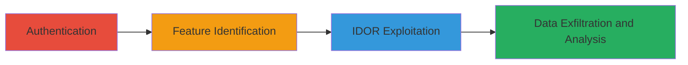

# IDOR in Dashlane Linked Accounts to Disclose Unauthorized Email Associations

Multi-stage attack chain demonstrating exploitation of missing access controls in Dashlane's linked accounts API, allowing authenticated users to query and retrieve linked email addresses for arbitrary emails, leading to privacy leaks of account associations.

## Chain Metrics Dashboard

| Metric | Value |
|--------|-------|
| Chain Status | Unverified |
| Total Steps | 4 |
| Execution Time | ~5 minutes |
| Skill Level | Intermediate |
| Complexity | Low |
| Impact Level | Medium |

## Attack Flow Visualization



## Prerequisites & Requirements

### Required Tools

- Browser developer tools or [[tools/curl]]

### Target Environment

- Web application: Dashlane (https://www.dashlane.com)
- Required services/ports: HTTPS (443)
- Network access requirements: Internet access to Dashlane domain

### Initial Access Requirements

- Valid Dashlane account credentials
- Network position: External (authenticated user)
- Prior access needed: None beyond login

## Detailed Attack Procedures

### Step 1: Authenticate to Dashlane
procedure: [[procedures/Authenticate-to-Dashlane]]

**Objective**: Gain authenticated access to the Dashlane application to obtain session cookies for subsequent API requests.

**Instructions**: Use your Dashlane credentials to log in via the web interface.

**Expected Output**: Successful login with session cookies set in the browser.

**Success Indicators**:
- Dashboard accessible
- Authentication cookies (e.g., session tokens) visible in browser dev tools

### Step 2: Identify Linked Accounts Feature
procedure: [[procedures/Identify-Linked-Accounts-Feature]]

**Objective**: Locate the linked accounts functionality to understand the entry point for email queries.

**Instructions**: Navigate the application to find forms or sections related to account linking, such as email entry for token retrieval.

**Expected Output**: Identification of a form or API endpoint for querying linked accounts.

**Success Indicators**:
- Form found allowing email input
- API endpoint /1/account/getLinkedAccounts inferred

### Step 3: Send IDOR POST to GetLinkedAccounts
procedure: [[procedures/Send-IDOR-POST-to-GetLinkedAccounts]]

**Objective**: Exploit the lack of access controls by sending a POST request with an arbitrary email to retrieve unauthorized linked accounts.

**Instructions**: Craft and send a POST request to the endpoint using an arbitrary email, including your authentication cookies.

Execute the request using [[commands/curl-post-getlinkedaccounts]]:

```bash
curl -X POST 'https://www.dashlane.com/1/account/getLinkedAccounts' \
  -H 'User-Agent: Mozilla/5.0 (Windows NT 6.1; Win64; x64; rv:47.0) Gecko/20100101 Firefox/47.0' \
  -H 'Content-Type: application/x-www-form-urlencoded; charset=UTF-8' \
  -H 'Referer: https://www.dashlane.com/business/try' \
  -b 'your_session_cookies_here' \
  -d 'email=pentester.owasp@gmail.com'
```

**Expected Output**: JSON response with linked emails array.

**Success Indicators**:
- HTTP 200 response
- "logins" array containing emails not owned by the authenticated user

### Step 4: Analyze Linked Accounts Response
procedure: [[procedures/Analyze-Linked-Accounts-Response]]

**Objective**: Parse the response to extract and understand the disclosed linked email associations.

**Instructions**: Review the JSON response for the "content.logins" array to identify leaked associations.

**Expected Output**: List of linked emails, e.g., ["pentester.owasp@gmail.com", "arbaz.owasp@gmail.com", "hacker.arbaz@gmail.com"].

**Success Indicators**:
- Unauthorized emails revealed
- Confirmation of privacy leakage

## Attack Chain Summary

### Key Achievements

1. Successful authentication to Dashlane
2. Identification of vulnerable linked accounts feature
3. Exploitation of IDOR to query arbitrary emails
4. Disclosure of linked account associations, enabling privacy violations

## Technique & Tactic Coverage

### MITRE ATT&CK Techniques

- [[Account Discovery]]

### MITRE ATT&CK Tactics

- [[Discovery]]

---
*Last updated: 2023-10-01T00:00:00Z*
