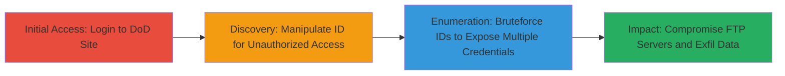

# IDOR in DoD FTP Push Server Management Exposing User FTP Credentials

Multi-stage attack chain demonstrating exploitation of an Insecure Direct Object Reference (IDOR) in the DoD website's FTP push server management feature. The vulnerability allows authenticated users to access, view, update, or delete any other user's FTP/sFTP server configurations by manipulating the ID parameter in the URL, bypassing ownership validation. This can lead to credential theft, server compromise, and exposure of confidential data. Discovered via manual URL tampering after login, the attack enables broad enumeration through ID bruteforcing.

## Chain Metrics Dashboard

| Metric | Value |
|--------|-------|
| Chain Status | Unverified |
| Total Steps | 3 |
| Execution Time | ~5 minutes |
| Skill Level | Intermediate |
| Complexity | Medium |
| Impact Level | High |

## Attack Flow Visualization

## Prerequisites & Requirements

### Required Tools

- Web browser (e.g., Chrome with developer tools for URL manipulation)

### Target Environment

- Web platform: DoD website at https://██████████/██████████
- Services: FTP/sFTP push server management
- Tech stack: CMS-based web application

### Initial Access Requirements

- Valid user account on the DoD website (login credentials required)
- Network access to the public-facing DoD site
- No prior elevated access needed, but authentication is mandatory

## Detailed Attack Procedures

### Step 1: Initial Access
procedure: [[procedures/Log-into-DoD-Website-for-Initial-Access]]

**Objective**: Gain authenticated access to the DoD website to reach the FTP push server management feature.

**Instructions**: Open a web browser and navigate to the login page. Enter valid credentials to authenticate. Upon success, access the FTP push server management section.

**Expected Output**: Successful login redirect to the dashboard, with access to personal FTP configurations.

**Success Indicators**:
- Authentication successful, session cookie established
- Navigation to FTP management interface possible

### Step 2: Unauthorized Access via ID Manipulation
dprocedure: [[procedures/Manipulate-ID-Parameter-for-Unauthorized-FTP-Access]]

**Objective**: Exploit IDOR by altering the URL ID parameter to view and manipulate another user's FTP server details.

**Instructions**: From the authenticated session, navigate to your own FTP server page (e.g., https://████████/█████/filepush/ftp/303/). Identify the ID in the URL path. Replace it with another value (e.g., 1 or a known other user's ID) and load the page. The response will display the target user's hostname, username, password, and path without validation.

**Expected Output**: Unauthorized FTP server details loaded, including sensitive credentials in plaintext.

**Success Indicators**:
- Page loads without errors, revealing foreign credentials
- Options to update or delete the configuration appear

### Step 3: Enumeration via ID Bruteforcing
procedure: [[procedures/Bruteforce-ID-to-Enumerate-User-Servers]]

**Objective**: Systematically enumerate multiple user servers by iterating through possible ID values to maximize credential exposure.

**Instructions**: Using browser developer tools or a simple script, iterate IDs starting from 1 upwards in the URL path (e.g., /filepush/ftp/<ID>/). Check each response for valid server data (e.g., HTTP 200 with form fields populated). Collect successful hits for further exploitation.

**Expected Output**: List of accessible server IDs with associated credentials.

**Success Indicators**:
- Multiple valid responses indicating exposed configurations
- Credentials harvested for offline analysis or direct use

## Attack Chain Summary

### Key Achievements

1. Authenticated access to DoD FTP management without additional privileges
2. Unauthorized viewing and potential modification of other users' FTP/sFTP credentials via IDOR
3. Scalable enumeration of all user servers through bruteforcing, enabling widespread compromise

## Technique & Tactic Coverage

### MITRE ATT&CK Techniques

- [[Exploit Public-Facing Application]] Exploit Public-Facing Application
- [[Account Discovery]] Account Discovery

### MITRE ATT&CK Tactics

- [[Initial Access]] Initial Access
- [[Discovery]] Discovery

---
*Last updated: 2023-10-01T00:00:00Z*
