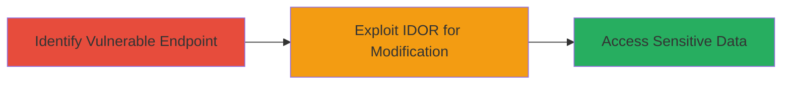

---
tags:
  - idor
  - web
  - unauthorized-access
  - dod
type: attack_chain
tools:
  - '[[tools/Burp-Suite]]'
tactics:
  - '[[Initial Access]]'
verified: false
platforms:
  - Web
submitted: true
complexity: medium
created_at: '2024-10-01T00:00:00Z'
procedures:
  - '[[procedures/Identify-IDOR-Vulnerable-Endpoint]]'
  - '[[procedures/Exploit-IDOR-for-Unauthorized-Modification]]'
step_count: 2
techniques:
  - '[[Exploit Public-Facing Application]]'
updated_at: '2025-12-14T17:25:23.550Z'
description: >-
  A multi-stage attack exploiting an Insecure Direct Object Reference (IDOR)
  vulnerability in a Department of Defense website to gain unauthorized access
  and modify sensitive web content or database parameters.
skill_level: intermediate
impact_level: high
id: c70ff2ce-0fba-4cf8-b72a-5d3b1b061d4f
validated: true
mitre_tactics:
  - '[[Initial Access]]'
mitre_techniques:
  - '[[Exploit Public-Facing Application]]'
---
# IDOR in DoD Website Allowing Unauthorized Modification of Web Content and Database Parameters

Multi-stage attack chain demonstrating exploitation of an Insecure Direct Object Reference (IDOR) in a Department of Defense website, enabling unauthorized access and modification of sensitive web content or database parameters through direct manipulation of object references.

## Chain Metrics Dashboard

| Metric | Value |
|--------|-------|
| Chain Status | Unverified |
| Total Steps | 2 |
| Execution Time | ~5 minutes |
| Skill Level | Intermediate |
| Complexity | Medium |
| Impact Level | High |

## Attack Flow Visualization



## Prerequisites & Requirements

### Required Tools

- [[tools/Burp-Suite]]

### Target Environment

- Target OS/Platform: Web application (DoD website)
- Required services/ports: HTTP/HTTPS on port 80/443
- Network access requirements: Direct internet access to the public-facing DoD website

### Initial Access Requirements

- Credential requirements: Valid user session (authenticated or unauthenticated depending on endpoint)
- Network position: External attacker position
- Prior access needed: None, as it's a public-facing web vulnerability

## Detailed Attack Procedures

### Step 1: Identify Vulnerable Endpoint
procedure: [[procedures/Identify-IDOR-Vulnerable-Endpoint]]

**Objective**: Locate endpoints in the DoD website that use predictable object references without proper access controls, such as user IDs or content IDs in URLs or parameters.

**Instructions**: Use a web proxy like [[tools/Burp-Suite]] to intercept and analyze requests to the website. Navigate to sections involving user profiles, content management, or database-driven pages. Look for sequential or predictable identifiers (e.g., /content?id=123).

Execute [[commands/burp-intercept-request]] to capture a legitimate request:

```bash
# In Burp Suite, configure proxy and browse to target endpoint
# Example intercepted request manipulation in Burp Repeater
GET /content?id=123 HTTP/1.1
Host: dod-website.example
```

Then, modify the ID parameter to test for access to other objects, such as changing id=123 to id=124.

**Expected Output**: Response containing data from an unauthorized object, indicating lack of access controls.

**Success Indicators**:
- Access to another user's content without authentication
- No error messages for invalid references

### Step 2: Exploit IDOR for Unauthorized Modification
procedure: [[procedures/Exploit-IDOR-for-Unauthorized-Modification]]

**Objective**: Manipulate the object reference to modify sensitive web content or database parameters belonging to other users or admins.

**Instructions**: Once a vulnerable endpoint is identified, use [[commands/curl-modify-parameter]] to send a modified request that alters the target object. For example, if the endpoint allows POST updates, change the ID to target unauthorized content.

First, capture a legitimate update request using [[tools/Burp-Suite]], then replay with modified ID:

```bash
curl -X POST 'https://dod-website.example/content' \
  -H 'Content-Type: application/x-www-form-urlencoded' \
  -d 'id=123&title=Legit Title&content=Legit Content' \
  -b 'session=valid_session_cookie'
```

Modify the 'id' to an unauthorized value (e.g., id=456 for admin content) and update fields:

```bash
curl -X POST 'https://dod-website.example/content' \
  -H 'Content-Type: application/x-www-form-urlencoded' \
  -d 'id=456&title=Malicious Title&content=Malicious Content' \
  -b 'session=valid_session_cookie'
```

**Expected Output**: Server response confirming the update (e.g., 200 OK with success message), and verification by accessing the modified content.

**Success Indicators**:
- Unauthorized content is altered
- Changes persist in the database or web display

## Attack Chain Summary

### Key Achievements

1. Identified IDOR-vulnerable endpoints in the DoD website
2. Gained unauthorized read access to sensitive objects
3. Successfully modified web content and database parameters

## Technique & Tactic Coverage

### MITRE ATT&CK Techniques

- [[Exploit Public-Facing Application]]

### MITRE ATT&CK Tactics

- [[Initial Access]]

---
*Last updated: 2024-10-01T00:00:00Z*
