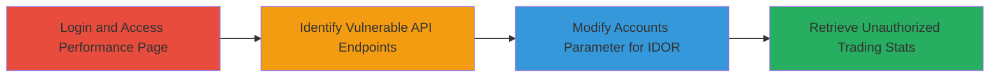

# IDOR in Exness Stats API to Access Unauthorized MT Account Trading Data

Multi-stage attack chain demonstrating exploitation of an Insecure Direct Object Reference (IDOR) vulnerability in the Exness Personal Area stats API endpoints. An authenticated user can modify the 'accounts=' parameter to access sensitive trading statistics, such as equity, net profit, order counts, and trading volumes, for any other MetaTrader (MT) account without authorization checks. This exposes financial privacy of other users and was discovered via inspection of API calls on the performance summary page.

## Chain Metrics Dashboard

| Metric | Value |
|--------|-------|
| Chain Status | Unverified |
| Total Steps | 4 |
| Execution Time | ~5 minutes |
| Skill Level | Intermediate |
| Complexity | Medium |
| Impact Level | High |

## Attack Flow Visualization



## Prerequisites & Requirements

### Required Tools

- Browser Developer Tools (e.g., Chrome DevTools for inspecting network requests)
- [[tools/curl]] (for replicating API calls)

### Target Environment

- Web platform with access to Exness Personal Area at https://my.exness.com
- REST API services using JSON over HTTPS
- MetaTrader (MT) account integration

### Initial Access Requirements

- Valid Exness account credentials for authentication (Bearer token)
- Network access to Exness domain (no specific ports beyond standard HTTPS/443)
- Prior knowledge of a target MT account ID to query

## Detailed Attack Procedures

### Step 1: Login and Access Performance Page
procedure: [[procedures/Login-to-Exness-Personal-Area-and-Identify-Endpoints]]

**Objective**: Authenticate to the Exness Personal Area and navigate to the performance summary page to trigger API calls for stats endpoints.

**Instructions**: Log in to https://my.exness.com/pa/performance/summary using valid credentials. This page loads and inspects network requests to reveal the stats API endpoints.

**Expected Output**: Page loads with initial stats for the user's own account; network tab shows API calls to /v3/personal_area/stats/* with 'accounts={ownAccount}' parameter.

**Success Indicators**:
- Successful login and page access
- Bearer token obtained for API requests

### Step 2: Identify Vulnerable API Endpoints
procedure: [[procedures/Login-to-Exness-Personal-Area-and-Identify-Endpoints]]

**Objective**: Inspect the page's network traffic to identify the stats API endpoints and their parameters.

**Instructions**: Use browser DevTools to monitor network requests. Look for GET requests to endpoints like /v3/personal_area/stats/net_profit with parameters time_range=365 and accounts={accountNumber}.

**Expected Output**: List of endpoints: /net_profit, /orders_number, /trading_volume, /equity.

**Success Indicators**:
- Endpoints and parameters documented
- Confirmation of 'accounts=' usage

### Step 3: Modify Accounts Parameter for IDOR
procedure: [[procedures/Exploit-IDOR-in-Exness-Stats-API]]

**Objective**: Alter the 'accounts=' parameter in API requests to target another MT account ID, bypassing authorization.

**Instructions**: Use [[commands/query-exness-equity-stats]] or similar to send a modified GET request, replacing the account number with a target ID (e.g., xxx). Include Authorization: Bearer {token} header.

```bash
curl -X GET "https://api.exness.com/v3/personal_area/stats/equity?time_range=365&accounts=xxx" -H "Authorization: Bearer {token}" -H "Content-Type: application/json"
```

**Expected Output**: JSON response with equity data for the target account.

**Success Indicators**:
- Request succeeds without errors
- Response contains data not belonging to the requester

### Step 4: Retrieve Unauthorized Trading Stats
procedure: [[procedures/Exploit-IDOR-in-Exness-Stats-API]]

**Objective**: Collect sensitive stats like net profit, orders, and volumes for the unauthorized account.

**Instructions**: Repeat modified requests using [[commands/query-exness-net-profit-stats]], [[commands/query-exness-orders-stats]], and [[commands/query-exness-volume-stats]] for comprehensive data exfiltration. Validate by comparing to known own-account data.

**Expected Output**: JSON objects with net_profit, orders_number, trading_volume, and equity arrays for the target account over 365 days. Example: {"data": [{"date": "2023-01-01", "value": 15000.00}]}

**Success Indicators**:
- Multiple stat types retrieved
- Data confirms unauthorized access (e.g., unfamiliar account figures)

## Attack Chain Summary

### Key Achievements

1. Authenticated access to Exness Personal Area without additional privileges.
2. Identification of IDOR-vulnerable API endpoints lacking account ownership validation.
3. Successful retrieval of sensitive trading metrics for arbitrary MT accounts, enabling privacy breaches.
4. Demonstration of high-impact financial data exposure via simple parameter manipulation.

## Technique & Tactic Coverage

### MITRE ATT&CK Techniques

- [[Exploit Public-Facing Application]] Exploit Public-Facing Application
- [[Steal Web Session Cookie]] Data from Information Repositories

### MITRE ATT&CK Tactics

- [[Initial Access]] Initial Access
- [[Collection]] Collection

---
*Last updated: 2023-10-01T00:00:00Z*
