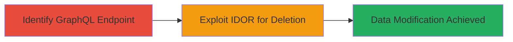

# IDOR in GraphQL API for Unauthorized Profile Image Deletion

Multi-stage attack chain demonstrating exploitation of an IDOR vulnerability in the GraphQL API of the LINE entry service (https://entry.line.me), a programming education platform for children. The attack allows an authenticated user to delete profile images or thumbnails belonging to other users by crafting GraphQL queries that directly reference unauthorized object IDs, bypassing access controls. This leads to unauthorized data modification, potential privacy issues, and disruption of user profiles.

## Chain Metrics Dashboard

| Metric | Value |
|--------|-------|
| Chain Status | Unverified |
| Total Steps | 2 |
| Execution Time | ~5 minutes |
| Skill Level | Intermediate |
| Complexity | Medium |
| Impact Level | High |

## Attack Flow Visualization



## Prerequisites & Requirements

### Required Tools

- None (uses standard HTTP client like curl)

### Target Environment

- Web platform with GraphQL API
- Services: GraphQL endpoint for user profile management
- Tech stack: GraphQL
- Network access: Internet access to https://entry.line.me

### Initial Access Requirements

- Valid user account on the LINE entry service (authenticated session)
- Knowledge of GraphQL query structure for profile images
- No elevated privileges required beyond basic authentication

## Detailed Attack Procedures

### Step 1: Identify GraphQL Endpoint
procedure: [[procedures/Identify-GraphQL-Endpoint-for-Profile-Management]]

**Objective**: Explore and identify the GraphQL API endpoint responsible for profile image management, including operations for adding, viewing, and deleting images.

**Instructions**: Use browser developer tools or a tool like curl to inspect network requests during profile image interactions. Send an introspection query to the GraphQL endpoint to discover available mutations and types related to user profiles and images.

**Expected Output**: Schema details revealing mutations like `deleteProfileImage` or similar, including required parameters such as image ID.

**Success Indicators**:
- GraphQL schema introspection successful
- Identification of profile image management operations

### Step 2: Exploit IDOR for Deletion
procedure: [[procedures/Exploit-IDOR-to-Delete-Profile-Image]]

**Objective**: Craft a GraphQL mutation using another user's image ID to delete their profile image without authorization checks.

**Instructions**: Obtain a target user's image ID (e.g., via enumeration or known value). Authenticate with your session and send a crafted GraphQL mutation to the endpoint, directly referencing the unauthorized ID.

Execute [[commands/graphql-delete-image]] to perform the deletion:

```bash
curl -X POST https://entry.line.me/graphql \
  -H "Content-Type: application/json" \
  -H "Authorization: Bearer YOUR_TOKEN" \
  -d '{"query": "mutation { deleteProfileImage(imageId: \"TARGET_USER_IMAGE_ID\") { success } }"}'
```

**Expected Output**: JSON response indicating successful deletion, e.g., {"data": {"deleteProfileImage": {"success": true}}}

**Success Indicators**:
- Profile image of target user deleted
- No authorization error returned

## Attack Chain Summary

### Key Achievements

1. Discovery of vulnerable GraphQL endpoint for profile management
2. Successful unauthorized deletion of another user's profile image via IDOR
3. Demonstration of data modification leading to privacy and profile disruption issues

## Technique & Tactic Coverage

### MITRE ATT&CK Techniques

- [[Exploit Public-Facing Application]]

### MITRE ATT&CK Tactics

- [[Initial Access]]

---
*Last updated: 2023-10-01T00:00:00Z*
