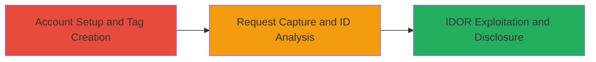

---
tags:
  - idor
  - graphql
  - hackerone
  - tag-disclosure
  - authorization-bypass
type: attack_chain
tools: []
tactics:
  - '[[Discovery]]'
verified: false
platforms:
  - Web
submitted: true
complexity: medium
created_at: '2023-10-01T00:00:00Z'
procedures:
  - '[[procedures/Setup-HackerOne-Accounts-and-Tags]]'
  - '[[procedures/Capture-and-Decode-Tag-Assignment-Request]]'
  - '[[procedures/Bruteforce-Tag-IDs-for-IDOR-Disclosure]]'
step_count: 3
techniques:
  - '[[Account Discovery]]'
updated_at: '2025-12-14T17:25:48.112Z'
description: >-
  Multi-stage IDOR exploitation in HackerOne's GraphQL API allowing unauthorized
  disclosure of victim's custom tags via predictable ID bruteforcing.
skill_level: intermediate
impact_level: high
id: aaacbac2-eacb-47a4-9891-bb8de3971004
validated: true
mitre_tactics:
  - '[[Discovery]]'
mitre_techniques:
  - '[[Account Discovery]]'
---
# IDOR in HackerOne AddTagToAssets GraphQL to Disclose Victim Custom Tags

Multi-stage attack chain demonstrating a complete IDOR workflow on HackerOne's platform to disclose sensitive custom tag information belonging to another user.

## Chain Metrics Dashboard

| Metric | Value |
|--------|-------|
| Chain Status | Unverified |
| Total Steps | 3 |
| Execution Time | ~15 minutes |
| Skill Level | Intermediate |
| Complexity | Medium |
| Impact Level | High |

## Attack Flow Visualization

## Prerequisites & Requirements

### Required Tools

- Web browser with developer tools or proxy like Burp Suite for request interception
- Base64 decoder (built-in browser tools or online)

### Target Environment

- HackerOne platform (https://hackerone.com)
- GraphQL API endpoint: https://hackerone.com/graphql
- No specific ports required; standard HTTPS (443)

### Initial Access Requirements

- Ability to register free accounts on HackerOne
- No prior credentials or network position needed; public-facing web app
- Attacker must simulate victim by creating separate accounts

## Detailed Attack Procedures

### Step 1: Account Setup and Tag Creation
procedure: [[procedures/Setup-HackerOne-Accounts-and-Tags]]

**Objective**: Establish attacker and victim environments by creating accounts and assets, then have the victim create a custom tag for later targeting.

**Instructions**: Register two separate HackerOne accounts—one for the attacker and one simulating the victim. Log in to each and add a scope asset (e.g., a program or domain) to the dashboard. Then, in the victim account, create a custom tag via the interface.

**Expected Output**: Two active accounts with scope assets; victim account has a new custom tag visible in their dashboard.

**Success Indicators**:
- Accounts registered and logged in successfully
- Scope assets added to dashboards
- Custom tag created and listed in victim's tag management

### Step 2: Request Capture and ID Analysis
procedure: [[procedures/Capture-and-Decode-Tag-Assignment-Request]]

**Objective**: Intercept a legitimate tag assignment request from the attacker account to analyze the predictable tagId format used in the GraphQL mutation.

**Instructions**: In the attacker account, assign a tag (any existing one) to the attacker's scope asset while intercepting the network traffic using browser dev tools or a proxy. Examine the GraphQL request payload, focusing on the tagId parameter, which is base64-encoded. Decode it to reveal the internal format like "gid://hackerone/AsmTag/4979xxxx".

**Expected Output**: Captured POST request to /graphql with operationName: AddTagToAssets; decoded tagId showing the AsmTag ID pattern.

**Success Indicators**:
- Request intercepted with tagId parameter
- Base64 decoding successful, exposing sequential numeric ID

### Step 3: IDOR Exploitation and Disclosure
procedure: [[procedures/Bruteforce-Tag-IDs-for-IDOR-Disclosure]]

**Objective**: Bruteforce sequential tag IDs in modified GraphQL requests to probe for and disclose the victim's custom tags without authorization checks.

**Instructions**: Modify the captured request by incrementing the numeric part of the AsmTag ID (e.g., from 4979xxxx to sequential values), re-encode to base64, and send the mutated AddTagToAssets request. Even if the API returns a NOT_FOUND error for invalid IDs, check the attacker's assets page to see if valid victim tags appear.

**Expected Output**: API responses with errors for non-existent tags, but valid tags from victim appearing on the assets page.

**Success Indicators**:
- Modified requests sent successfully (200 OK with errors)
- Victim's custom tag visible on attacker's assets page without victim interaction

## Attack Chain Summary

### Key Achievements

1. Bypassed authorization in GraphQL AddTagToAssets via predictable IDOR
2. Disclosed victim's sensitive custom tags through UI reflection despite API failures
3. Demonstrated no user interaction required for information disclosure

## Technique & Tactic Coverage

### MITRE ATT&CK Techniques

- [[Account Discovery]]

### MITRE ATT&CK Tactics

- [[Discovery]]

---
*Last updated: 2023-10-01T00:00:00Z*
