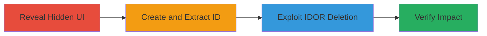

---
tags:
  - idor
  - graphql
  - unauthorized-deletion
  - web-vulnerability
type: attack_chain
tools:
  - '[[tools/Browser-Console]]'
  - '[[tools/Burp-Suite]]'
tactics:
  - '[[Execution]]'
  - '[[Impact]]'
verified: false
platforms:
  - Web
submitted: true
complexity: medium
created_at: '2023-10-01T00:00:00Z'
procedures:
  - '[[procedures/Reveal-Hidden-Copilot-Interface]]'
  - '[[procedures/Create-LLM-Conversation-and-Extract-ID]]'
  - '[[procedures/Exploit-IDOR-to-Delete-Conversation]]'
  - '[[procedures/Verify-Conversation-Deletion]]'
step_count: 4
techniques:
  - '[[Exploit Public-Facing Application]]'
  - '[[JavaScript]]'
updated_at: '2025-12-14T17:25:48.184Z'
description: >-
  Exploits an Insecure Direct Object Reference in the unreleased HackerOne
  Copilot feature to delete any user's LLM conversations via GraphQL mutation
  without authorization.
skill_level: intermediate
impact_level: high
id: b3caa763-cd30-4e4e-aaf4-eeae1797ee6d
validated: true
mitre_tactics:
  - '[[Execution]]'
  - '[[Impact]]'
mitre_techniques:
  - '[[Exploit Public-Facing Application]]'
  - '[[JavaScript]]'
---
# IDOR in HackerOne Copilot Allowing Unauthorized LLM Conversation Deletion

Multi-stage attack chain demonstrating exploitation of an IDOR vulnerability in the unreleased HackerOne Copilot feature to unauthorizedly delete LLM conversations.

## Chain Metrics Dashboard

| Metric | Value |
|--------|-------|
| Chain Status | Unverified |
| Total Steps | 4 |
| Execution Time | ~10 minutes |
| Skill Level | Intermediate |
| Complexity | Medium |
| Impact Level | High |

## Attack Flow Visualization



## Prerequisites & Requirements

### Required Tools

- [[tools/Browser-Console]]
- [[tools/Burp-Suite]]

### Target Environment

- Web platform
- Access to HackerOne opportunities page (https://hackerone.com/opportunities/all)
- Two accounts: victim and attacker

### Initial Access Requirements

- Valid HackerOne user credentials for victim and attacker accounts
- Browser with developer tools and proxy interception capability
- No special network access beyond standard internet

## Detailed Attack Procedures

### Step 1: Reveal Hidden Copilot Interface
procedure: [[procedures/Reveal-Hidden-Copilot-Interface]]

**Objective**: Uncover the unreleased Copilot GUI hidden by CSS classes to enable interaction.

**Instructions**: Navigate to https://hackerone.com/opportunities/all and execute the reveal script using [[commands/reveal-copilot-gui]] in the browser console:

```javascript
document.querySelectorAll('div').forEach(e=>{ e.classList.remove('hidden'); e.classList.remove('dark:text-white'); });
```

**Expected Output**: Copilot interface becomes visible on the page.

**Success Indicators**:
- Hidden div elements are now displayed
- Copilot GUI elements appear in the DOM

### Step 2: Create LLM Conversation and Extract ID
procedure: [[procedures/Create-LLM-Conversation-and-Extract-ID]]

**Objective**: Initiate a new conversation in the victim account to obtain a usable conversation ID for exploitation.

**Instructions**: Interact with the revealed GUI to create a new conversation, then use [[tools/Burp-Suite]] to intercept the GraphQL request. Extract the ID from the 'NewConversation' response using [[commands/extract-conversation-id]] (monitor network for data.newConversation.llm_conversation.id).

**Expected Output**: Conversation ID retrieved, e.g., a base64-encoded string like "bGxtX2NvbnZlcnNhdGlvbjoxMjM0NTY=".

**Success Indicators**:
- New conversation created in GUI
- ID successfully extracted from proxy response

### Step 3: Exploit IDOR to Delete Conversation
procedure: [[procedures/Exploit-IDOR-to-Delete-Conversation]]

**Objective**: From the attacker account, send a GraphQL mutation using the victim's conversation ID to delete it without authorization.

**Instructions**: Switch to the attacker account, navigate to the opportunities page, reveal the GUI if needed, and send the mutation via proxy using [[commands/destroy-llm-conversation]] with the victim's ID in variables.llmConversationId:

```json
{"operationName":"DestroyLlmConversation","variables":{"llmConversationId":"victim-id-here"},"query":"\n mutation DestroyLlmConversation($llmConversationId: ID!) {\n destroyConversation(input: { llm_conversation_id: $llmConversationId }) {\n destroyed\n }\n }\n"}
```

**Expected Output**: GraphQL response with { "destroyed": true }.

**Success Indicators**:
- Mutation executes without error
- Server confirms deletion

### Step 4: Verify Conversation Deletion
procedure: [[procedures/Verify-Conversation-Deletion]]

**Objective**: Confirm the impact by checking the victim's account for the deleted conversation.

**Instructions**: Switch back to the victim account, refresh the page, re-execute [[commands/reveal-copilot-gui]] in the console, and inspect the GUI or network for the missing conversation.

```javascript
document.querySelectorAll('div').forEach(e=>{ e.classList.remove('hidden'); e.classList.remove('dark:text-white'); });
```

**Expected Output**: Conversation no longer present in the interface.

**Success Indicators**:
- GUI shows no trace of the targeted conversation
- No errors on refresh

## Attack Chain Summary

### Key Achievements

1. Revealed unreleased feature for testing
2. Extracted predictable conversation IDs
3. Deleted arbitrary user conversations via IDOR
4. Demonstrated potential disruption to future Copilot functionality

## Technique & Tactic Coverage

### MITRE ATT&CK Techniques

- [[Exploit Public-Facing Application]]
- [[JavaScript]]

### MITRE ATT&CK Tactics

- [[Execution]]
- [[Impact]]

---
*Last updated: 2023-10-01T00:00:00Z*
