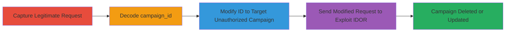

---
tags:
  - idor
  - graphql
  - authorization-bypass
  - web-vulnerability
type: attack_chain
tools: []
tactics:
  - '[[Initial Access]]'
  - '[[Impact]]'
verified: false
platforms:
  - Web
submitted: true
complexity: medium
created_at: '2023-10-01T00:00:00Z'
procedures:
  - '[[procedures/Capture-Legitimate-UpdateCampaign-Request]]'
  - '[[procedures/Decode-Base64-Campaign-ID]]'
  - '[[procedures/Modify-Campaign-ID-for-IDOR]]'
  - '[[procedures/Send-Modified-UpdateCampaign-Request]]'
step_count: 4
techniques:
  - '[[Exploit Public-Facing Application]]'
updated_at: '2025-12-14T17:25:52.873Z'
description: >-
  Multi-stage exploitation of an Insecure Direct Object Reference (IDOR)
  vulnerability in HackerOne's GraphQL UpdateCampaign mutation, enabling
  authenticated users to delete or modify campaigns from unauthorized programs.
skill_level: intermediate
impact_level: high
id: d90c5e07-e27b-488d-8b1b-9a955f09599d
validated: true
mitre_tactics:
  - '[[Initial Access]]'
  - '[[Impact]]'
mitre_techniques:
  - '[[Exploit Public-Facing Application]]'
---
# IDOR in HackerOne GraphQL UpdateCampaign Allowing Unauthorized Campaign Deletion

Multi-stage attack chain demonstrating the exploitation of an IDOR vulnerability in HackerOne's platform, where the base64-encoded campaign_id in the UpdateCampaign GraphQL mutation lacks proper authorization checks. This allows any authenticated user to manipulate the ID and target campaigns from other programs, leading to unauthorized updates or deletions that disrupt program availability.

## Chain Metrics Dashboard

| Metric | Value |
|--------|-------|
| Chain Status | Unverified |
| Total Steps | 4 |
| Execution Time | ~5 minutes |
| Skill Level | Intermediate |
| Complexity | Medium |
| Impact Level | High |

## Attack Flow Visualization

## Prerequisites & Requirements

### Required Tools

- Browser developer tools or proxy like Burp Suite for request interception
- Base64 decoder (built-in tools or online)

### Target Environment

- HackerOne platform (/graphql endpoint)
- Authenticated session as a HackerOne user
- No specific ports; web-based over HTTPS

### Initial Access Requirements

- Valid authenticated cookie/session for HackerOne
- Access to edit a campaign in a program you own (for initial request capture)
- Knowledge of target campaign IDs from other programs (e.g., via enumeration or guessing sequential IDs)

## Detailed Attack Procedures

### Step 1: Capture Legitimate Request
procedure: [[procedures/Capture-Legitimate-UpdateCampaign-Request]]

**Objective**: Obtain a valid GraphQL UpdateCampaign mutation request to analyze the campaign_id structure.

**Instructions**: While editing a campaign you have access to, use browser dev tools or a proxy to intercept the POST request to /graphql. The request includes the JSON payload with the UpdateCampaign mutation and variables.

**Expected Output**: HTTP POST request with JSON body containing operationName: "UpdateCampaign" and variables.input.campaign_id as base64-encoded string.

**Success Indicators**:
- Request captured successfully
- Response shows 'was_successful': true for the legitimate edit

### Step 2: Decode Base64 Campaign ID
procedure: [[procedures/Decode-Base64-Campaign-ID]]

**Objective**: Reveal the internal GlobalID structure of the campaign_id to understand how to manipulate it.

**Instructions**: Extract the campaign_id value (e.g., 'Z2lkOi8vaGFja2Vyb25lL0NhbXBhaWduLzI0NA==') and decode it using a base64 decoder.

**Expected Output**: Decoded string like 'gid://hackerone/Campaign/244', showing the format for modification.

**Success Indicators**:
- Internal ID structure identified (e.g., /Campaign/NUMBER)
- Numeric ID extracted for alteration

### Step 3: Modify Campaign ID for IDOR
procedure: [[procedures/Modify-Campaign-ID-for-IDOR]]

**Objective**: Alter the numeric ID in the GlobalID to reference an unauthorized campaign from another program.

**Instructions**: Change the number after '/Campaign/' (e.g., from 244 to 500 for a different campaign), then re-encode the full string (e.g., 'gid://hackerone/Campaign/500') to base64.

**Expected Output**: New base64-encoded ID like 'Z2lkOi8vaGFja2Vyb25lL0NhbXBhaWduLzUwMA==', ready for substitution.

**Success Indicators**:
- Modified ID decodes back correctly
- ID points to a valid but unauthorized campaign

### Step 4: Send Modified UpdateCampaign Request
procedure: [[procedures/Send-Modified-UpdateCampaign-Request]]

**Objective**: Submit the tampered request to delete or update the targeted unauthorized campaign.

**Instructions**: Replace the original campaign_id in the JSON variables with the new encoded value and resend the POST to /graphql using tools like curl or a proxy. For deletion, adjust input fields accordingly (e.g., set end_date to past or use a delete mutation if available; here, update can disrupt).

**Expected Output**: JSON response with 'was_successful': true, indicating the unauthorized campaign was modified or deleted.

**Success Indicators**:
- Target campaign no longer accessible to its owners
- No authorization error in response (pre-fix)

## Attack Chain Summary

### Key Achievements

1. Bypassed authorization to access campaigns across programs
2. Demonstrated disruption of program availability via deletion
3. Highlighted IDOR in GraphQL GlobalID handling

## Technique & Tactic Coverage

### MITRE ATT&CK Techniques

- [[Exploit Public-Facing Application]] Exploit Public-Facing Application

### MITRE ATT&CK Tactics

- [[Initial Access]] Initial Access
- [[Impact]] Impact

---

*Last updated: 2023-10-01T00:00:00Z*
