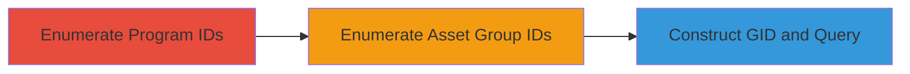

---
tags:
  - idor
  - graphql
  - enumeration
  - information-disclosure
type: attack_chain
tools:
  - '[[tools/Burp-Suite]]'
tactics:
  - '[[Discovery]]'
  - '[[Initial Access]]'
commands:
  - '[[commands/graphql-query-asset-group-name]]'
  - '[[commands/graphql-query-asset-group-details]]'
platforms:
  - Web
complexity: medium
procedures:
  - '[[procedures/Enumerate-HackerOne-Program-IDs-via-GraphQL]]'
  - '[[procedures/Enumerate-PolicyPageAssetGroup-IDs]]'
  - '[[procedures/Construct-GID-and-Query-Private-Asset-Groups]]'
step_count: 3
techniques:
  - '[[Data from Information Repositories]]'
  - '[[Exploit Public-Facing Application]]'
description: >-
  Exploitation of an IDOR vulnerability in HackerOne's GraphQL endpoint to
  access sensitive details of private bug bounty programs without authorization
skill_level: intermediate
impact_level: high
id: 24d70f9f-2b53-4f8f-923a-4ec179282c2e
created_at: '2025-12-11T03:48:05.937Z'
updated_at: '2025-12-11T03:48:05.937Z'
verified: false
validated: true
submitted: true
mitre_tactics:
  - '[[TA0007]]'
  - '[[TA0001]]'
mitre_techniques:
  - '[[T1213]]'
  - '[[T1190]]'
---
# IDOR in HackerOne GraphQL to Disclose Private Bug Bounty Program Details

Multi-stage attack chain demonstrating unauthorized access to private bug bounty program details via an IDOR vulnerability in the GraphQL endpoint.

## Chain Metrics Dashboard

| Metric | Value |
|--------|-------|
| Chain Status | Unverified |
| Total Steps | 3 |
| Execution Time | ~5 minutes |
| Skill Level | Intermediate |
| Complexity | Medium |
| Impact Level | High |

## Attack Flow Visualization



## Prerequisites & Requirements

### Required Tools

- [[tools/Burp-Suite]]

### Target Environment

- Web platform with GraphQL service
- No authentication required for initial queries

### Initial Access Requirements

- Access to the public GraphQL endpoint at /graphql
- Ability to send HTTP POST requests

## Detailed Attack Procedures

### Step 1: Enumerate Program IDs - [[procedures/Enumerate-HackerOne-Program-IDs-via-GraphQL]]

**Procedure**: [[procedures/Enumerate-HackerOne-Program-IDs-via-GraphQL]]

**Objective**: Obtain a list of program IDs, including those for private programs, to form part of the Global ID (GID).

**Expected Output**: JSON response with program IDs and handles.

**Success Indicators**:
- Successful retrieval of program _id and handle fields
- Inclusion of private program data in the response

**Instructions**:

Send the GraphQL query using [[commands/graphql-enumerate-programs]] to fetch teams with null state:

```json
{"query":"{teams(where:{state:{_eq:null}}){total_count,nodes{_id,handle}}}"}
```

Review the output for enumerable IDs.

### Step 2: Enumerate Asset Group IDs - [[procedures/Enumerate-PolicyPageAssetGroup-IDs]]

**Procedure**: [[procedures/Enumerate-PolicyPageAssetGroup-IDs]]

**Objective**: Guess or enumerate the PolicyPageAssetGroup IDs to combine with program IDs for GID construction.

**Expected Output**: Valid numerical IDs (e.g., 3981) that can be used in GIDs.

**Success Indicators**:
- Identification of valid ID ranges through trial and error
- No immediate errors from invalid guesses

**Instructions**:

Manually enumerate numerical values for PolicyPageAssetGroup IDs, such as trying values up to a certain range (e.g., 1 to 5000). This step relies on brute-force guessing without specific commands.

### Step 3: Construct GID and Query Private Details - [[procedures/Construct-GID-and-Query-Private-Asset-Groups]]

**Procedure**: [[procedures/Construct-GID-and-Query-Private-Asset-Groups]]

**Objective**: Combine IDs into a GID and query the GraphQL endpoint to disclose private asset group details.

**Expected Output**: JSON with private data like asset names and scope counts.

**Success Indicators**:
- Retrieval of private program asset names and counts
- Confirmation of unauthorized access to sensitive information

**Instructions**:

Use [[tools/Burp-Suite]] to send requests. First, query for basic asset group info with [[commands/graphql-query-asset-group-name]]:

```json
{"query":"{node(id:\"gid://hackerone/PolicyPageAssetGroupsIndex::PolicyPageAssetGroup/3981-41287\"){... on PolicyPageAssetGroupDocument{id,name}}}"}
```

Then, extend to detailed scopes with [[commands/graphql-query-asset-group-details]]:

```json
{"query":"{node(id:\"gid://hackerone/PolicyPageAssetGroupsIndex::PolicyPageAssetGroup/3981-41287\"){... on PolicyPageAssetGroupDocument{id,name,in_scope_count,out_of_scope_count,structured_scopes_count}}}"}
```

Validate the output for disclosed private data.

## Attack Chain Summary

### Key Achievements

1. Enumeration of private program IDs without authentication
2. Successful guessing of asset group IDs
3. Disclosure of sensitive program details via constructed GIDs

## Technique & Tactic Coverage

### MITRE ATT&CK Techniques

- [[Data from Information Repositories]]
- [[Exploit Public-Facing Application]]

### MITRE ATT&CK Tactics

- [[Discovery]]
- [[Initial Access]]

*Last updated: [TIMESTAMP]*
