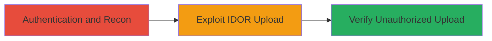

---
tags:
  - idor
  - unauthorized-access
  - video-upload
  - ibm
type: attack_chain
tools: []
tactics:
  - '[[Initial Access]]'
commands:
  - '[[commands/curl-upload-video]]'
platforms:
  - Web
complexity: low
procedures:
  - '[[procedures/Exploit-IDOR-in-Video-Upload]]'
step_count: 2
techniques:
  - '[[Exploit Public-Facing Application]]'
description: >-
  An attack chain exploiting an Insecure Direct Object Reference (IDOR)
  vulnerability in IBM's video upload functionality to upload videos to
  unauthorized channels.
skill_level: intermediate
impact_level: high
id: 1e03207f-51d2-4b05-a0c0-8f654ce0d8e0
created_at: '2025-12-14T17:25:34.241Z'
updated_at: '2025-12-14T17:25:34.241Z'
verified: false
validated: true
submitted: true
mitre_tactics:
  - '[[Initial Access]]'
mitre_techniques:
  - '[[Exploit Public-Facing Application]]'
---
# IDOR in IBM Video Channel Upload Allowing Unauthorized Video Uploads

## Overview

This attack chain demonstrates the exploitation of an Insecure Direct Object Reference (IDOR) vulnerability in the video upload functionality on https://video.ibm.com. The flaw allows authenticated users to upload videos to channels they do not own by manipulating the channel identifier in the upload request. Discovered by researcher tusnj and reported to IBM on July 26, 2023, this critical vulnerability (CVSS 9.8) enables unauthorized content manipulation, potentially leading to data tampering, abuse, or misinformation dissemination within IBM's video platform.

## Chain Metrics Dashboard

| Metric | Value |
|--------|-------|
| Chain Status | Unverified |
| Total Steps | 2 |
| Execution Time | ~5 minutes |
| Skill Level | Intermediate |
| Complexity | Low |
| Impact Level | High |

## Attack Flow Visualization



## Prerequisites & Requirements

### Required Tools

- Web browser or [[Burp Suite]] for request manipulation

### Target Environment

- Web platform: https://video.ibm.com
- Required services/ports: HTTPS (443)
- Network access requirements: Internet access to the target domain

### Initial Access Requirements

- Valid user credentials for authentication (e.g., IBM account)
- Network position: External
- Prior access needed: None, but authentication required

## Detailed Attack Procedures

### Step 1: Authentication and Reconnaissance

**Objective**: Gain authenticated access to the video platform and identify the upload endpoint structure, including the channel ID parameter.

**Instructions**: Log in to https://video.ibm.com using valid credentials. Navigate to the video upload section for your own channel and inspect the network requests using browser developer tools or a proxy like Burp Suite. Identify the upload API endpoint, typically a POST request to something like `/api/channels/{channel_id}/videos`, where `{channel_id}` is the direct object reference.

**Expected Output**: Captured request showing the channel ID in the URL or payload.

**Success Indicators**:
- Successful login and access to upload interface
- Identification of channel ID parameter in requests

### Step 2: Exploit IDOR for Unauthorized Upload

procedure: [[procedures/Exploit-IDOR-in-Video-Upload]]

**Objective**: Manipulate the channel ID to upload a video to a target unauthorized channel, bypassing ownership checks.

**Instructions**: Use the identified endpoint to craft a request with a modified channel ID belonging to another user. Prepare a test video file and send the upload request via [[commands/curl-upload-video]] or intercepted proxy request.

```bash
curl -X POST -H "Authorization: Bearer YOUR_TOKEN" -F "video=@test.mp4" https://video.ibm.com/api/channels/UNAUTHORIZED_CHANNEL_ID/videos
```

**Expected Output**: HTTP 200 or 201 response confirming successful upload, with the video appearing in the unauthorized channel.

**Success Indicators**:
- Video uploads without ownership errors
- Verification of video in target channel via platform UI

## Attack Chain Summary

### Key Achievements

1. Bypassed authorization to access foreign channels
2. Successfully uploaded unauthorized content
3. Demonstrated potential for widespread content abuse

## Technique & Tactic Coverage

### MITRE ATT&CK Techniques

- [[Exploit Public-Facing Application]]

### MITRE ATT&CK Tactics

- [[Initial Access]]

---
*Last updated: 2023-10-01*
