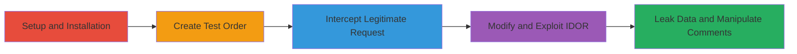

---
tags:
  - idor
  - shopify
  - judge.me
  - web
  - data-leakage
  - unauthorized-access
type: attack_chain
tools:
  - '[[tools/Burp-Suite]]'
tactics:
  - '[[Initial Access]]'
  - '[[Collection]]'
  - '[[Impact]]'
verified: false
platforms:
  - Web
  - Shopify
submitted: true
complexity: medium
created_at: '2023-10-01T00:00:00Z'
procedures:
  - '[[procedures/Install-and-Setup-Judge.me-Checkout-Comments]]'
  - '[[procedures/Create-Test-Order-and-Comment]]'
  - '[[procedures/Intercept-and-Modify-Curate-Request]]'
  - '[[procedures/Exploit-IDOR-for-Foreign-Comment-Access]]'
step_count: 5
techniques:
  - '[[Exploit Public-Facing Application]]'
updated_at: '2025-12-14T17:25:47.335Z'
description: >-
  Multi-stage attack exploiting an Insecure Direct Object Reference (IDOR) in
  Judge.me's Shopify Checkout Comments addon to access and manipulate comments
  from other stores, leaking sensitive buyer data.
skill_level: intermediate
impact_level: high
id: 85cacc3b-6031-4720-86d0-fe8b1abde622
validated: true
mitre_tactics:
  - '[[Initial Access]]'
  - '[[Collection]]'
  - '[[Impact]]'
mitre_techniques:
  - '[[Exploit Public-Facing Application]]'
---
---

# IDOR in Judge.me Checkout Comments to Leak Buyer Info and Manipulate Foreign Comments

Multi-stage attack chain demonstrating a complete attack workflow exploiting IDOR in Judge.me's Checkout Comments addon for Shopify.

## Chain Metrics Dashboard

| Metric | Value |
|--------|-------|
| Chain Status | Unverified |
| Total Steps | 5 |
| Execution Time | ~15 minutes |
| Skill Level | Intermediate |
| Complexity | Medium |
| Impact Level | High |

## Attack Flow Visualization

## Prerequisites & Requirements

### Required Tools

- [[tools/Burp-Suite]]

### Target Environment

- Shopify store with Judge.me Checkout Comments addon installed
- Access to Shopify admin panel
- Network access to judge.me API endpoints

### Initial Access Requirements

- Valid Shopify store admin credentials
- Ability to create test orders (no payment required for testing)
- Burp Suite configured as proxy for traffic interception

## Detailed Attack Procedures

### Step 1: Install and Setup Judge.me Checkout Comments
procedure: [[procedures/Install-and-Setup-Judge.me-Checkout-Comments]]

**Objective**: Gain access to the vulnerable addon by installing it in a test Shopify store.

**Instructions**: Log in to the Shopify admin panel and search for the Judge.me Checkout Comments app in the Shopify App Store. Install the app and enable it for checkout comments collection.

**Expected Output**: App installed successfully, visible in the admin apps section.

**Success Indicators**:
- App listed in Shopify admin under Apps
- No installation errors

### Step 2: Create Test Order and Comment
procedure: [[procedures/Create-Test-Order-and-Comment]]

**Objective**: Generate a legitimate comment to capture the curation request format.

**Instructions**: Proceed to the store's checkout as a customer, add a product to cart, and complete a test purchase (use a free product or test mode). During checkout, enter a sample comment in the comments field.

**Expected Output**: Order confirmed with comment attached.

**Success Indicators**:
- Order ID generated
- Comment visible in admin comments page

### Step 3: Intercept Legitimate Publish Request
procedure: [[procedures/Intercept-and-Modify-Curate-Request]]

**Objective**: Capture the POST request used to publish the test comment for later modification.

**Instructions**: Navigate to the Shopify admin comments page at `/admin/apps/checkout-comments/extensions/checkout_comments/comments`. Select the test comment and perform the publish action while proxying traffic through Burp Suite to intercept the request.

**Expected Output**: Intercepted POST request to `/extensions/checkout_comments/curate_comment` with original comment_id.

**Success Indicators**:
- Request captured in Burp Suite Proxy
- Response confirms comment published

### Step 4: Modify and Send Request for IDOR Exploitation
procedure: [[procedures/Exploit-IDOR-for-Foreign-Comment-Access]]

**Objective**: Alter the comment_id to access unauthorized comments from other stores and observe data leakage.

**Instructions**: In Burp Repeater, modify the `comment_id` parameter to a guessed or iterated value (e.g., 1 or lower than original). Set `curated=ok` to publish and send the request. Repeat with different IDs to access foreign shop data.

**Expected Output**: JSON response with buyer name, email, product details from another shop.

**Success Indicators**:
- Unauthorized comment data returned
- Ability to publish/hide foreign comments

### Step 5: Validate Impact and Cleanup

**Objective**: Confirm leakage and manipulation capabilities, then remove test data.

**Instructions**: Iterate on multiple comment_ids to leak more data. Use the same endpoint with `curated=hidden` to test hiding foreign comments. Delete the test order and uninstall the app if needed.

**Expected Output**: Multiple leaked records; successful status changes on foreign comments.

**Success Indicators**:
- Sensitive info (emails, names) exfiltrated
- Integrity violation confirmed by altering foreign comment visibility

## Attack Chain Summary

### Key Achievements

1. Unauthorized access to buyer personal information across Shopify stores
2. Manipulation of comment visibility on unrelated stores without authentication
3. Demonstration of confidentiality and integrity breaches via IDOR

## Technique & Tactic Coverage

### MITRE ATT&CK Techniques

- [[Exploit Public-Facing Application]]

### MITRE ATT&CK Tactics

- [[Initial Access]]
- [[Collection]]
- [[Impact]]

---

*Last updated: 2023-10-01T00:00:00Z*
