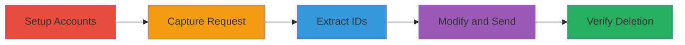

# IDOR in LinkedIn Featured Image Deletion Allowing Unauthorized Removal of User Media

Multi-stage attack chain demonstrating exploitation of an IDOR vulnerability in LinkedIn's featured image deletion API, enabling unauthorized deletion of any user's profile media.

## Chain Metrics Dashboard

| Metric | Value |
|--------|-------|
| Chain Status | Unverified |
| Total Steps | 5 |
| Execution Time | ~10 minutes |
| Skill Level | Intermediate |
| Complexity | Medium |
| Impact Level | High |

## Attack Flow Visualization

## Prerequisites & Requirements

### Required Tools

- [[tools/Burp-Suite]]

### Target Environment

- LinkedIn web platform
- Public access to victim profiles (no login required for viewing)
- Attacker must have a LinkedIn account for authentication

### Initial Access Requirements

- Valid LinkedIn credentials for attacker account
- Network access to LinkedIn (standard internet)
- Burp Suite configured as proxy for browser traffic

## Detailed Attack Procedures

### Step 1: Setup Accounts and Add Featured Images
procedure: [[procedures/Setup-LinkedIn-Accounts-and-Add-Featured-Images]]

**Objective**: Prepare the environment by creating attacker and victim accounts and adding featured images to simulate the target state.

**Instructions**: Register two separate LinkedIn accounts. Log in to each and navigate to the profile section to upload images.

**Expected Output**: Both accounts have at least one featured image uploaded and visible on their profiles.

**Success Indicators**:
- Accounts created successfully
- Featured images added and confirmed visible

### Step 2: Capture Legitimate Delete Request
procedure: [[procedures/Capture-Legitimate-Delete-Request-with-Burp-Suite]]

**Objective**: Intercept a legitimate delete request from the attacker's own account to obtain the API structure for replay.

**Instructions**: Configure Burp Suite to proxy browser traffic, then delete a featured image on the attacker's account while intercepting the request.

**Expected Output**: Captured DELETE request in Burp Repeater, including ProfileId, ImageId, and sectionUrn parameters.

**Success Indicators**:
- Request captured without errors
- Image successfully deleted on attacker's profile

### Step 3: Extract ProfileId and ImageId from Victim Profile
procedure: [[procedures/Extract-ProfileId-and-ImageId-from-Victim-Profile]]

**Objective**: Gather the necessary IDs from the victim's public profile without authentication as the victim.

**Instructions**: Visit the victim's public profile, locate a featured image, and copy the viewer link to parse the parameters.

**Expected Output**: Extracted victim ProfileId and ImageId values ready for substitution.

**Success Indicators**:
- Victim profile accessible publicly
- IDs successfully parsed from URL

### Step 4: Modify and Send Delete Request
procedure: [[procedures/Modify-and-Send-Delete-Request-for-Victim]]

**Objective**: Alter the captured request with victim IDs and execute it to perform unauthorized deletion.

**Instructions**: In Burp Repeater, replace the original ProfileId and ImageId with the victim's values, then forward the modified DELETE request.

**Expected Output**: HTTP 200 or success response from the API indicating deletion processed.

**Success Indicators**:
- Request sent successfully
- No authorization error returned

### Step 5: Verify Image Deletion
procedure: [[procedures/Verify-Image-Deletion-on-Victim-Profile]]

**Objective**: Confirm the exploitation by checking the victim's profile for the missing image.

**Instructions**: Refresh the victim's public profile page and inspect the featured section.

**Expected Output**: Targeted image no longer present on the profile.

**Success Indicators**:
- Image confirmed deleted
- No other profile changes observed

## Attack Chain Summary

### Key Achievements

1. Demonstrated IDOR allowing cross-account media deletion
2. Exploited public exposure of IDs in profile links
3. Achieved unauthorized data modification without brute-forcing

## Technique & Tactic Coverage

### MITRE ATT&CK Techniques

- [[Exploit Public-Facing Application]]
- [[Stored Data Manipulation]]

### MITRE ATT&CK Tactics

- [[Execution]]
- [[Impact]]

---
*Last updated: 2023-10-01T00:00:00Z*
