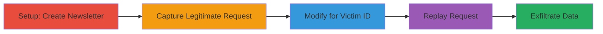

---
tags:
  - idor
  - linkedin
  - privacy-violation
  - unauthorized-access
  - api-abuse
type: attack_chain
tools:
  - '[[tools/Burp-Suite]]'
tactics:
  - '[[Discovery]]'
commands:
  - '[[commands/curl-linkedin-subscribers-request]]'
verified: false
platforms:
  - Web
submitted: true
complexity: medium
created_at: '2023-10-01T00:00:00Z'
procedures:
  - '[[procedures/Create-LinkedIn-Newsletter]]'
  - '[[procedures/Access-Newsletter-Subscribers-UI]]'
  - '[[procedures/Capture-Subscribers-API-Request]]'
  - '[[procedures/Replay-Request-with-Victim-NewsletterId]]'
  - '[[procedures/Analyze-Unauthorized-Subscriber-Data]]'
step_count: 5
techniques:
  - '[[Account Discovery]]'
updated_at: '2025-12-14T17:30:47.240Z'
description: >-
  Multi-stage attack exploiting an Insecure Direct Object Reference (IDOR)
  vulnerability in LinkedIn's newsletter feature to view unauthorized subscriber
  lists and personal details.
skill_level: intermediate
impact_level: high
id: 467a6f11-82c8-49fa-96ab-9540793d2a3d
validated: true
mitre_tactics:
  - '[[Discovery]]'
mitre_techniques:
  - '[[Account Discovery]]'
---
# IDOR in LinkedIn Newsletter Subscribers API for Unauthorized Access to Subscriber Lists

Multi-stage attack chain demonstrating a complete workflow to exploit an IDOR vulnerability in LinkedIn's newsletter API, allowing any authenticated user to view subscriber lists and personal details of other users' newsletters by manipulating the NewsletterId in API requests.

## Chain Metrics Dashboard

| Metric | Value |
|--------|-------|
| Chain Status | Unverified |
| Total Steps | 5 |
| Execution Time | ~10 minutes |
| Skill Level | Intermediate |
| Complexity | Medium |
| Impact Level | High |

## Attack Flow Visualization



## Prerequisites & Requirements

### Required Tools

- [[tools/Burp-Suite]]
- Web browser with developer tools

### Target Environment

- LinkedIn web platform
- Authenticated LinkedIn account
- Network access to LinkedIn API endpoints

### Initial Access Requirements

- Valid LinkedIn credentials for an authenticated session
- Knowledge of a victim's publicly accessible NewsletterId (obtainable from their profile or newsletter page)
- No prior access to the victim's account needed

## Detailed Attack Procedures

### Step 1: Create Newsletter
procedure: [[procedures/Create-LinkedIn-Newsletter]]

**Objective**: Establish a legitimate newsletter to capture the API request structure for subscriber viewing.

**Instructions**: Log in to LinkedIn and navigate to the newsletter creation feature to set up a test newsletter.

**Expected Output**: A new newsletter created with a unique NewsletterId (seriesUrn).

**Success Indicators**:
- Newsletter page accessible
- NewsletterId visible in URL or page source

### Step 2: Access Newsletter Subscribers UI
procedure: [[procedures/Access-Newsletter-Subscribers-UI]]

**Objective**: Trigger the legitimate API request by interacting with the subscribers interface.

**Instructions**: Open the created newsletter and click the 'Subscribers' button to initiate the API call.

**Expected Output**: UI displays your own subscriber list; API request captured in proxy tool.

**Success Indicators**:
- Subscribers page loads
- HTTP request to /voyager/api/voyagerPublishingDashSeriesSubscribers intercepted

### Step 3: Capture Subscribers API Request
procedure: [[procedures/Capture-Subscribers-API-Request]]

**Objective**: Intercept the legitimate GET request to understand the vulnerable endpoint and parameters.

**Instructions**: Use [[tools/Burp-Suite]] to proxy the request. The request is a GET to /voyager/api/voyagerPublishingDashSeriesSubscribers with seriesUrn=urn%3Ali%3Afsd_contentSeries%3A<your-NewsletterId>.

**Expected Output**: Captured request details including headers, parameters like decorationId, count=10, q=contentSeries, start=0.

**Success Indicators**:
- Request fully intercepted
- Parameters including seriesUrn confirmed

### Step 4: Replay Request with Victim NewsletterId
procedure: [[procedures/Replay-Request-with-Victim-NewsletterId]]

**Objective**: Modify and resend the request using a victim's NewsletterId to bypass authorization.

**Instructions**: In [[tools/Burp-Suite]], replace the seriesUrn with urn%3Ali%3Afsd_contentSeries%3A<victim-NewsletterId>. Use [[commands/curl-linkedin-subscribers-request]] to replay if needed:

```bash
curl -H "Cookie: <your-linkedin-cookies>" "https://www.linkedin.com/voyager/api/voyagerPublishingDashSeriesSubscribers?decorationId=com.linkedin.voyager.dash.deco.publishing.SeriesSubscriberMiniProfile-2&count=10&q=contentSeries&seriesUrn=urn%3Ali%3Afsd_contentSeries%3A<victim-NewsletterId>&start=0"
```

**Expected Output**: JSON response with victim's subscriber list.

**Success Indicators**:
- Response contains unauthorized data
- No 403/401 errors

### Step 5: Analyze Unauthorized Subscriber Data
procedure: [[procedures/Analyze-Unauthorized-Subscriber-Data]]

**Objective**: Extract and review the disclosed personal details from the response.

**Instructions**: Parse the JSON response for subscriber mini-profiles, including names, profiles, and subscription details.

**Expected Output**: List of subscribers with personal information.

**Success Indicators**:
- Personal details visible
- Confirmation of privacy violation

## Attack Chain Summary

### Key Achievements

1. Bypassed UI restrictions to access API directly
2. Exploited missing server-side checks for any NewsletterId
3. Retrieved sensitive subscriber data without authorization

## Technique & Tactic Coverage

### MITRE ATT&CK Techniques

- [[Account Discovery]]

### MITRE ATT&CK Tactics

- [[Discovery]]

---
*Last updated: 2023-10-01T00:00:00Z*
