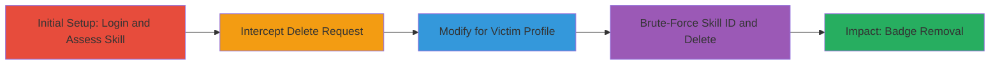

# IDOR in LinkedIn Skill Assessment Deletion to Remove User Badges

Multi-stage attack chain demonstrating exploitation of an Insecure Direct Object Reference (IDOR) in LinkedIn's skill assessment deletion endpoint. An authenticated attacker can delete verified skill assessments and badges from any other user's profile by intercepting a legitimate delete request, replacing the profile ID with the victim's UUID (sourced from their public profile), and brute-forcing the skill ID. This undermines professional credentials and can damage reputations.

## Chain Metrics Dashboard

| Metric | Value |
|--------|-------|
| Chain Status | Unverified |
| Total Steps | 4 |
| Execution Time | ~10 minutes |
| Skill Level | Intermediate |
| Complexity | Medium |
| Impact Level | High |

## Attack Flow Visualization

## Prerequisites & Requirements

### Required Tools

- [[tools/Burp-Suite]]

### Target Environment

- LinkedIn web platform (https://www.linkedin.com)
- No specific ports or services beyond standard HTTPS (443)
- Attacker requires a valid LinkedIn account with assessment access

### Initial Access Requirements

- Authenticated LinkedIn session
- Network access to LinkedIn (no VPN restrictions)
- Victim's public profile UUID (extractable from page source)

## Detailed Attack Procedures

### Step 1: Prepare LinkedIn Skill Assessment Setup
procedure: [[procedures/Prepare-LinkedIn-Skill-Assessment-Setup]]

**Objective**: Establish a legitimate skill assessment to generate a deletable result, enabling request interception.

**Instructions**: Log in to LinkedIn, complete an assessment (e.g., HTML or PowerPoint), and navigate to the assessments hub to access results.

**Expected Output**: Visible skill assessment result or retake option on the hub page.

**Success Indicators**:
- Successful login and assessment completion
- Access to delete option via kebab menu

### Step 2: Intercept LinkedIn Delete Request
procedure: [[procedures/Intercept-LinkedIn-Delete-Request]]

**Objective**: Capture the legitimate DELETE request for your own assessment using a proxy tool.

**Instructions**: Configure Burp Suite as a proxy, initiate deletion of your own result, and intercept the request to the endpoint /voyager/api/voyagerAssessmentsDashSkillAssessmentAttemptReports/.

**Expected Output**: Intercepted HTTP DELETE request with your profile UUID and skill ID.

**Success Indicators**:
- Request captured in Burp Suite
- Endpoint path visible with URN parameters

### Step 3: Modify Request with Victim Profile
procedure: [[procedures/Modify-Request-with-Victim-Profile]]

**Objective**: Alter the intercepted request to target the victim's profile by replacing the fsd_profile UUID.

**Instructions**: Extract the victim's UUID from their public profile page source (search for "profileUrn" or similar), replace the parameter in the request path, and forward to Burp Intruder for further modification.

**Expected Output**: Modified request ready for skill ID brute-forcing, targeting victim's profile.

**Success Indicators**:
- Victim UUID successfully inserted
- No immediate errors on request forwarding

### Step 4: Brute-Force Skill ID for Deletion
procedure: [[procedures/Brute-Force-Skill-ID-for-Deletion]]

**Objective**: Identify and delete the victim's specific skill assessment by brute-forcing the skill ID in the request.

**Instructions**: In Burp Intruder, set the skill ID position as payload, use a numeric list (e.g., 1-1000) with 3 requests per second, and send. A successful response (HTTP 200) indicates deletion.

**Expected Output**: HTTP 200 response confirming deletion; victim's profile updated without the badge.

**Success Indicators**:
- Successful HTTP response for matching skill ID
- Verification on victim's public profile shows removed badge

## Attack Chain Summary

### Key Achievements

1. Bypassed authorization to access any user's skill assessments
2. Deleted verified badges, impacting professional credibility
3. Demonstrated scalable attack via brute-force on skill IDs

## Technique & Tactic Coverage

### MITRE ATT&CK Techniques

- [[Valid Accounts]]
- [[Exploit Public-Facing Application]]
- [[Data Destruction]]

### MITRE ATT&CK Tactics

- [[Initial Access]]
- [[Impact]]

---

*Last updated: 2023-10-01T00:00:00Z*
