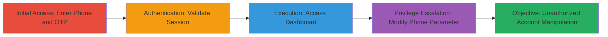

# IDOR in MTN Offers Dashboard for Horizontal Privilege Escalation

Multi-stage attack chain demonstrating a complete attack workflow exploiting insecure direct object reference (IDOR) in the MTN Nigeria offers dashboard. An attacker authenticates with a valid phone number, accesses the dashboard, and manipulates the 'phone' URL parameter to gain unauthorized access to any other MTN user's account. This enables viewing sensitive offer data, subscribing to data/airtime bundles on behalf of victims, and sending impersonated messages, leading to fraud and account compromise.

## Chain Metrics Dashboard

| Metric | Value |
|--------|-------|
| Chain Status | Unverified |
| Total Steps | 4 |
| Execution Time | ~5 minutes |
| Skill Level | Intermediate |
| Complexity | Medium |
| Impact Level | High |

## Attack Flow Visualization

## Prerequisites & Requirements

### Required Tools

- Web browser (e.g., Chrome or Firefox with developer tools for URL manipulation)

### Target Environment

- Web platform
- MTN Nigeria telecom services
- SMS service for OTP delivery
- No specific ports required; operates over HTTPS

### Initial Access Requirements

- Valid MTN Nigerian phone number for initial authentication
- Ability to receive SMS (physical SIM or virtual number service)
- Network access to https://mtn.ng

## Detailed Attack Procedures

### Step 1: Navigate to Offers Page and Enter Phone Number
procedure: [[procedures/Navigate-and-Enter-Phone-Number-for-OTP]]

**Objective**: Initiate the authentication process by submitting a valid phone number to trigger OTP delivery.

**Instructions**: Open a web browser and visit the MTN offers page. Locate the input form for phone number entry and submit a valid Nigerian MTN number (e.g., starting with 23481 or similar). Click the Submit button to send the request for OTP via SMS.

**Expected Output**: The page redirects to an OTP validation screen, and an SMS containing the one-time password is received on the specified phone number.

**Success Indicators**:
- OTP SMS received
- Validation page loads without errors

### Step 2: Enter and Validate the OTP
procedure: [[procedures/Validate-OTP-to-Authenticate]]

**Objective**: Complete authentication by entering the received OTP to establish a valid session.

**Instructions**: On the OTP validation page, input the 6-digit code received via SMS into the provided field. Click the Validate button to submit the OTP for verification.

**Expected Output**: Successful authentication redirects to the personalized offers dashboard, with the URL including the authenticated phone number (e.g., https://mtn.ng/offers/list?phone=2348160817474).

**Success Indicators**:
- Dashboard loads with user-specific offers
- No authentication errors displayed

### Step 3: Access the Offers Dashboard
procedure: [[procedures/Access-Offers-Dashboard]]

**Objective**: Load the authenticated user's dashboard to prepare for parameter manipulation.

**Instructions**: Upon successful OTP validation, the browser automatically navigates to the offers list page. Verify that the page displays available offers tailored to the authenticated phone number.

**Expected Output**: A dashboard interface showing offers, bundles, and account-related options for the logged-in number.

**Success Indicators**:
- URL contains the 'phone' parameter matching the authenticated number
- Personalized content visible (e.g., current balance or offers)

### Step 4: Modify the Phone Parameter to Escalate Privileges
procedure: [[procedures/Modify-Phone-Parameter-for-IDOR-Exploitation]]

**Objective**: Exploit the IDOR vulnerability by altering the phone parameter to access another user's account without re-authentication.

**Instructions**: In the browser's address bar, edit the 'phone' query parameter to a target victim's MTN phone number (e.g., change to ?phone=2349138557692). Press Enter to reload the page or navigate to the modified URL.

**Expected Output**: The dashboard reloads with content for the target phone number, allowing viewing of offers, subscription to services, and sending messages as if authenticated for that account.

**Success Indicators**:
- Access to target account's offers without OTP prompt
- Ability to perform actions like subscribing bundles on the victim's behalf

## Attack Chain Summary

### Key Achievements

1. Successful authentication to MTN dashboard using minimal credentials (phone + OTP)
2. Bypassing access controls via URL parameter manipulation
3. Unauthorized manipulation of victim accounts, enabling fraud

## Technique & Tactic Coverage

### MITRE ATT&CK Techniques

- [[Exploit Public-Facing Application]] Exploit Public-Facing Application
- [[Exploitation for Privilege Escalation]] Exploitation for Privilege Escalation

### MITRE ATT&CK Tactics

- [[Initial Access]] Initial Access
- [[Privilege Escalation]] Privilege Escalation

---
*Last updated: 2023-10-01T00:00:00Z*
