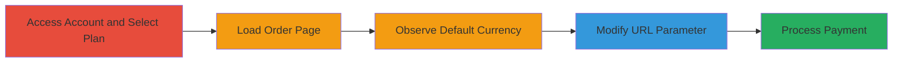

---
tags:
  - idor
  - web
  - payment-manipulation
  - business-logic
  - currency-bypass
type: attack_chain
tools: []
tactics:
  - '[[Initial Access]]'
verified: false
platforms:
  - Web
submitted: true
complexity: low
created_at: '2023-10-01T00:00:00Z'
procedures:
  - '[[procedures/Navigate-to-MailPoet-Order-Page]]'
  - '[[procedures/Manipulate-Currency-Parameter-via-IDOR]]'
  - '[[procedures/Complete-Purchase-with-Altered-Currency]]'
step_count: 5
techniques:
  - '[[Exploit Public-Facing Application]]'
updated_at: '2025-12-14T17:25:23.585Z'
description: >-
  Multi-stage attack exploiting an Insecure Direct Object Reference (IDOR) in
  MailPoet's subscription order process to unauthorizedly change the currency
  from EUR to USD, allowing payment of the same numerical amount but lower
  real-world value due to exchange rates.
skill_level: beginner
impact_level: medium
id: 51b6a507-d7b5-439b-bb61-2f98c9f31645
validated: true
mitre_tactics:
  - '[[Initial Access]]'
mitre_techniques:
  - '[[Exploit Public-Facing Application]]'
---
# IDOR in MailPoet Order Creation to Manipulate Currency for Reduced Payment

Multi-stage attack chain demonstrating a complete attack workflow exploiting an IDOR vulnerability in the MailPoet subscription order process. An authenticated user can append a 'cur' parameter to the order URL to switch from EUR to USD without server-side validation, paying the same numerical amount (e.g., 33600) but benefiting from a weaker currency's lower real value, resulting in approximately $107 less revenue for the company per transaction based on exchange rates.

## Chain Metrics Dashboard

| Metric | Value |
|--------|-------|
| Chain Status | Unverified |
| Total Steps | 5 |
| Execution Time | ~5 minutes |
| Skill Level | Beginner |
| Complexity | Low |
| Impact Level | Medium |

## Attack Flow Visualization

## Prerequisites & Requirements

### Required Tools

- Web browser (e.g., Chrome, Firefox)

### Target Environment

- Web platform
- MailPoet account portal at https://account.mailpoet.com/
- Active internet connection
- No specific ports or services beyond standard HTTPS (443)

### Initial Access Requirements

- Valid authenticated MailPoet user account
- No elevated privileges needed; standard user access suffices
- Direct network access to the MailPoet domain

## Detailed Attack Procedures

### Step 1: Access Account and Select Plan
procedure: [[procedures/Navigate-to-MailPoet-Order-Page]]

**Objective**: Gain initial access to the subscription plans and load the order creation interface.

**Instructions**: Log in to the MailPoet account portal and navigate to the subscription section to select a plan, preparing the order URL for manipulation.

**Expected Output**: Order page loaded with default EUR pricing displayed.

**Success Indicators**:
- Account dashboard accessible
- Plan selection leads to order URL (e.g., https://account.mailpoet.com/orders/new?p=214)

### Step 2: Load Specific Order Page
procedure: [[procedures/Navigate-to-MailPoet-Order-Page]]

**Objective**: Target a specific subscription plan to initiate the order process.

**Instructions**: Use the plan ID in the URL to directly access the order creation page for the desired subscription.

**Expected Output**: Page shows plan details with default currency set to EUR.

**Success Indicators**:
- URL loads without errors
- Plan ID (e.g., 214) is recognized and pricing is visible

### Step 3: Observe Default Currency
procedure: [[procedures/Navigate-to-MailPoet-Order-Page]]

**Objective**: Confirm the default pricing in EUR to calculate potential savings from currency switch.

**Instructions**: Inspect the order page to note the numerical amount and currency (e.g., 33600€).

**Expected Output**: Pricing displayed as 33600€ in EUR.

**Success Indicators**:
- Default currency confirmed as EUR
- Numerical amount noted for comparison

### Step 4: Modify URL Parameter
procedure: [[procedures/Manipulate-Currency-Parameter-via-IDOR]]

**Objective**: Exploit the IDOR by altering the 'cur' parameter to switch to USD without validation.

**Instructions**: Append '&cur=usd' to the existing order URL in the browser address bar.

**Expected Output**: Page refreshes or updates to show 33600$ in USD.

**Success Indicators**:
- Currency changes to USD
- Numerical amount remains the same (33600)

### Step 5: Process Payment
procedure: [[procedures/Complete-Purchase-with-Altered-Currency]]

**Objective**: Finalize the transaction to realize the reduced real-world payment value.

**Instructions**: Proceed through the payment flow with the modified currency, completing the purchase.

**Expected Output**: Order processed successfully for 33600 USD, resulting in lower effective payment due to exchange rates.

**Success Indicators**:
- Payment confirmation received
- Company incurs ~$107 loss per transaction (exchange rate dependent)

## Attack Chain Summary

### Key Achievements

1. Unauthorized currency switch from EUR to USD via IDOR
2. Payment of identical numerical amount but reduced real value
3. Demonstrated business logic flaw leading to revenue loss

## Technique & Tactic Coverage

### MITRE ATT&CK Techniques

- [[Exploit Public-Facing Application]]

### MITRE ATT&CK Tactics

- [[Initial Access]]

---

*Last updated: 2023-10-01T00:00:00Z*
