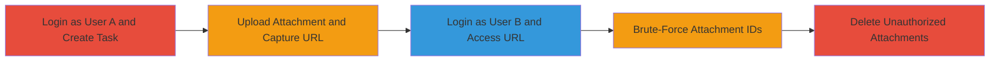

---

# IDOR in Nextcloud Deck Attachments for Unauthorized File Access and Deletion

Multi-stage attack chain demonstrating a complete attack workflow exploiting IDOR in the Nextcloud Deck app, where attachments use sequential numeric IDs without access controls, enabling unauthorized viewing, downloading, enumeration, and deletion of other users' files.

## Chain Metrics Dashboard

| Metric | Value |
|--------|-------|
| Chain Status | Unverified |
| Total Steps | 5 |
| Execution Time | ~10 minutes |
| Skill Level | Intermediate |
| Complexity | Medium |
| Impact Level | High |

## Attack Flow Visualization

## Prerequisites & Requirements

### Required Tools

- Web browser (e.g., Firefox or Chrome with developer tools)
- Optional: [[tools/curl]] for scripted access

### Target Environment

- Nextcloud instance with Deck app enabled (e.g., us.cloudamo.com)
- Web platform access via HTTPS
- No specific ports required beyond standard 443

### Initial Access Requirements

- Valid credentials for at least two user accounts (User A for upload, User B for unauthorized access)
- Network access to the Nextcloud server
- No prior elevated access needed; any authenticated user can exploit

## Detailed Attack Procedures

### Step 1: Login as User A and Create Task
procedure: [[procedures/Create-Task-and-Upload-Attachment-in-Nextcloud-Deck]]

**Objective**: Set up a task in the Deck app and prepare for attachment upload to obtain the vulnerable URL structure.

**Instructions**: Log in to the Nextcloud instance as User A, navigate to the Deck app, and create a new task. This establishes the card ID needed for the attachment URL.

**Expected Output**: A new task (card) created, visible in the Deck interface with a unique card ID (e.g., 8420).

**Success Indicators**:
- Task creation confirmation in UI
- Card ID visible in browser developer tools or URL

### Step 2: Upload Attachment and Capture URL
procedure: [[procedures/Create-Task-and-Upload-Attachment-in-Nextcloud-Deck]]

**Objective**: Upload a file to the task and intercept the attachment URL to identify the sequential ID format.

**Instructions**: In the task view, upload a test file (e.g., a sensitive document). Use browser developer tools (Network tab) to capture the POST request or resulting GET URL for the attachment, which follows /apps/deck/cards/{card_id}/attachment/{attachment_id}.

**Expected Output**: Uploaded file attached to task; captured URL like /apps/deck/cards/8420/attachment/30.

**Success Indicators**:
- File upload success message
- URL captured with numeric attachment ID

### Step 3: Login as User B and Access URL
procedure: [[procedures/Access-Unauthorized-Attachment-as-Another-User]]

**Objective**: Demonstrate unauthorized access by viewing/downloading the attachment from another user's session.

**Instructions**: Log out of User A, log in as User B (no shared boards or tasks), and directly navigate to the captured URL from Step 2. The file should load without permission errors.

**Expected Output**: Attachment file displayed or downloadable, despite no ownership.

**Success Indicators**:
- File accessible without access denied error
- Content matches uploaded file

### Step 4: Brute-Force Attachment IDs
procedure: [[procedures/Brute-Force-Attachment-IDs-for-Enumeration]]

**Objective**: Enumerate multiple attachments across users by iterating sequential IDs, exploiting low entropy.

**Instructions**: Using the known card ID, modify the attachment ID in the URL (e.g., start from 1 and increment: /apps/deck/cards/8420/attachment/1, /apps/deck/cards/8420/attachment/2, etc.). Script this with a loop in a browser console or use curl to check for valid responses (HTTP 200).

**Expected Output**: List of accessible attachments from various users, including sensitive files.

**Success Indicators**:
- Multiple files retrieved
- No rate limiting observed

### Step 5: Delete Unauthorized Attachments
procedure: [[procedures/Delete-Unauthorized-Attachments-via-IDOR]]

**Objective**: Tamper with data integrity by deleting other users' attachments using the same IDOR.

**Instructions**: From User B's session, send a DELETE request to the attachment endpoint (e.g., via browser tools or curl POST to delete action) using the known URL structure.

**Expected Output**: Attachment removed from the original task; owner loses access.

**Success Indicators**:
- 200 OK response on delete
- File no longer accessible from original account

## Attack Chain Summary

### Key Achievements

1. Unauthorized access to sensitive attachments, leading to data leakage.
2. Enumeration of all attachments via predictable IDs, enabling mass exfiltration.
3. Integrity violation through deletion of others' files, denying availability.

## Technique & Tactic Coverage

### MITRE ATT&CK Techniques

- [[Exploit Public-Facing Application]] Exploit Public-Facing Application
- [[Account Discovery]] Account Discovery

### MITRE ATT&CK Tactics

- [[Discovery]] Discovery
- [[Collection]] Collection

---

*Last updated: 2023-10-01T12:00:00Z*
