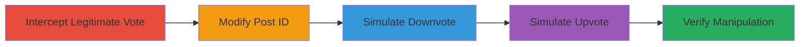

# IDOR in Reddit Vote API to Manipulate Upvote Percentage on Private Subreddit Posts

Multi-stage attack chain demonstrating exploitation of improper access control in Reddit's /api/vote API endpoint, allowing unauthorized manipulation of post upvote percentages in private or restricted subreddits.

## Chain Metrics Dashboard

| Metric | Value |
|--------|-------|
| Chain Status | Unverified |
| Total Steps | 4 |
| Execution Time | ~5 minutes |
| Skill Level | Intermediate |
| Complexity | Medium |
| Impact Level | Medium |

## Attack Flow Visualization

## Prerequisites & Requirements

### Required Tools

- [[tools/Burp-Suite]]

### Target Environment

- Reddit web platform
- Access to a Reddit account (attacker must be logged in)
- Knowledge of target post ID in a private subreddit or one where attacker is banned

### Initial Access Requirements

- Valid Reddit session cookies for API calls
- Network access to reddit.com
- Burp Suite proxy configured in browser

## Detailed Attack Procedures

### Step 1: Intercept Legitimate Vote Request
procedure: [[procedures/Intercept-Legitimate-Reddit-Vote-Request]]

**Objective**: Capture a legitimate /api/vote request to use as a template for modification.

**Instructions**: Configure Burp Suite as a proxy and perform a normal upvote or downvote on a public post to intercept the request.

**Expected Output**: HTTP POST request to https://www.reddit.com/api/vote with parameters id and dir captured in Burp.

**Success Indicators**:
- Request intercepted successfully in Burp Proxy
- Request details visible, including JSON body with id and dir

### Step 2: Modify Post ID for Private Subreddit
procedure: [[procedures/Modify-Post-ID-for-Private-Subreddit]]

**Objective**: Alter the post ID in the intercepted request to target a post in a private subreddit.

**Instructions**: Send the intercepted request to Burp Repeater and replace the id parameter with the target private post ID.

**Expected Output**: Modified request ready for sending, targeting the unauthorized post.

**Success Indicators**:
- Post ID updated in request body
- No immediate errors on request preparation

### Step 3: Simulate Downvote to Decrease Upvote Percentage
procedure: [[procedures/Simulate-Downvote-to-Decrease-Upvote-Percentage]]

**Objective**: Send a downvote request to reduce the displayed upvote percentage.

**Instructions**: In Burp Repeater, set dir to -1 and forward the request.

**Expected Output**: Server responds with 200 OK; upvote percentage on target post decreases (e.g., from 100% to 99%).

**Success Indicators**:
- HTTP 200 response
- Upvote ratio changes upon refreshing the post page

### Step 4: Simulate Upvote to Further Alter Upvote Percentage
procedure: [[procedures/Simulate-Upvote-to-Further-Alter-Upvote-Percentage]]

**Objective**: Follow up with an upvote to demonstrate further manipulation of the percentage.

**Instructions**: Modify dir to 1 in the request and resend.

**Expected Output**: Upvote percentage adjusts again (e.g., from 99% to 67%).

**Success Indicators**:
- Additional change in upvote ratio
- Actual vote counts unchanged, only display affected

## Attack Chain Summary

### Key Achievements

1. Unauthorized access to private subreddit post voting
2. Manipulation of upvote percentage without membership or access
3. Demonstration of IDOR impact on post integrity and visibility

## Technique & Tactic Coverage

### MITRE ATT&CK Techniques

- [[Exploit Public-Facing Application]]

### MITRE ATT&CK Tactics

- [[Initial Access]]

---
*Last updated: 2023-10-01T00:00:00Z*
