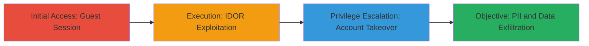

# IDOR in Registration Endpoint Leading to Account Takeover and PII Disclosure

Multi-stage attack chain demonstrating a complete attack workflow exploiting an IDOR vulnerability in theperfumeshop.com's registration process to achieve account takeover.

## Chain Metrics Dashboard

| Metric | Value |
|--------|-------|
| Chain Status | Unverified |
| Total Steps | 3 |
| Execution Time | ~5 minutes |
| Skill Level | Intermediate |
| Complexity | Medium |
| Impact Level | High |

## Attack Flow Visualization



## Prerequisites & Requirements

### Required Tools

- [[tools/Burp-Suite]]

### Target Environment

- Web platform (HTTPS)
- No authentication required for initial access
- Access to victim's order ID (e.g., via social engineering or prior reconnaissance)

### Initial Access Requirements

- No credentials needed
- Direct network access to theperfumeshop.com
- No prior access required

## Detailed Attack Procedures

### Step 1: Initiate Guest Session and Prepare Request
procedure: [[procedures/Initiate-Guest-Session-and-Prepare-Request]]

**Objective**: Establish an unauthenticated session, add a product to the basket, and extract necessary CSRF token and cookies for subsequent requests.

**Instructions**: Navigate to the target website in a browser and use Burp Suite to intercept traffic. Select any product and add it to the basket to initiate the guest checkout flow. Capture the CSRF token and session cookies from the intercepted requests.

**Expected Output**: Valid CSRF token and session cookies available for use in POST requests.

**Success Indicators**:
- Product successfully added to basket
- CSRF token and cookies extracted without errors

### Step 2: Exploit IDOR to Associate New Account with Victim's Order
procedure: [[procedures/Exploit-IDOR-to-Associate-New-Account-with-Victims-Order]]

**Objective**: Submit a registration request using the victim's order ID to link a new account to the victim's data, bypassing authorization checks.

**Instructions**: Obtain a target victim's order ID (e.g., 664448593). Use Burp Suite or [[commands/curl-post-register-fororder]] to send a POST request to /register/forOrder with the victim's orderCode, a random unregistered email, password, date of birth, and the captured CSRF token. Include parameters like associateCard=yes and termsCheck=1.

```bash
curl -X POST 'https://theperfumeshop.com/register/forOrder' \
  -H 'Cookie: [session-cookies]' \
  -H 'X-CSRF-Token: [csrf-token]' \
  -d 'orderCode=664448593&email=random@example.com&associateCard=yes&termsCheck=1&dateOfBirth.day=1&dateOfBirth.month=1&dateOfBirth.year=1990&pwd=Password123&checkPwd=Password123'
```

**Expected Output**: Response with 'Location: [redacted]serverError' indicating successful association (despite the error code, the backend links the account).

**Success Indicators**:
- HTTP response indicates processing success
- No validation error on orderCode

### Step 3: Login and Access Victim's Account Data
procedure: [[procedures/Login-and-Access-Victims-Account-Data]]

**Objective**: Log in with the newly created credentials to access and manage the victim's full account data, including PII, orders, and payments.

**Instructions**: Navigate to the login page and submit credentials using the random email and password from the previous step. Once logged in, browse account sections for personal info, addresses, orders, and saved payments.

**Expected Output**: Dashboard displaying victim's full name, address, phone, order history, and payment details.

**Success Indicators**:
- Successful login without errors
- Victim's data visible in account sections
- Ability to view/delete orders

## Attack Chain Summary

### Key Achievements

1. Bypassed authorization to associate arbitrary order IDs with new accounts
2. Achieved full account takeover without original credentials
3. Disclosed sensitive PII, orders, and payment information

## Technique & Tactic Coverage

### MITRE ATT&CK Techniques

- [[Exploit Public-Facing Application]]
- [[Account Discovery]]
- [[Unsecured Credentials]]

### MITRE ATT&CK Tactics

- [[Initial Access]]
- [[Discovery]]
- [[Collection]]

---

*Last updated: 2023-10-01T00:00:00Z*
