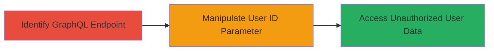

---
id: a1b2c3d4-e5f6-7890-abcd-ef1234567890
name: IDOR in Semrush Content Outline Builder via GraphQL User ID Manipulation
type: attack_chain
description: An attack chain exploiting an Insecure Direct Object Reference (IDOR) vulnerability in Semrush's Content Outline Builder, allowing unauthorized access to other users' sensitive information through GraphQL query manipulation.
verified: false
submitted: false
step_count: 2
created_at: 2023-10-01T00:00:00Z
updated_at: 2023-10-01T00:00:00Z
procedures: [[procedures/Identify-GraphQL-Endpoint-in-Content-Outline-Builder]], [[procedures/Manipulate-User-ID-for-Unauthorized-Access]]
techniques: [[Account Discovery]], [[Exploit Public-Facing Application]]
tactics: [[Discovery]]
tags: idor, graphql, unauthorized-access, web-vulnerability
platforms: Web
tools: []
---

# IDOR in Semrush Content Outline Builder via GraphQL User ID Manipulation

Multi-stage attack chain demonstrating a complete attack workflow targeting Semrush's Content Outline Builder product via an IDOR vulnerability in GraphQL requests.

## Chain Metrics Dashboard

| Metric | Value |
|--------|-------|
| Chain Status | Unverified |
| Total Steps | 2 |
| Execution Time | ~5 minutes |
| Skill Level | Intermediate |
| Complexity | Medium |
| Impact Level | High |

## Attack Flow Visualization

## Prerequisites & Requirements

### Required Tools

- Browser Developer Tools or [[tools/Burp-Suite]] for inspecting and modifying requests

### Target Environment

- Web platform
- GraphQL API endpoint in Semrush Content Outline Builder
- No specific ports required; standard HTTPS (443)

### Initial Access Requirements

- Valid user account in Semrush Content Outline Builder (authenticated session)
- Network access to Semrush's web application
- No prior elevated access needed

## Detailed Attack Procedures

### Step 1: Identify GraphQL Endpoint
procedure: [[procedures/Identify-GraphQL-Endpoint-in-Content-Outline-Builder]]

**Objective**: Locate and observe the GraphQL endpoint handling user data requests in the Content Outline Builder to understand the request structure.

**Instructions**: Log in to the Semrush Content Outline Builder with a valid account. Use browser developer tools to monitor network traffic while interacting with user-related features, such as viewing your own profile or content outlines. Identify the GraphQL query that fetches user information, noting the endpoint URL (typically something like `/graphql` or a specific API path) and the structure of the query, including variables like `userId`.

**Expected Output**: Captured GraphQL request showing the query mutation or query with user data fields, including the `userId` parameter set to your own ID.

**Success Indicators**:
- GraphQL endpoint URL identified
- Request payload observed, confirming user ID parameter presence

### Step 2: Manipulate User ID for Unauthorized Access
procedure: [[procedures/Manipulate-User-ID-for-Unauthorized-Access]]

**Objective**: Alter the user ID in the GraphQL request to reference another user's ID, bypassing authorization checks to retrieve sensitive information.

**Instructions**: Using the identified GraphQL endpoint from Step 1, intercept the request (e.g., via Burp Suite proxy). Modify the `userId` variable in the query payload to a different value, such as an adjacent ID (e.g., if your ID is 123, try 124). Replay the modified request to the server. Parse the response for additional user details like email, content outlines, or other sensitive data.

**Expected Output**: GraphQL response containing data for the targeted user, such as profile information or Content Outline Builder specifics, without authentication errors.

**Success Indicators**:
- Response includes data for a different user
- No authorization denial; sensitive info revealed

## Attack Chain Summary

### Key Achievements

1. Successful identification of vulnerable GraphQL endpoint in Semrush Content Outline Builder
2. Unauthorized access to other users' information via IDOR manipulation
3. Demonstration of impact on user privacy without evidence of external exploitation

## Technique & Tactic Coverage

### MITRE ATT&CK Techniques

- [[Account Discovery]]
- [[Exploit Public-Facing Application]]

### MITRE ATT&CK Tactics

- [[Discovery]]

---
*Last updated: 2023-10-01T00:00:00Z*
