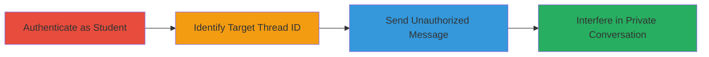

# IDOR in Sensei LMS to Send Unauthorized Messages in Private Threads

Multi-stage attack chain demonstrating exploitation of an IDOR vulnerability in the Sensei LMS WordPress plugin's private messaging feature, allowing any authenticated student to interfere in other students' private conversations with teachers by sending unauthorized messages.

## Chain Metrics Dashboard

| Metric | Value |
|--------|-------|
| Chain Status | Unverified |
| Total Steps | 3 |
| Execution Time | ~5 minutes |
| Skill Level | Intermediate |
| Complexity | Medium |
| Impact Level | High |

## Attack Flow Visualization



## Prerequisites & Requirements

### Required Tools

- Browser or curl for HTTP requests

### Target Environment

- WordPress site with Sensei LMS plugin version < 4.5.2
- Web platform accessible via HTTP/HTTPS
- No specific ports beyond standard 80/443

### Initial Access Requirements

- Valid student credentials for authentication
- Network access to the WordPress site
- No prior elevated access needed; exploits post-authentication flaw

## Detailed Attack Procedures

### Step 1: Authenticate as Student
procedure: [[procedures/Authenticate-as-Student-User-in-WordPress]]

**Objective**: Gain authenticated access to the Sensei LMS messaging feature as a student user.

**Instructions**: Log in to the WordPress site using student credentials via the standard login form. This establishes a session cookie necessary for subsequent authenticated requests.

**Expected Output**: Successful login redirect to the dashboard, with session cookies set (e.g., wordpress_logged_in_*).

**Success Indicators**:
- Access to student dashboard
- Ability to view own private messages

### Step 2: Identify Target Private Message Thread ID
procedure: [[procedures/Identify-Target-Private-Message-Thread-ID]]

**Objective**: Discover or brute-force the numeric ID of a target private message thread between another student and the teacher.

**Instructions**: Observe that private threads use sequential numeric IDs starting from low numbers (e.g., 111). Use browser developer tools or intercept requests to identify patterns, then brute-force by testing sequential IDs in a simple loop with [[commands/test-thread-id-access]] or manual trial.

**Expected Output**: Identification of a valid thread ID that accepts posts without errors.

**Success Indicators**:
- Valid thread ID found (e.g., via successful POST response or error patterns)
- Confirmation that the ID corresponds to a private thread

### Step 3: Exploit IDOR to Send Unauthorized Message
procedure: [[procedures/Exploit-IDOR-to-Send-Unauthorized-Message-via-POST]]

**Objective**: Send a message to the target private thread by modifying the comment_post_ID parameter, bypassing authorization checks.

**Instructions**: With an active session, craft and send a POST request to /wp-comments-post.php using [[commands/exploit-sensei-lms-idor-post]] with the target thread ID. Include arbitrary comment text and set comment_parent=0 for a new reply.

```bash
curl -X POST -b "wordpress_logged_in_*=session_cookie" https://target.com/wp-comments-post.php -d "comment=Unauthorized message&submit=Post Comment&comment_post_ID=111&comment_parent=0"
```

**Expected Output**: HTTP 302 redirect or success response indicating the comment was posted to the thread.

**Success Indicators**:
- Message appears in the target thread (verifiable by teacher or owner)
- No authorization error returned

## Attack Chain Summary

### Key Achievements

1. Authenticated access as a low-privilege student
2. Discovery of target private thread IDs via brute-force
3. Successful injection of unauthorized messages, enabling impersonation or disruption

## Technique & Tactic Coverage

### MITRE ATT&CK Techniques

- [[Valid Accounts]] Valid Accounts
- [[Exploit Public-Facing Application]] Exploit Public-Facing Application

### MITRE ATT&CK Tactics

- [[Lateral Movement]] Lateral Movement

---
*Last updated: 2023-10-01T12:00:00Z*
