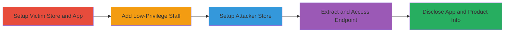

# IDOR in Shopify Digital Downloads App for Unauthorized App and Product Disclosure

Multi-stage attack chain demonstrating a complete information disclosure workflow via Insecure Direct Object Reference (IDOR) in Shopify's Digital Downloads app. A low-privilege staff member can access a product-specific endpoint on a store they lack permissions for, revealing whether the app is installed and which products have attachments configured. This violates access controls by leaking sensitive store configuration details, such as app presence and product titles, potentially aiding further reconnaissance or targeted attacks.

## Chain Metrics Dashboard

| Metric | Value |
|--------|-------|
| Chain Status | Unverified |
| Total Steps | 4 |
| Execution Time | ~30 minutes |
| Skill Level | Intermediate |
| Complexity | Medium |
| Impact Level | Medium |

## Attack Flow Visualization

## Prerequisites & Requirements

### Required Tools

- Web browser (e.g., Chrome or Firefox for manual navigation and inspection)

### Target Environment

- Shopify platform with admin access
- Digital Downloads app available in Shopify App Store
- No specific ports or services beyond standard web access (HTTPS/443)

### Initial Access Requirements

- Valid Shopify account credentials for creating stores
- Ability to invite staff members
- Network access to Shopify admin interfaces and app endpoints

## Detailed Attack Procedures

### Step 1: Setup Victim Store and Configure App
procedure: [[procedures/Setup-Victim-Shopify-Store-with-Digital-Downloads-App]]

**Objective**: Create a test store, add products, install the Digital Downloads app, and configure a product with an attachment to simulate a vulnerable setup.

**Instructions**: Log in as the store owner and use the Shopify admin UI to create products, install the app from the Shopify App Store, and attach files to a specific product. This establishes the target for disclosure.

**Expected Output**: App installed, one product (e.g., 'Tt') configured with an attachment, product ID obtainable (e.g., 3785077260000).

**Success Indicators**:
- Digital Downloads app dashboard accessible and product attachment visible
- Product ID extractable from app interface or store page source

### Step 2: Add Low-Privilege Staff Member
procedure: [[procedures/Add-Low-Privilege-Staff-Member-to-Victim-Store]]

**Objective**: Invite a secondary account as a staff member with zero permissions to the victim store, enabling simulation of unauthorized access.

**Instructions**: From the victim store admin, navigate to Settings > Users and permissions, invite the attacker account as staff, and assign no permissions.

**Expected Output**: Invitee receives an email and can log in to the store dashboard but lacks any action capabilities.

**Success Indicators**:
- Staff member listed in admin with 'No access' permissions
- Login successful but UI restricted

### Step 3: Setup Attacker's Independent Store
procedure: [[procedures/Setup-Attackers-Independent-Shopify-Store]]

**Objective**: Create a separate store under the attacker's account and install the Digital Downloads app to establish a session context for accessing external endpoints.

**Instructions**: Log in as the attacker, create a new store (e.g., test100.myshopify.com), and install the Digital Downloads app without adding products.

**Expected Output**: New store active, app installed and dashboard accessible.

**Success Indicators**:
- Attacker logged into independent store
- App installation confirmed in store apps list

### Step 4: Extract and Access Product Disclosure Endpoint
procedure: [[procedures/Extract-and-Access-Product-Disclosure-Endpoint]]

**Objective**: Obtain the product-specific URL from the victim store's app and access it under the attacker's session to disclose the product title and app presence.

**Instructions**: In the victim store's app dashboard, right-click the configured product to copy its URL (e.g., https://delivery.shopifyapps.com/products/3785077260000). Switch to the attacker's browser session and navigate to this URL. Inspect the page title for disclosure.

**Expected Output**: Page loads with title 'Digital Downloads/Tt' for attached products, or just 'Digital Downloads' for non-attached/invalid IDs, confirming leakage.

**Success Indicators**:
- Product title visible in page title despite no permissions
- Difference in titles between attached and non-attached products verifies selective disclosure

## Attack Chain Summary

### Key Achievements

1. Simulated unauthorized access to app configuration across stores using low-privilege credentials
2. Disclosed product titles and app installation status without ownership validation
3. Demonstrated IDOR by direct endpoint access bypassing Shopify's permission model

## Technique & Tactic Coverage

### MITRE ATT&CK Techniques

- [[Exploit Public-Facing Application]] Exploit Public-Facing Application
- [[Account Discovery]] Account Discovery

### MITRE ATT&CK Tactics

- [[Discovery]] Discovery

---
*Last updated: 2023-10-01T00:00:00Z*
