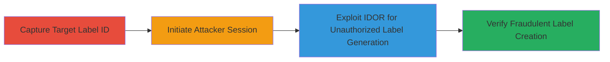

# IDOR in Shopify Shipping Labels Allowing Unauthorized Label Generation for Other Stores

Multi-stage attack chain demonstrating exploitation of an IDOR vulnerability in Shopify's mailbox.shopifycloud.com service to generate shipping labels for another store's orders.

## Chain Metrics Dashboard

| Metric | Value |
|--------|-------|
| Chain Status | Unverified |
| Total Steps | 3 |
| Execution Time | ~10 minutes |
| Skill Level | Intermediate |
| Complexity | Medium |
| Impact Level | High |

## Attack Flow Visualization

## Prerequisites & Requirements

### Required Tools

- [[tools/curl]]
- [[tools/Web-Browser]]

### Target Environment

- Shopify admin panel access for target and attacker stores
- Unfulfilled order in the target store with initiated shipping label creation
- Network access to mailbox.shopifycloud.com

### Initial Access Requirements

- Valid shop owner credentials for both target (victim) and attacker stores
- Ability to intercept and modify GraphQL requests (e.g., via browser dev tools or curl)

## Detailed Attack Procedures

### Step 1: Capture Target Shipping Label ID
procedure: [[procedures/Capture-Target-Shipping-Label-ID]]

**Objective**: Access the target store's unfulfilled order, initiate shipping label creation, and extract the shipping label ID for later exploitation.

**Instructions**: Log in to the target Shopify admin, navigate to an unfulfilled order, and trigger the shipping label creation process to capture the GraphQL request. Void the label if created, then re-initiate to obtain the ID from the URL.

**Expected Output**: GraphQL object ID like gid://shopify/ShippingLabel/522221879427.

**Success Indicators**:
- Shipping label ID extracted from URL or response
- Order state reset for re-testing

### Step 2: Initiate Attacker Session Authentication
procedure: [[procedures/Initiate-Attacker-Session-Authentication]]

**Objective**: Use the attacker's shop owner account to authenticate a new session with the mailbox service and obtain a valid session ID.

**Instructions**: Send an authentication request to the session endpoint using the attacker's shop domain in the Origin header. Follow the redirect in a browser to complete authentication and extract the session ID from the JSON response.

**Expected Output**: Session ID (e.g., "abc") from the JSON payload after clicking install.

**Success Indicators**:
- Valid redirect URL obtained
- Session ID extracted successfully

### Step 3: Exploit IDOR to Generate Unauthorized Shipping Label
procedure: [[procedures/Exploit-IDOR-to-Generate-Unauthorized-Shipping-Label]]

**Objective**: Modify the captured GraphQL request to use the target store's shipping label ID with the attacker's session, bypassing ownership checks to generate an unauthorized label.

**Instructions**: Update the original PurchaseShippingLabels mutation: replace the shippingLabelId with the target's ID, set the sessionId and cookie to the attacker's values, and remove the hmac. Execute the modified request and verify the label in the target order.

**Expected Output**: Successful GraphQL response with shippingLabelId and status indicating purchase completion.

**Success Indicators**:
- New shipping label generated in the target store's order
- No authorization errors in the response

## Attack Chain Summary

### Key Achievements

1. Captured sensitive shipping label ID from target store without ownership
2. Established cross-store session to impersonate legitimate access
3. Exploited IDOR to incur potential costs or fraudulent actions on the target store

## Technique & Tactic Coverage

### MITRE ATT&CK Techniques

- [[Exploit Public-Facing Application]]

### MITRE ATT&CK Tactics

- [[Initial Access]]

---
*Last updated: 2023-10-01T00:00:00Z*
