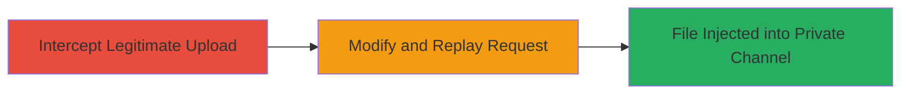

# IDOR in Slack File Upload Allowing Unauthorized Injections into Private IM Channels

Multi-stage attack chain demonstrating a complete attack workflow exploiting an IDOR vulnerability in Slack's file upload functionality.

## Chain Metrics Dashboard

| Metric | Value |
|--------|-------|
| Chain Status | Unverified |
| Total Steps | 2 |
| Execution Time | ~5 minutes |
| Skill Level | Intermediate |
| Complexity | Medium |
| Impact Level | High |

## Attack Flow Visualization

## Prerequisites & Requirements

### Required Tools

- [[tools/Burp-Suite]]

### Target Environment

- Slack web application
- Authenticated access as a team member
- Knowledge of target private IM channel IDs

### Initial Access Requirements

- Valid Slack team credentials
- Network access to Slack API endpoints
- Proxy tool configured to intercept traffic

## Detailed Attack Procedures

### Step 1: Intercept Legitimate File Upload Request
procedure: [[procedures/Exploit-Slack-File-Upload-IDOR]]

**Objective**: Capture a legitimate file upload HTTP request to understand the structure and parameters used by Slack's API.

**Instructions**: Perform a file upload in a channel or IM where you have permissions using the Slack web interface. Configure [[tools/Burp-Suite]] as a proxy to intercept the outgoing HTTP POST request to the file upload endpoint (typically `https://files.slack.com/api/files.upload` or similar). Inspect the request for the `channel` parameter, which contains the channel ID.

**Expected Output**: A captured HTTP request showing multipart form data with file contents and the `channel` parameter set to your current channel's ID.

**Success Indicators**:
- Proxy successfully intercepts the request
- Request includes `channel` parameter with a valid ID format (e.g., `C1234567890` for channels or `D1234567890` for DMs)

### Step 2: Modify Channel ID and Replay Request
procedure: [[procedures/Exploit-Slack-File-Upload-IDOR]]

**Objective**: Alter the channel ID in the intercepted request to target a private IM channel between other users, then forward the modified request to inject the file unauthorized.

**Instructions**: In [[tools/Burp-Suite]], edit the `channel` parameter in the request body to the ID of the target private IM channel (obtainable via Slack API calls like `conversations.list` or by inspecting network traffic in the target conversation). Ensure your authentication cookies or tokens are preserved. Forward the modified request to Slack's server. Verify the upload by checking if the file appears in the target private channel.

**Expected Output**: HTTP 200 response from Slack API confirming successful upload, with the file now visible in the unauthorized private IM channel.

**Success Indicators**:
- File appears in the target private channel without direct access to it
- No authorization errors in the response
- Potential notifications or logs in the target channel indicating the injection

## Attack Chain Summary

### Key Achievements

1. Bypassed authorization checks in Slack's file upload API using IDOR
2. Injected arbitrary files into private conversations, enabling privacy breaches
3. Demonstrated potential for spam, harassment, or sensitive data exposure in team communications

## Technique & Tactic Coverage

### MITRE ATT&CK Techniques

- [[Valid Accounts]] Valid Accounts
- [[Remote File Copy]] Ingress Tool Transfer

### MITRE ATT&CK Tactics

- [[Initial Access]] Initial Access
- [[Execution]] Execution

---
*Last updated: 2023-10-01T00:00:00Z*
