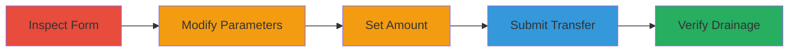

# IDOR in Starbucks Fund Transfer for Unauthorized Victim Fund Drainage

Multi-stage attack chain demonstrating exploitation of an Insecure Direct Object Reference (IDOR) vulnerability in the Starbucks card management web application, allowing an authenticated attacker to transfer funds from any victim's card to their own without authorization.

## Chain Metrics Dashboard

| Metric | Value |
|--------|-------|
| Chain Status | Unverified |
| Total Steps | 5 |
| Execution Time | ~5 minutes |
| Skill Level | Intermediate |
| Complexity | Medium |
| Impact Level | High |

## Attack Flow Visualization

## Prerequisites & Requirements

### Required Tools

- [[tools/Google-Chrome-DevTools]]
- [[tools/Google-Chrome]]

### Target Environment

- Web platform
- Starbucks Card Management service
- Attacker must have a valid Starbucks account and be authenticated in the web application

### Initial Access Requirements

- Valid attacker Starbucks account credentials
- Knowledge of a victim's valid card number
- Network access to the Starbucks web application

## Detailed Attack Procedures

### Step 1: Inspect the Fund Transfer Form
procedure: [[procedures/Exploit-Starbucks-IDOR-Fund-Transfer]]

**Objective**: Examine the HTML structure of the fund transfer form to identify manipulable parameters.

**Instructions**: Open the Starbucks web application in Google Chrome, navigate to the fund transfer section, and use DevTools to inspect the form elements. Right-click on the form and select "Inspect" or press F12 to open DevTools, then navigate to the Elements tab to view the HTML form, focusing on the 'CardNumber' input field.

**Expected Output**: Visible HTML form with parameters like 'CardNumber' and 'FullAmount'.

**Success Indicators**:
- Form elements identified, including the 'CardNumber' field without client-side restrictions.
- No immediate validation errors on inspection.

### Step 2: Modify the CardNumber Field
procedure: [[procedures/Exploit-Starbucks-IDOR-Fund-Transfer]]

**Objective**: Alter the target card number to reference the victim's account, bypassing authorization.

**Instructions**: In the DevTools Console or Elements tab, locate the 'CardNumber' input element and change its value attribute to the victim's valid Starbucks card number (e.g., edit the HTML to <input name="CardNumber" value="VICTIM_CARD_NUMBER">). Alternatively, use the Console to execute: document.querySelector('input[name="CardNumber"]').value = 'VICTIM_CARD_NUMBER';.

**Expected Output**: The form now references the victim's card number.

**Success Indicators**:
- Modified value persists in the form without client-side rejection.
- Form remains submittable.

### Step 3: Set the Transfer Amount
procedure: [[procedures/Exploit-Starbucks-IDOR-Fund-Transfer]]

**Objective**: Specify a transfer amount that does not exceed the victim's available balance to ensure successful processing.

**Instructions**: In the form, enter a value in the 'FullAmount' field that is less than or equal to the known balance on the victim's card (e.g., if balance is $50, set to $40). Use DevTools if needed to confirm the field name and ensure no upper limits are enforced client-side.

**Expected Output**: Amount field populated with the desired value.

**Success Indicators**:
- Amount accepted without validation errors.
- Form ready for submission.

### Step 4: Submit the Transfer Form
procedure: [[procedures/Exploit-Starbucks-IDOR-Fund-Transfer]]

**Objective**: Initiate the unauthorized fund transfer to the attacker's account.

**Instructions**: With the modified form, click the submit button. The server will process the request; an error message may appear indicating insufficient funds or authorization issues, but ignore it as the transfer may still succeed due to the IDOR flaw.

**Expected Output**: Error message displayed, but backend transfer occurs.

**Success Indicators**:
- Form submission completes without crash.
- No immediate account lockout.

### Step 5: Verify the Transfer
procedure: [[procedures/Exploit-Starbucks-IDOR-Fund-Transfer]]

**Objective**: Confirm the funds have been drained from the victim and added to the attacker's account.

**Instructions**: Navigate to the Card Information page in the Starbucks application using Google Chrome. Refresh the page and check the balance on the attacker's card for the added amount, and if possible, verify the victim's card balance has decreased.

**Expected Output**: Updated balances showing the transferred funds.

**Success Indicators**:
- Attacker's balance increased by the specified amount.
- Victim's balance decreased accordingly.

## Attack Chain Summary

### Key Achievements

1. Successful inspection and manipulation of the transfer form via DevTools.
2. Unauthorized transfer of funds from victim's card despite error messages.
3. Verification of fund drainage, demonstrating full account compromise potential.

## Technique & Tactic Coverage

### MITRE ATT&CK Techniques

- [[Exploit Public-Facing Application]]

### MITRE ATT&CK Tactics

- [[Initial Access]]

---

*Last updated: 2023-10-01T00:00:00Z*
