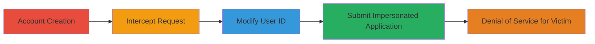

---
tags:
  - idor
  - web
  - impersonation
  - denial-of-service
type: attack_chain
tools:
  - '[[tools/HTTP-Proxy]]'
tactics:
  - '[[Initial Access]]'
verified: false
platforms:
  - Web
submitted: true
complexity: medium
created_at: '2023-10-01T00:00:00Z'
procedures:
  - '[[procedures/Exploit-IDOR-in-Streamlabs-App-Whitelist]]'
step_count: 5
techniques:
  - '[[Exploit Public-Facing Application]]'
updated_at: '2025-12-14T17:25:34.276Z'
description: >-
  Multi-stage attack exploiting an Insecure Direct Object Reference (IDOR)
  vulnerability in the Streamlabs platform to impersonate users during app
  creation, leading to denial of service for victims.
skill_level: intermediate
impact_level: high
id: d91e48c6-3c30-4b91-8bb7-9b8b5d667548
validated: true
mitre_tactics:
  - '[[Initial Access]]'
mitre_techniques:
  - '[[Exploit Public-Facing Application]]'
---
# IDOR in Streamlabs App Creation to Impersonate Users and Cause Denial of Service

Multi-stage attack chain demonstrating a complete attack workflow exploiting an IDOR vulnerability in the /api/v1/store/whitelist endpoint on platform.streamlabs.com.

## Chain Metrics Dashboard

| Metric | Value |
|--------|-------|
| Chain Status | Unverified |
| Total Steps | 5 |
| Execution Time | ~10 minutes |
| Skill Level | Intermediate |
| Complexity | Medium |
| Impact Level | High |

## Attack Flow Visualization

## Prerequisites & Requirements

### Required Tools

- [[tools/HTTP-Proxy]]

### Target Environment

- Web platform: platform.streamlabs.com
- No specific ports or services required beyond standard HTTPS (443)
- Network access: Direct internet access to the target site

### Initial Access Requirements

- Ability to create multiple user accounts on platform.streamlabs.com
- Valid email addresses for sign-ups
- No prior authenticated access needed beyond basic registration

## Detailed Attack Procedures

### Step 1: Create Attacker and Victim Accounts
procedure: [[procedures/Exploit-IDOR-in-Streamlabs-App-Whitelist]]

**Objective**: Establish two separate accounts to simulate attacker and victim scenarios, ensuring neither has previously submitted an app creation request.

**Instructions**: Navigate to platform.streamlabs.com and sign up for two distinct accounts using different email addresses. Verify each account via email confirmation. Do not proceed to the app creation form yet.

**Expected Output**: Two active user accounts with unique user_ids, obtainable via the /api/v1/s/user/me endpoint after login.

**Success Indicators**:
- Successful registration and login for both accounts
- User IDs retrieved and noted (e.g., attacker_id: 12345, victim_id: 67890)

### Step 2: Initiate App Creation and Intercept Request
procedure: [[procedures/Exploit-IDOR-in-Streamlabs-App-Whitelist]]

**Objective**: Start the app creation process on the attacker's account and capture the outgoing HTTP request using a proxy.

**Instructions**: Log in with the attacker account, navigate to the 'Create App' section, and enable the HTTP proxy (e.g., Burp Suite) to intercept traffic. Begin filling out the form but do not submit yet.

**Expected Output**: Proxy captures the initial GET/POST requests to the Create App page.

**Success Indicators**:
- Proxy is actively intercepting traffic from the browser
- Form fields are accessible without errors

### Step 3: Submit Form and Capture JSON Payload
procedure: [[procedures/Exploit-IDOR-in-Streamlabs-App-Whitelist]]

**Objective**: Complete and submit the app creation form to generate the vulnerable JSON payload containing the user_id.

**Instructions**: Fill in the required form fields (e.g., app name, description) with arbitrary data and click 'Apply'. The proxy will intercept the POST request to /api/v1/store/whitelist, which includes a JSON body with the user_id field set to the attacker's ID.

**Expected Output**: Intercepted POST request with JSON payload like {"user_id": "12345", "app_name": "Test App", ...}.

**Success Indicators**:
- Request body contains the user_id field
- No immediate errors on form submission

### Step 4: Modify User ID to Victim's ID
procedure: [[procedures/Exploit-IDOR-in-Streamlabs-App-Whitelist]]

**Objective**: Alter the user_id in the intercepted request to impersonate the victim account.

**Instructions**: In the proxy tool, edit the JSON body of the POST request, changing the user_id value to the victim's ID (e.g., from "12345" to "67890"). Ensure the rest of the payload remains intact, including any app details. Optionally, use invalid or spam data to maximize disruption.

**Expected Output**: Modified JSON payload with {"user_id": "67890", ...}.

**Success Indicators**:
- Payload modification successful without breaking JSON syntax
- Victim's user_id correctly substituted

### Step 5: Forward Modified Request and Verify Impact
procedure: [[procedures/Exploit-IDOR-in-Streamlabs-App-Whitelist]]

**Objective**: Submit the tampered request to create an app on behalf of the victim, causing denial of service.

**Instructions**: Forward the modified request through the proxy. Monitor the response. Attempt to create a legitimate app with the victim account afterward to confirm blockage.

**Expected Output**: 200 OK response from /api/v1/store/whitelist, indicating successful submission. Victim's subsequent app creation attempt may fail or be rejected due to prior invalid submission.

**Success Indicators**:
- 200 OK response received
- Victim account unable to submit a new app (e.g., error about existing application or rate limit)

## Attack Chain Summary

### Key Achievements

1. Successful impersonation of victim user via IDOR
2. Submission of fraudulent app creation requests on behalf of victims
3. Denial of service preventing legitimate app submissions

## Technique & Tactic Coverage

### MITRE ATT&CK Techniques

- [[Exploit Public-Facing Application]]

### MITRE ATT&CK Tactics

- [[Initial Access]]

---
*Last updated: 2023-10-01T00:00:00Z*
