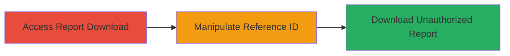

# IDOR in TikTok Ads Report Download for Unauthorized Access to User Reports

Multi-stage attack chain demonstrating a complete attack workflow exploiting an IDOR vulnerability in the report download functionality on ads.tiktok.com.

## Chain Metrics Dashboard

| Metric | Value |
|--------|-------|
| Chain Status | Unverified |
| Total Steps | 1 |
| Execution Time | ~5 minutes |
| Skill Level | Beginner |
| Complexity | Low |
| Impact Level | Low |

## Attack Flow Visualization



## Prerequisites & Requirements

### Required Tools

- Browser developer tools or proxy like Burp Suite for request manipulation

### Target Environment

- Web platform
- Access to ads.tiktok.com with a valid advertising account
- No specific services/ports required beyond standard HTTPS (443)

### Initial Access Requirements

- Valid TikTok advertising account credentials
- Network access to ads.tiktok.com
- No prior elevated access needed

## Detailed Attack Procedures

### Step 1: Exploit IDOR in Report Download
procedure: [[procedures/Exploit-IDOR-in-Report-Download]]

**Objective**: Gain unauthorized access to another user's advertising reports by manipulating the direct object reference in the download request.

**Instructions**: Log in to ads.tiktok.com and navigate to your own reports to identify the download endpoint. Use developer tools to inspect the request, which typically includes a report ID parameter. Modify the report ID to reference another user's report (e.g., increment or replace with a known ID) and resend the request using [[commands/curl-idor-test]]:

```bash
curl -X GET "https://ads.tiktok.com/report/download?report_id=12345" -H "Authorization: Bearer YOUR_TOKEN" -H "Cookie: session=YOUR_SESSION"
```

Replace `12345` with a target report ID. If successful, the response will contain the unauthorized report data.

**Expected Output**: JSON or file download containing the target user's report details, such as ad performance metrics.

**Success Indicators**:
- Report data from another user is returned without authentication errors
- No access denied response (e.g., 403 Forbidden)

## Attack Chain Summary

### Key Achievements

1. Identified vulnerable report download endpoint on ads.tiktok.com
2. Manipulated report ID to access unauthorized user data
3. Demonstrated low-severity information disclosure impacting user privacy

## Technique & Tactic Coverage

### MITRE ATT&CK Techniques

- [[Account Discovery]]

### MITRE ATT&CK Tactics

- [[Discovery]]

---
*Last updated: 2023-10-01T00:00:00Z*
