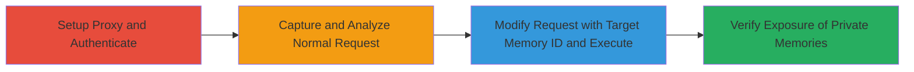

---
tags:
  - idor
  - tiktok
  - android
  - privacy-bypass
  - unauthorized-access
  - mobile
type: attack_chain
tools:
  - '[[tools/Burp-Suite]]'
tactics:
  - '[[Collection]]'
verified: false
platforms:
  - Android
  - Mobile
submitted: true
complexity: medium
created_at: '2024-10-01T00:00:00Z'
procedures:
  - '[[procedures/Exploit-IDOR-in-TikTok-Memories-Privacy-Settings]]'
step_count: 3
techniques:
  - '[[Exploit Public-Facing Application]]'
updated_at: '2025-12-14T17:25:47.856Z'
description: >-
  An attack chain exploiting an Insecure Direct Object Reference (IDOR)
  vulnerability in the TikTok Now feature on Android, allowing authenticated
  users to modify other users' memories privacy settings and expose private
  content.
skill_level: intermediate
impact_level: high
id: 32f7b27b-b2cc-42e6-98cb-8e686d45337d
validated: true
mitre_tactics:
  - '[[Collection]]'
mitre_techniques:
  - '[[Exploit Public-Facing Application]]'
---
# IDOR in TikTok Now Android App for Unauthorized Modification of Memories Privacy Settings

Multi-stage attack chain demonstrating a complete attack workflow exploiting an IDOR vulnerability in the TikTok Android app's Now feature to access and alter other users' memories privacy settings.

## Chain Metrics Dashboard

| Metric | Value |
|--------|-------|
| Chain Status | Unverified |
| Total Steps | 3 |
| Execution Time | ~15 minutes |
| Skill Level | Intermediate |
| Complexity | Medium |
| Impact Level | High |

## Attack Flow Visualization

## Prerequisites & Requirements

### Required Tools

- [[tools/Burp-Suite]]

### Target Environment

- Android device or emulator (API level 28+ recommended for TikTok compatibility)
- TikTok Android app installed (latest version at time of discovery)
- Network access to TikTok servers

### Initial Access Requirements

- Valid TikTok account credentials for authentication
- Ability to set up a proxy on the Android device (requires ADB or manual WiFi proxy configuration)
- Knowledge of target user's memory ID (obtainable via social engineering, shared links, or prior reconnaissance)

## Detailed Attack Procedures

### Step 1: Setup Proxy and Authenticate
procedure: [[procedures/Exploit-IDOR-in-TikTok-Memories-Privacy-Settings]]

**Objective**: Establish a man-in-the-middle proxy to intercept app traffic and authenticate to the TikTok app to gain a valid session.

**Instructions**: Configure Burp Suite as a proxy on your host machine, then set the Android device's WiFi proxy to point to your machine's IP and Burp's port (default 8080). Use ADB to forward the proxy if needed. Launch the TikTok app, log in with valid credentials, and navigate to the Now feature to create or view a memory, ensuring traffic is captured in Burp.

**Expected Output**: Successful login and session token in intercepted requests; normal memory privacy setting change request visible in Burp.

**Success Indicators**:
- App traffic routed through Burp without errors
- Authentication successful with valid session cookies or tokens

### Step 2: Capture and Analyze Normal Request
procedure: [[procedures/Exploit-IDOR-in-TikTok-Memories-Privacy-Settings]]

**Objective**: Identify the API endpoint and object reference format used for modifying memory privacy settings by capturing a legitimate request for your own memory.

**Instructions**: In the TikTok app, select one of your own memories and change its 'Who Can View' privacy setting (e.g., from Private to Public). Intercept the outgoing API request in Burp. Analyze the request payload, noting the memory ID (object reference) in the JSON body or URL parameters, typically under a field like 'memory_id' or similar.

**Expected Output**: HTTP POST or PUT request to an endpoint like '/memories/privacy/update' with JSON payload containing your memory_id and new privacy value.

**Success Indicators**:
- Request structure understood, including authorization headers (e.g., Bearer token)
- Memory ID format identified (usually a numeric or UUID string)

### Step 3: Modify Request with Target Memory ID and Execute
procedure: [[procedures/Exploit-IDOR-in-TikTok-Memories-Privacy-Settings]]

**Objective**: Replace the memory ID with another user's to unauthorizedly modify their privacy settings, exposing private memories.

**Instructions**: In Burp Repeater, copy the captured request, replace the memory_id with the target user's memory ID (obtained separately), change the privacy setting to 'Public' or 'Everyone', and forward the modified request. Drop the original request in Burp to prevent it from reaching the server. Verify in the app or via another account if the target's memory is now visible publicly.

**Expected Output**: Server response with 200 OK and confirmation of updated settings; target's memory becomes accessible to unauthorized viewers.

**Success Indicators**:
- Modified request accepted without authorization errors
- Privacy change reflected, exposing private content

## Attack Chain Summary

### Key Achievements

1. Bypassed ownership validation to access other users' memory objects
2. Unauthorizedly modified privacy settings to expose private memories
3. Demonstrated potential for widespread data exposure in TikTok's Now feature

## Technique & Tactic Coverage

### MITRE ATT&CK Techniques

- [[Exploit Public-Facing Application]]

### MITRE ATT&CK Tactics

- [[Collection]]

---
*Last updated: 2024-10-01T00:00:00Z*
