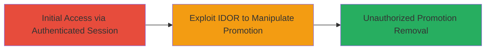

# IDOR in TikTok Seller Endpoint Allowing Unauthorized Promotion Removal

Multi-stage attack chain demonstrating a complete attack workflow targeting the TikTok Seller platform's promotion management endpoint.

## Chain Metrics Dashboard

| Metric | Value |
|--------|-------|
| Chain Status | Unverified |
| Total Steps | 1 |
| Execution Time | ~5 minutes |
| Skill Level | Intermediate |
| Complexity | Medium |
| Impact Level | High |

## Attack Flow Visualization



## Prerequisites & Requirements

### Required Tools

- [[tools/Burp-Suite]]

### Target Environment

- Target Platform: Web application (TikTok Seller endpoint)
- Required services/ports: HTTPS on port 443
- Network access requirements: Internet access to TikTok API endpoints

### Initial Access Requirements

- Credential requirements: Valid authenticated session as a TikTok seller user
- Network position: External attacker with legitimate account
- Prior access needed: Ability to create or view own promotions to capture promotion_id format

## Detailed Attack Procedures

### Step 1: Exploit IDOR for Unauthorized Promotion Manipulation
procedure: [[procedures/Exploit-IDOR-in-TikTok-Seller-Promotion-Endpoint]]

**Objective**: Gain unauthorized access to another user's promotion object by manipulating the promotion_id parameter without proper ownership checks, enabling deletion or modification.

**Instructions**: Authenticate into the TikTok Seller dashboard to obtain a session. Use [[tools/Burp-Suite]] to intercept a legitimate request to view or manage your own promotion, noting the promotion_id format (typically numeric). Modify the promotion_id to reference another user's promotion (obtained via enumeration or guesswork, e.g., sequential IDs). Replay the request with the altered ID to perform unauthorized actions like removal. For API simulation, use [[commands/curl-idor-exploit]] to send the modified request:

```bash
curl -X DELETE 'https://seller.tiktok.com/api/promotions/{target_promotion_id}' \
  -H 'Authorization: Bearer {your_session_token}' \
  -H 'Content-Type: application/json'
```

Then verify the impact by checking the target's account or monitoring for errors indicating success.

**Expected Output**: HTTP 200 or success response confirming promotion removal, or error revealing access without ownership validation.

**Success Indicators**:
- Promotion removed from target account without ownership
- No authorization error returned on modified request
- Account disruption confirmed (e.g., via follow-up access if possible)

## Attack Chain Summary

### Key Achievements

1. Unauthorized access to promotion objects via direct ID reference
2. Successful manipulation (e.g., deletion) of another user's promotions
3. Potential disruption to seller operations, leading to $500 HackerOne bounty

## Technique & Tactic Coverage

### MITRE ATT&CK Techniques

- [[Exploit Public-Facing Application]]

### MITRE ATT&CK Tactics

- [[Initial Access]]

---
*Last updated: 2023-10-01T00:00:00Z*
