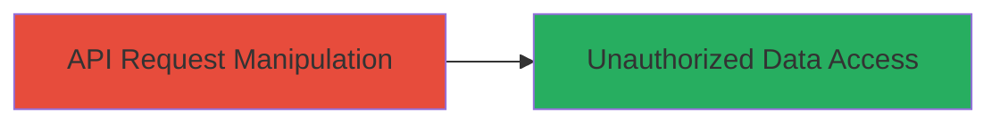

---
tags:
  - idor
  - api
  - unauthorized-access
  - private-data
  - tiktok
type: attack_chain
tools: []
tactics:
  - '[[Initial Access]]'
  - '[[Collection]]'
commands:
  - '[[commands/curl-idor-access]]'
platforms:
  - Web
complexity: low
procedures:
  - '[[procedures/Exploit-IDOR-in-TikTok-Translation-API]]'
step_count: 1
techniques:
  - '[[Exploit Public-Facing Application]]'
description: >-
  A single-stage attack exploiting an Insecure Direct Object Reference (IDOR)
  vulnerability in the TikTok translation API to unauthorizedly read private
  video descriptions from private accounts.
skill_level: beginner
impact_level: low
id: 10f1237b-a635-40df-9da8-6ebaa8a78c90
created_at: '2025-12-14T17:32:39.527Z'
updated_at: '2025-12-14T17:32:39.527Z'
verified: false
validated: true
submitted: true
mitre_tactics:
  - '[[Initial Access]]'
  - '[[Collection]]'
mitre_techniques:
  - '[[Exploit Public-Facing Application]]'
---
# IDOR in TikTok Translation API to Access Private Video Descriptions

## Overview

This attack chain demonstrates a vulnerability in the TikTok translation API endpoint that suffers from an Insecure Direct Object Reference (IDOR), allowing attackers to access video descriptions from private accounts without proper authorization checks. The exploit involves manipulating the video ID parameter in API requests to retrieve private content. Reported via HackerOne (Report #2921830), this low-severity issue enabled unauthorized reading of private data and was resolved with a bounty. The attack requires basic knowledge of API interactions and does not involve complex tooling.

## Attack Flow Visualization



## Prerequisites & Requirements

### Required Tools

- None specialized; standard HTTP client like curl or browser developer tools.

### Target Environment

- Web platform
- Access to TikTok's public-facing translation API endpoint
- No specific ports or services required beyond standard HTTPS (443)

### Initial Access Requirements

- Public internet access to the API
- Knowledge of a target private video ID (e.g., obtained via other means or enumeration)
- No credentials needed due to the lack of authorization checks

## Detailed Attack Procedures

### Step 1: Manipulate API Request for Private Access
procedure: [[procedures/Exploit-IDOR-in-TikTok-Translation-API]]

**Objective**: Exploit the IDOR vulnerability by directly referencing a private video ID in the translation API request to retrieve its description without authorization.

**Instructions**: Identify the translation API endpoint, typically structured as a POST or GET request to something like `/api/translate/video/{video_id}` or with a query parameter `video_id`. Use a tool like curl to send a request with a known private video ID. For demonstration, assume the endpoint requires a language parameter but fails to validate ownership of the video.

Execute [[commands/curl-idor-access]] to test access to a private video description:

```bash
curl -X GET "https://api.tiktok.com/translate?video_id=PRIVATE_VIDEO_ID&lang=en" -H "User-Agent: Mozilla/5.0"
```

Replace `PRIVATE_VIDEO_ID` with an actual private video identifier. The request bypasses checks, returning the description in the response.

**Expected Output**: JSON response containing the private video's description, e.g., `{"description": "Private content text"}`.

**Success Indicators**:
- Response includes private description not visible in the public TikTok interface
- No authentication errors or access denied messages
- Confirmation via comparing with public video responses

## Attack Chain Summary

### Key Achievements

1. Successful unauthorized retrieval of private video descriptions
2. Demonstration of IDOR impact on API security
3. Low-effort exploitation highlighting missing authorization controls

## Technique & Tactic Coverage

### MITRE ATT&CK Techniques

- [[Exploit Public-Facing Application]]

### MITRE ATT&CK Tactics

- [[Initial Access]]
- [[Collection]]

*Last updated: 2023-10-01*
