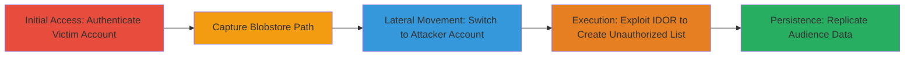

# IDOR in Twitter Ads Audience Manager Allowing Unauthorized Audience List Creation

Multi-stage attack chain demonstrating exploitation of an IDOR vulnerability in the Twitter (X) Ads platform's audience manager, where lack of authorization checks on the 'blobstore_path' parameter allows attackers to load and create audience lists from other accounts' uploaded CSV data. This enables unauthorized replication of audience segments for targeted advertising, though the underlying data is hashed.

## Chain Metrics Dashboard

| Metric | Value |
|--------|-------|
| Chain Status | Unverified |
| Total Steps | 4 |
| Execution Time | ~5 minutes (plus processing time) |
| Skill Level | Intermediate |
| Complexity | Medium |
| Impact Level | High |

## Attack Flow Visualization

## Prerequisites & Requirements

### Required Tools

- [[tools/Burp-Suite]]

### Target Environment

- Web platform (Twitter Ads & Analytics dashboard)
- Required services: ads.twitter.com, upload.twitter.com
- Network access: Valid authenticated sessions to two separate Twitter Ads accounts

### Initial Access Requirements

- Credentials for a victim account with Ads & Analytics enabled
- Credentials for an attacker account with Ads & Analytics enabled
- No prior access needed beyond standard login

## Detailed Attack Procedures

### Step 1: Authenticate and Capture in Victim Account
procedure: [[procedures/Capture-Blobstore-Path-in-Victim-Account]]

**Objective**: Gain access to the victim account and intercept the blobstore_path generated from uploading a CSV file during audience list creation.

**Instructions**: Authenticate into the victim account using the Ads dashboard, start Burp Suite as a proxy, navigate to the audience creation page, upload a CSV, and intercept the POST request to capture the predictable blobstore_path (e.g., /ta_data/<account_id>/<timestamp>.txt).

**Expected Output**: Intercepted POST request containing the blobstore_path parameter.

**Success Indicators**:
- Successful login and dashboard access
- CSV upload completes and path is captured in Burp

### Step 2: Switch to Attacker Account
procedure: [[procedures/Switch-to-Attacker-Account]]

**Objective**: Log out of the victim account and authenticate into the attacker account to prepare for the exploitation phase.

**Instructions**: Log out of the current session, then log in to the attacker account with Ads & Analytics enabled, ensuring Burp Suite remains active for traffic interception.

**Expected Output**: Successful authentication in the attacker account dashboard.

**Success Indicators**:
- Clean logout from victim account
- Attacker account dashboard loads without issues

### Step 3: Initiate and Modify Request in Attacker Account
procedure: [[procedures/Exploit-IDOR-for-Unauthorized-Audience-Creation]]

**Objective**: Upload a dummy CSV in the attacker account to generate a request template, then modify the blobstore_path to reference the victim account's path, allowing unauthorized audience list creation.

**Instructions**: Navigate to the audience creation page in the attacker account, upload a random CSV to trigger a POST request, intercept it in Burp, replace the blobstore_path with the one from the victim account, and forward the modified request.

**Expected Output**: The POST request succeeds, and after processing (up to a few hours), an identical audience list appears in the attacker account based on the victim's data.

**Success Indicators**:
- Modified request returns a 200 OK status
- Audience list processes successfully in the attacker account

### Step 4: Validate Unauthorized Access

**Objective**: Confirm the exploitation by checking that the attacker account now has access to the victim's audience segment for ad targeting.

**Instructions**: Monitor the audience manager in the attacker account for the new list. Note that while the data is hashed and not readable, the segment can be used for campaigns.

**Expected Output**: New audience list visible and usable in the attacker account.

**Success Indicators**:
- List appears with matching record count (e.g., 10001 records)
- No errors in processing logs

## Attack Chain Summary

### Key Achievements

1. Captured predictable blobstore_path from victim account's CSV upload
2. Bypassed authorization by substituting paths in attacker account requests
3. Created identical audience lists across accounts, enabling unauthorized ad targeting

## Technique & Tactic Coverage

### MITRE ATT&CK Techniques

- [[Valid Accounts]] Valid Accounts
- [[Account Discovery]] Account Discovery

### MITRE ATT&CK Tactics

- [[Initial Access]] Initial Access
- [[Discovery]] Discovery

---

*Last updated: 2023-10-01T00:00:00Z*
