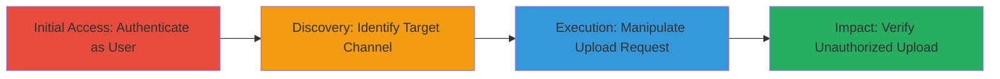

# IDOR in Video Upload Allowing Unauthorized Access to IBM Video Channels

Multi-stage attack chain demonstrating exploitation of an IDOR vulnerability in the video upload feature of https://video.ibm.com, allowing attackers to upload content to channels owned by others, potentially leading to data manipulation, abuse, or misinformation dissemination.

## Chain Metrics Dashboard

| Metric | Value |
|--------|-------|
| Chain Status | Unverified |
| Total Steps | 3 |
| Execution Time | ~5 minutes |
| Skill Level | Intermediate |
| Complexity | Medium |
| Impact Level | High |

## Attack Flow Visualization



## Prerequisites & Requirements

### Required Tools

- Browser Developer Tools or [[Burp Suite]]

### Target Environment

- Web platform: https://video.ibm.com
- Required services/ports: HTTPS (443)
- Network access requirements: Internet access to the target domain

### Initial Access Requirements

- Credential requirements: Valid user account on the platform (low-privilege)
- Network position: External attacker
- Prior access needed: None, but authentication required for upload functionality

## Detailed Attack Procedures

### Step 1: Initial Access
procedure: [[procedures/Exploit-IDOR-in-Video-Upload]]

**Objective**: Authenticate to the platform and access the video upload interface to prepare for IDOR manipulation.

**Instructions**: Log in to https://video.ibm.com using a valid user account. Navigate to the "Upload Video" section within your own channel. Use browser developer tools to inspect the network requests during a normal upload attempt to understand the request structure, particularly the channel ID parameter.

**Expected Output**: Successful login and access to upload form; network tab shows POST request to upload endpoint with channel_id parameter.

**Success Indicators**:
- User dashboard accessible
- Upload interface loads without errors

### Step 2: Discovery and Manipulation
procedure: [[procedures/Exploit-IDOR-in-Video-Upload]]

**Objective**: Identify a target channel ID (e.g., via URL enumeration or guessing sequential IDs) and modify the upload request to reference it, bypassing authorization checks.

**Instructions**: Select or guess a target channel ID (e.g., from public channel URLs like /channel/123). Intercept the upload request using browser dev tools or Burp Suite. Modify the channel_id parameter in the POST request body from your own ID to the target ID (e.g., change "channel_id": "your_id" to "channel_id": "123"). Submit the request with a test video file.

Use the following example with [[commands/curl-idor-upload]] to simulate via command line:

```bash
curl -X POST 'https://video.ibm.com/api/upload' \
  -H 'Authorization: Bearer your_token' \
  -H 'Content-Type: multipart/form-data' \
  -F 'channel_id=123' \
  -F 'video=@test.mp4'
```

**Expected Output**: HTTP 200 response indicating successful upload, without authorization errors.

**Success Indicators**:
- Request succeeds with modified channel_id
- No 403 Forbidden or auth error returned

### Step 3: Verification and Impact
procedure: [[procedures/Exploit-IDOR-in-Video-Upload]]

**Objective**: Confirm the video appears in the target channel, demonstrating unauthorized data manipulation.

**Instructions**: Navigate to the target channel's page (e.g., https://video.ibm.com/channel/123) and refresh. Check if the uploaded video is listed. If using API, query the channel's video list endpoint to verify.

**Expected Output**: Uploaded video visible in the unauthorized channel.

**Success Indicators**:
- Video listed under target channel
- Channel owner notifications or logs show unexpected upload (if accessible)

## Attack Chain Summary

### Key Achievements

1. Bypassed authorization to upload to foreign channels
2. Demonstrated potential for content abuse or misinformation
3. Highlighted critical data integrity risks (CVSS 9.8)

## Technique & Tactic Coverage

### MITRE ATT&CK Techniques

- [[Exploit Public-Facing Application]]

### MITRE ATT&CK Tactics

- [[Initial Access]]

---
*Last updated: 2023-10-01T12:00:00Z*
