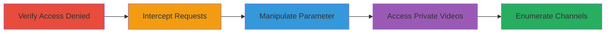

# IDOR in Vimeo Montage Widget to Access Private Channel Videos

Multi-stage attack chain demonstrating exploitation of an Insecure Direct Object Reference (IDOR) vulnerability in Vimeo's widget montage endpoint. This allows unauthorized users to access videos from private channels configured as 'Only moderators and people I choose' by manipulating the 'badge_channel' parameter without proper access validation.

## Chain Metrics Dashboard

| Metric | Value |
|--------|-------|
| Chain Status | Unverified |
| Total Steps | 5 |
| Execution Time | ~10 minutes |
| Skill Level | Intermediate |
| Complexity | Medium |
| Impact Level | High |

## Attack Flow Visualization

## Prerequisites & Requirements

### Required Tools

- [[tools/Burp-Proxy]]

### Target Environment

- Web platform (Vimeo.com)
- Required services/ports: HTTPS (443)
- Network access requirements: Internet access to Vimeo.com while authenticated as a logged-in user

### Initial Access Requirements

- Logged-in Vimeo account (any valid user credentials)
- No special privileges needed beyond basic authentication
- Prior access: Ability to browse Vimeo channels

## Detailed Attack Procedures

### Step 1: Verify Private Channel Access Denied

procedure: [[procedures/Verify-Private-Channel-Access-Denied]]

**Objective**: Confirm that the target private channel is inaccessible to unauthorized users, establishing the baseline for the privacy bypass.

**Instructions**: Directly navigate to the private channel URL in a browser while logged in. For example, access https://vimeo.com/channels/870575. The page should display an access denied message.

**Expected Output**: Error message: "Private Channel Sorry, this Channel is private. You do not have permission to view this Channel."

**Success Indicators**:
- Access denied error displayed
- No video content visible

### Step 2: Intercept Montage Widget Requests

procedure: [[procedures/Intercept-Montage-Widget-Requests]]

**Objective**: Use a proxy tool to capture HTTP requests made when interacting with the montage widget tool, identifying parameters for manipulation.

**Instructions**: Configure your browser to route traffic through Burp Proxy. Navigate to https://vimeo.com/tools/widget/montage and perform actions to generate requests, such as selecting options in the widget builder.

**Expected Output**: Intercepted requests visible in Burp, including POST or GET to the montage endpoint with parameters like badge_channel.

**Success Indicators**:
- Requests successfully intercepted
- Parameters such as user_id and badge_channel observed

### Step 3: Manipulate Badge Channel Parameter

procedure: [[procedures/Manipulate-Badge-Channel-Parameter]]

**Objective**: Analyze the intercepted request and modify the 'badge_channel' parameter to test for IDOR by changing it to the target private channel ID.

**Instructions**: In Burp Proxy, forward the second intercepted request (typically to https://vimeo.com/tools/widget/montage with query parameters). Edit the 'badge_channel' value from the original to 870575 (or target ID) and forward the request.

**Expected Output**: Server responds without error, indicating no access check on the channel ID.

**Success Indicators**:
- Modified request forwarded successfully
- No authentication error returned for the private channel

### Step 4: Access Private Videos via IDOR

procedure: [[procedures/Access-Private-Videos-via-IDOR]]

**Objective**: Construct and load the manipulated URL in a browser to view videos from the private channel without membership.

**Instructions**: Copy the full manipulated URL (e.g., https://vimeo.com/tools/widget/montage?widget=1&preview=1&user_id=36807051&badge_stream=channel&badge_channel=870575&badge_album=3231945&badge_layout=horizontal&badge_quantity=6&show_titles=no&badge_size=80) and open it in your browser while logged in.

**Expected Output**: Widget displays thumbnails and links to videos from the private channel.

**Success Indicators**:
- Videos from private channel visible
- Ability to click and play videos without permission prompt

### Step 5: Enumerate Private Channels with IDOR

procedure: [[procedures/Enumerate-Private-Channels-with-IDOR]]

**Objective**: Systematically change the 'badge_channel' parameter to different IDs to discover and access multiple private channels.

**Instructions**: Iterate by modifying 'badge_channel' to other valid channel IDs (e.g., 123456, 789012) in the URL and reloading the page. Test incrementally to identify accessible private content.

**Expected Output**: Videos from various private channels load without access denial.

**Success Indicators**:
- Multiple private channels' videos accessible
- Enumeration reveals sensitive content across channels

## Attack Chain Summary

### Key Achievements

1. Bypassed Vimeo private channel privacy settings via IDOR
2. Viewed unauthorized video content without membership
3. Enabled enumeration of private channels for broader data exposure

## Technique & Tactic Coverage

### MITRE ATT&CK Techniques

- [[Exploit Public-Facing Application]]

### MITRE ATT&CK Tactics

- [[Initial Access]]
- [[Discovery]]
- [[Collection]]

---

*Last updated: 2023-10-01T00:00:00Z*
