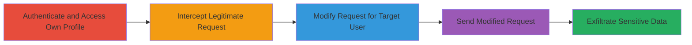

# IDOR in WakaTime API to Access Other Users' Profile Information

Multi-stage attack chain demonstrating a complete workflow to exploit an Insecure Direct Object Reference (IDOR) vulnerability in WakaTime's user profile API, allowing authenticated users to access sensitive data of other users without authorization checks. The attack involves intercepting a legitimate API request, modifying it to target another user's profile, and retrieving private information such as full names, bios, locations, and social media details. This leads to privacy breaches and potential identity theft.

## Chain Metrics Dashboard

| Metric | Value |
|--------|-------|
| Chain Status | Unverified |
| Total Steps | 5 |
| Execution Time | ~5 minutes |
| Skill Level | Intermediate |
| Complexity | Medium |
| Impact Level | High |

## Attack Flow Visualization



## Prerequisites & Requirements

### Required Tools

- [[tools/Burp-Suite]]

### Target Environment

- Web platform with access to WakaTime API (https://wakatime.com/api/v1/)
- Authenticated session as a WakaTime user
- Network access to the internet

### Initial Access Requirements

- Valid WakaTime account credentials for authentication
- Proxy setup (e.g., Burp Suite) to intercept browser traffic
- No prior elevated access needed; standard user authentication suffices

## Detailed Attack Procedures

### Step 1: Access Current User's Profile
procedure: [[procedures/Access-Current-User-Profile]]

**Objective**: Establish a legitimate authenticated request to the user's own profile endpoint to serve as a base for modification.

**Instructions**: Log in to WakaTime and navigate to trigger a GET request to the current user's profile API. Use a browser or tool to send:

```http
GET /api/v1/users/current? HTTP/1.1
Host: wakatime.com
Cookie: [your-auth-cookie]
User-Agent: [your-user-agent]
```

**Expected Output**: JSON response with the authenticated user's profile data, confirming successful authentication.

**Success Indicators**:
- HTTP 200 OK response received
- Profile data for current user returned without errors

### Step 2: Intercept the Request
procedure: [[procedures/Intercept-Request-with-Burp-Suite]]

**Objective**: Capture the legitimate API request using a proxy to prepare for manipulation.

**Instructions**: Configure your browser to proxy traffic through Burp Suite. Trigger the profile access request and intercept it in Burp's Proxy tab. Capture details including headers like Host, Cookie, and User-Agent.

**Expected Output**: Intercepted HTTP GET request visible in Burp Suite with full headers and endpoint /api/v1/users/current?.

**Success Indicators**:
- Request successfully intercepted and paused
- All authentication headers (e.g., Cookie) preserved

### Step 3: Send to Repeater for Modification
procedure: [[procedures/Modify-Endpoint-for-IDOR-Exploitation]]

**Objective**: Forward the request to Burp's Repeater module to enable safe modification without affecting the original flow.

**Instructions**: In Burp Suite's Proxy, right-click the intercepted request and select "Send to Repeater." This prepares the request for editing in an isolated tab.

**Expected Output**: Request loaded in Repeater tab, ready for endpoint alteration.

**Success Indicators**:
- Request appears in Repeater without errors
- Original request details intact for modification

### Step 4: Modify Endpoint to Target Another User
procedure: [[procedures/Modify-Endpoint-for-IDOR-Exploitation]]

**Objective**: Alter the API path to reference another user's username, exploiting the IDOR to bypass authorization.

**Instructions**: In Repeater, change the path from /api/v1/users/current? to /api/v1/users/@targetusername (e.g., /api/v1/users/@hasn0xxxx). Preserve all headers and send the modified GET request.

```http
GET /api/v1/users/@targetusername HTTP/1.1
Host: wakatime.com
Cookie: [your-auth-cookie]
User-Agent: [your-user-agent]
```

**Expected Output**: Modified request sent successfully.

**Success Indicators**:
- Request forwarded without proxy errors
- Endpoint path updated correctly

### Step 5: Receive and Analyze Response
procedure: [[procedures/Observe-Unauthorized-Response]]

**Objective**: Retrieve and examine the unauthorized profile data to confirm the IDOR exploitation.

**Instructions**: Send the modified request in Repeater and inspect the response body for the target user's data.

**Expected Output**: HTTP 200 OK with JSON containing sensitive info like full name, bio, city, country, GitHub, LinkedIn, Twitter usernames, and profile URLs.

**Success Indicators**:
- No authorization error (e.g., 403 Forbidden)
- Target user's private data exposed in response

## Attack Chain Summary

### Key Achievements

1. Successful authentication and baseline request capture
2. Endpoint manipulation to access unauthorized user data
3. Exposure of sensitive personal information without detection

## Technique & Tactic Coverage

### MITRE ATT&CK Techniques

- [[Account Discovery]] Account Discovery
- [[Automated Collection]] Automated Collection

### MITRE ATT&CK Tactics

- [[Discovery]] Discovery
- [[Collection]] Collection

---
*Last updated: 2023-10-01T12:00:00Z*
