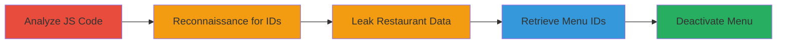

---
tags:
  - idor
  - api
  - web
  - authorization-bypass
  - restaurant-management
type: attack_chain
tools: []
tactics:
  - '[[Initial Access]]'
  - '[[Discovery]]'
commands:
  - '[[commands/zomato-deactivate-special-menu-js-snippet]]'
  - '[[commands/zomato-leak-restaurant-data-post]]'
  - '[[commands/zomato-get-special-menus-post]]'
  - '[[commands/zomato-deactivate-menu-post]]'
platforms:
  - Web
  - Mobile API
complexity: medium
procedures:
  - '[[procedures/Analyze-JavaScript-for-Vulnerable-API-Endpoints]]'
  - '[[procedures/Reconnaissance-to-Obtain-Restaurant-IDs]]'
  - '[[procedures/Leak-Restaurant-Data-via-API-Request]]'
  - '[[procedures/Retrieve-Special-Menu-IDs]]'
  - '[[procedures/Deactivate-Special-Menu-via-IDOR]]'
step_count: 5
techniques:
  - '[[Exploit Public-Facing Application]]'
  - '[[Account Discovery]]'
description: >-
  A multi-stage attack exploiting an Insecure Direct Object Reference (IDOR)
  vulnerability in Zomato's API to unauthorizedly deactivate special menus for
  any restaurant by bypassing ownership checks.
skill_level: intermediate
impact_level: high
id: 82e5fc55-2d4f-4bc4-9a5e-8ce63a1447ae
created_at: '2025-12-14T17:25:29.768Z'
updated_at: '2025-12-14T17:25:29.768Z'
verified: false
validated: true
submitted: true
mitre_tactics:
  - '[[Initial Access]]'
  - '[[Discovery]]'
mitre_techniques:
  - '[[Exploit Public-Facing Application]]'
  - '[[Account Discovery]]'
---
# IDOR in Zomato API Allowing Deactivation of Any Restaurant's Special Menus

## Overview

This attack chain exploits an Insecure Direct Object Reference (IDOR) vulnerability in Zomato's API endpoints for managing special menus. By analyzing client-side JavaScript, attackers can identify POST requests that lack proper authorization checks for restaurant ownership. Through reconnaissance and crafted API calls, an attacker can obtain necessary IDs (user_id, res_id, menu_set_id) and deactivate special menus for any restaurant, disrupting business operations. The vulnerability was demonstrated on a test restaurant owned by Zomato to avoid production impact, but it could affect all restaurants with special menus.

## Chain Metrics Dashboard

| Metric | Value |
|--------|-------|
| Chain Status | Unverified |
| Total Steps | 5 |
| Execution Time | ~30 minutes |
| Skill Level | Intermediate |
| Complexity | Medium |
| Impact Level | High |

## Attack Flow Visualization



## Prerequisites & Requirements

### Required Tools

- Browser Developer Tools (for JS analysis)
- cURL or Postman (for API requests)

### Target Environment

- Zomato web or mobile API
- Access to authenticated session (e.g., valid access_token and cookies)
- No specific ports required; operates over HTTPS

### Initial Access Requirements

- Valid Zomato user account with access_token
- Network access to api.zomato.com
- No prior elevated access needed; exploits public-facing API

## Detailed Attack Procedures

### Step 1: Analyze JavaScript for Vulnerable API Endpoints
procedure: [[procedures/Analyze-JavaScript-for-Vulnerable-API-Endpoints]]

**Objective**: Identify API endpoints and request structures lacking authorization checks by inspecting client-side JavaScript code.

**Instructions**: Load the Zomato application in a browser and use developer tools to search for functions handling special menu management. Look for POST requests to endpoints like "/XXX/XXXXXX" that use parameters such as request_type, user_id, and menu_set_id without ownership validation.

**Expected Output**: JavaScript snippet revealing the vulnerable POST request structure.

**Success Indicators**:
- Discovery of request_type:"deactivate-special-menu" without auth checks
- Endpoint URL and parameter format identified

### Step 2: Reconnaissance to Obtain Restaurant IDs
procedure: [[procedures/Reconnaissance-to-Obtain-Restaurant-IDs]]

**Objective**: Gather necessary IDs (user_id, res_id) through extended research on Zomato's application structure to target a safe test environment.

**Instructions**: Spend time exploring the app to understand API flows. Identify a test restaurant (e.g., res_id=XXXXXX) owned by Zomato to minimize impact. Extract user_id from your session or prior requests.

**Expected Output**: Valid res_id for a target restaurant and user_id.

**Success Indicators**:
- res_id confirmed for a non-production restaurant
- user_id obtained from authenticated session

### Step 3: Leak Restaurant Data via API Request
procedure: [[procedures/Leak-Restaurant-Data-via-API-Request]]

**Objective**: Send an initial POST request to an API endpoint using an arbitrary res_id to leak restaurant data, confirming no ownership restrictions.

**Instructions**: Use [[commands/zomato-leak-restaurant-data-post]] to send a POST request to /XX/XXXXX?res_id=XXXXX with your access_token and client_id.

```bash
curl -X POST "https://api.zomato.com/XX/XXXXX?res_id=XXXXX" \
  -H "Host: api.zomato.com" \
  -H "X-Device-Is-Rooted: 0" \
  -H "Cookie: <COOKIES>" \
  -H "Content-Type: application/x-www-form-urlencoded" \
  -d "access_token=<your token>&client_id=zomato_ios_v2"
```

**Expected Output**: JSON response containing restaurant data without requiring ownership.

**Success Indicators**:
- Response includes sensitive restaurant details
- No error for unauthorized res_id

### Step 4: Retrieve Special Menu IDs
procedure: [[procedures/Retrieve-Special-Menu-IDs]]

**Objective**: Use the leaked data to fetch special menus for the target restaurant and extract menu_set_id.

**Instructions**: Chain with [[commands/zomato-get-special-menus-post]] to POST to XXX/XXXXX.php using the obtained res_id and user_id.

```bash
curl -X POST "https://api.zomato.com/XXX/XXXXX.php" \
  -d "user_id=XXXX&type=SPECIAL&request_type=get-special-menus&res_id=XXXXX"
```

**Expected Output**: List of special menus with menu_set_id values.

**Success Indicators**:
- menu_set_id retrieved for active menus
- Confirmation of special menu existence

### Step 5: Deactivate Special Menu via IDOR
procedure: [[procedures/Deactivate-Special-Menu-via-IDOR]]

**Objective**: Exploit the IDOR by sending a deactivation request using arbitrary IDs to disable the special menu.

**Instructions**: Execute [[commands/zomato-deactivate-menu-post]] with the request_type set to "deactivate-special-menu", using the user_id and menu_set_id.

```bash
curl -X POST "https://api.zomato.com/XXX/XXXXXX" \
  -H "Content-Type: application/json" \
  -d '{"request_type":"deactivate-special-menu","user_id":USER_ID,"menu_set_id":XXXX}'
```

**Expected Output**: Success response confirming menu deactivation.

**Success Indicators**:
- Menu status changed to inactive
- No ownership validation error

## Attack Chain Summary

### Key Achievements

1. Identified IDOR in API without restaurant ownership checks
2. Leaked data and IDs for arbitrary restaurants
3. Successfully deactivated a special menu on a test restaurant

## Technique & Tactic Coverage

### MITRE ATT&CK Techniques

- [[Exploit Public-Facing Application]]
- [[Account Discovery]]

### MITRE ATT&CK Tactics

- [[Initial Access]]
- [[Discovery]]

---
*Last updated: 2023-10-01T00:00:00Z*
