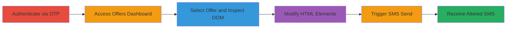

---
tags:
  - idor
  - dom-manipulation
  - sms-spoofing
  - web-vulnerability
type: attack_chain
tools:
  - '[[tools/Browser-Developer-Tools]]'
tactics:
  - '[[Lateral Movement]]'
verified: false
platforms:
  - Web
submitted: true
complexity: medium
created_at: '2023-10-01T00:00:00Z'
procedures:
  - '[[procedures/Exploit-IDOR-via-DOM-Manipulation-in-MTN-Offers]]'
step_count: 6
techniques:
  - '[[Exploit Public-Facing Application]]'
updated_at: '2025-12-14T17:25:34.202Z'
description: >-
  Multi-stage attack exploiting an IDOR vulnerability in the MTN offers
  dashboard, allowing authenticated users to manipulate DOM elements and send
  customized SMS messages via the official 'MYMTN' sender ID.
skill_level: intermediate
impact_level: high
id: 9a1ef5ba-1afc-455f-b0f9-778a496f021d
validated: true
mitre_tactics:
  - '[[Lateral Movement]]'
mitre_techniques:
  - '[[Exploit Public-Facing Application]]'
---
# IDOR via Client-Side DOM Manipulation to Send Altered SMS from Official MTN Sender

Multi-stage attack chain demonstrating a complete attack workflow exploiting an Insecure Direct Object Reference (IDOR) in the MTN Nigeria offers dashboard. An authenticated user can manipulate client-side DOM elements to alter SMS content, which the server trusts without validation, enabling the sending of customized messages (e.g., for phishing or spam) from the official 'MYMTN' sender ID to the user's registered phone number. This horizontal escalation requires initial authentication via OTP but allows injection of arbitrary text. Broader claims suggest potential reach to any MTN number, though reproduction is limited to the authenticated user's device.

## Chain Metrics Dashboard

| Metric | Value |
|--------|-------|
| Chain Status | Unverified |
| Total Steps | 6 |
| Execution Time | ~5 minutes |
| Skill Level | Intermediate |
| Complexity | Medium |
| Impact Level | High |

## Attack Flow Visualization

## Prerequisites & Requirements

### Required Tools

- [[tools/Browser-Developer-Tools]]

### Target Environment

- Web platform (https://mtn.ng/offers/)
- Required services: SMS Service
- Network access: Internet connection to MTN Nigeria site

### Initial Access Requirements

- Valid MTN phone number for authentication
- Access to OTP via SMS on the registered device
- Modern web browser (e.g., Chrome, Firefox) with developer tools

## Detailed Attack Procedures

### Step 1: Access the Offers Page and Initiate Login
procedure: [[procedures/Exploit-IDOR-via-DOM-Manipulation-in-MTN-Offers]]

**Objective**: Gain initial access to the MTN offers dashboard by navigating to the site and starting the authentication process.

**Instructions**: Open a web browser and navigate to the MTN offers page. Enter your registered MTN phone number in the login field and click Submit to receive an OTP.

**Expected Output**: OTP SMS sent to the registered phone number; login form advances to OTP entry.

**Success Indicators**:
- Page loads successfully at https://mtn.ng/offers/
- Phone number submission triggers OTP delivery

### Step 2: Complete Authentication with OTP
procedure: [[procedures/Exploit-IDOR-via-DOM-Manipulation-in-MTN-Offers]]

**Objective**: Authenticate the session using the received OTP to access protected dashboard features.

**Instructions**: Enter the 6-digit OTP code from the SMS into the validation field and click Validate.

**Expected Output**: Successful login redirects to the personalized offers dashboard.

**Success Indicators**:
- Dashboard loads with user-specific offers
- No authentication errors displayed

### Step 3: Access the Offers Dashboard and Select a Specific Offer
procedure: [[procedures/Exploit-IDOR-via-DOM-Manipulation-in-MTN-Offers]]

**Objective**: Load the dashboard and target a specific offer for manipulation.

**Instructions**: Once authenticated, the dashboard loads automatically. Scroll to find and click on a specific offer, such as 'Data4ME Bundles 4Me (2)'.

**Expected Output**: Offer details expand, showing card elements with title and body text.

**Success Indicators**:
- Offer card opens with visible text elements
- 'SMS Offer' button becomes available

### Step 4: Inspect and Modify the Offer Text Elements
procedure: [[procedures/Exploit-IDOR-via-DOM-Manipulation-in-MTN-Offers]]

**Objective**: Use browser tools to tamper with DOM elements, altering the SMS content that will be sent.

**Instructions**: Right-click on the offer's card title or body text, select 'Inspect' to open Developer Tools. Locate the relevant HTML elements (e.g., 
 or 
), edit the text content to inject custom malicious text (e.g., change to phishing lure), and close the inspector.

**Expected Output**: Page visually updates to reflect the modified text in the offer card.

**Success Indicators**:
- DOM changes persist on the page without refresh
- Modified text is visible in the browser view

### Step 5: Verify Changes and Trigger SMS Send
procedure: [[procedures/Exploit-IDOR-via-DOM-Manipulation-in-MTN-Offers]]

**Objective**: Confirm the alterations and initiate the SMS transmission using the vulnerable feature.

**Instructions**: Verify the modified text displays correctly on the page, then click the 'SMS Offer' button to send the SMS.

**Expected Output**: SMS request processes; no client-side errors.

**Success Indicators**:
- Button click succeeds without validation alerts
- Server accepts the request (page may show success message)

### Step 6: Receive Modified SMS
procedure: [[procedures/Exploit-IDOR-via-DOM-Manipulation-in-MTN-Offers]]

**Objective**: Validate the exploit by receiving the altered SMS from the official sender.

**Instructions**: Check the registered phone for the incoming SMS.

**Expected Output**: SMS arrives from 'MYMTN' with the injected custom content.

**Success Indicators**:
- SMS contains the manipulated text
- Sender ID is official 'MYMTN'

## Attack Chain Summary

### Key Achievements

1. Successful authentication and dashboard access
2. Client-side DOM manipulation to inject arbitrary SMS content
3. Sending of customized SMS via official channel without server validation

## Technique & Tactic Coverage

### MITRE ATT&CK Techniques

- [[Exploit Public-Facing Application]]

### MITRE ATT&CK Tactics

- [[Lateral Movement]]

---

*Last updated: 2023-10-01T00:00:00Z*
