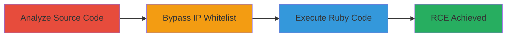

---
tags:
  - rails
  - web-console
  - ip-bypass
  - rce
  - auth-bypass
  - ruby
type: attack_chain
tools:
  - '[[tools/curl]]'
tactics:
  - '[[Initial Access]]'
  - '[[Execution]]'
verified: false
platforms:
  - Web
submitted: true
complexity: medium
created_at: '2023-10-01T00:00:00Z'
procedures:
  - '[[procedures/Analyze-Rails-Source-for-IP-Parsing-Discrepancy]]'
  - '[[procedures/Bypass-IP-Whitelist-with-Crafted-X-Forwarded-For]]'
  - '[[procedures/Execute-Arbitrary-Ruby-Code-via-Web-Console]]'
step_count: 3
techniques:
  - '[[Exploit Public-Facing Application]]'
  - '[[Command-Line Interface]]'
updated_at: '2025-12-14T17:23:31.173Z'
description: >-
  Multi-stage attack exploiting a parser differential in Ruby on Rails 4.0 and
  4.1 Web Console to bypass IP whitelisting and achieve remote code execution.
skill_level: intermediate
impact_level: high
id: 36f7b1aa-15fe-4062-be94-3e22da1f8884
validated: true
mitre_tactics:
  - '[[Initial Access]]'
  - '[[Execution]]'
mitre_techniques:
  - '[[Exploit Public-Facing Application]]'
  - '[[Command-Line Interface]]'
---
# IP Whitelist Bypass in Rails Web Console Leading to RCE

Multi-stage attack chain demonstrating exploitation of a parser differential in the Ruby on Rails Web Console for versions 4.0 and 4.1, allowing IP whitelist bypass and remote code execution in development or test environments.

## Chain Metrics Dashboard

| Metric | Value |
|--------|-------|
| Chain Status | Unverified |
| Total Steps | 3 |
| Execution Time | ~5 minutes |
| Skill Level | Intermediate |
| Complexity | Medium |
| Impact Level | High |

## Attack Flow Visualization



## Prerequisites & Requirements

### Required Tools

- [[tools/curl]]

### Target Environment

- Ruby on Rails 4.0 or 4.1 application with Web Console enabled (default in development/test environments)
- Web server exposing the Rails app (e.g., port 3000)
- Network access to the target application

### Initial Access Requirements

- No credentials required; assumes public-facing or accessible Rails app
- Attacker positioned to send HTTP requests to the target
- Prior knowledge of the target using Rails 4.0/4.1

## Detailed Attack Procedures

### Step 1: Analyze Source Code for Discrepancy
procedure: [[procedures/Analyze-Rails-Source-for-IP-Parsing-Discrepancy]]

**Objective**: Identify the parser differential between Rails RemoteIp middleware regex and Web Console's IPAddr validation to find bypass opportunities.

**Instructions**: Review the Web Console documentation and Rails source code. Examine the RemoteIp middleware in Rails 4.1 at https://github.com/rails/rails/blob/4-1-stable/actionpack/lib/action_dispatch/middleware/remote_ip.rb#L31-38, noting regex patterns like ^::1$ for IPv6 localhost. Compare with Web Console's use of IPAddr class for request.remote_ip validation.

**Expected Output**: Confirmation that '0000::1' bypasses the regex (^::1$ does not match) but is interpreted as ::1 by IPAddr.

**Success Indicators**:
- Identified discrepancy in IP parsing logic
- Verified vulnerable versions (Rails 4.0/4.1 with Web Console)

### Step 2: Bypass IP Whitelist with Crafted Header
procedure: [[procedures/Bypass-IP-Whitelist-with-Crafted-X-Forwarded-For]]

**Objective**: Spoof the client IP to bypass the localhost-only whitelist using a malformed IPv6 address in the X-Forwarded-For header.

**Instructions**: Use [[commands/curl-bypass-rails-ip]] to send a request with X-Forwarded-For set to '0000::1':

```bash
curl -H "X-Forwarded-For: 0000::1" http://target:3000/rails/console
```

This header tricks the RemoteIp middleware (regex fails to strip) while Web Console's IPAddr parses it as localhost (::1), granting access.

**Expected Output**: HTTP response indicating access to the Web Console (e.g., console interface loads without 403).

**Success Indicators**:
- Access granted to /rails/console endpoint
- No IP restriction error

### Step 3: Execute Arbitrary Ruby Code
procedure: [[procedures/Execute-Arbitrary-Ruby-Code-via-Web-Console]]

**Objective**: Leverage the bypassed Web Console to evaluate and execute arbitrary Ruby code, achieving RCE.

**Instructions**: Once accessed, interact with the Web Console interface (typically at /rails/console) to input Ruby statements. For example, execute a command like `system('whoami')` in the console input field to run shell commands.

**Expected Output**: Execution results displayed in the console, such as output from the Ruby evaluation or shell command.

**Success Indicators**:
- Ruby code evaluates successfully
- Arbitrary commands (e.g., file read, shell execution) perform as intended
- Confirmation of RCE (e.g., server-side effects like file creation)

## Attack Chain Summary

### Key Achievements

1. Discovered and validated IP parsing vulnerability in Rails Web Console
2. Bypassed localhost IP restrictions remotely
3. Achieved full RCE via arbitrary Ruby code execution

## Technique & Tactic Coverage

### MITRE ATT&CK Techniques

- [[Exploit Public-Facing Application]]
- [[Command-Line Interface]]

### MITRE ATT&CK Tactics

- [[Initial Access]]
- [[Execution]]

---

*Last updated: 2023-10-01T00:00:00Z*
