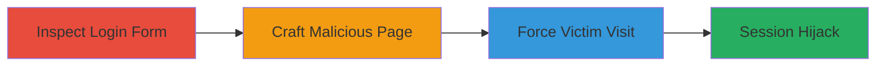

---
tags:
  - csrf
  - web
  - authentication
  - session-hijacking
type: attack_chain
tools: []
tactics:
  - '[[Initial Access]]'
verified: false
platforms:
  - Web
submitted: true
complexity: low
procedures:
  - '[[procedures/Inspect-IRCCloud-Login-Form-for-CSRF]]'
  - '[[procedures/Craft-and-Exploit-Login-CSRF-PoC]]'
step_count: 2
techniques:
  - '[[Exploit Public-Facing Application]]'
description: >-
  Attack chain exploiting CSRF vulnerability in IRCCloud login form to force
  victims to authenticate as an attacker-controlled account, enabling session
  hijacking or account confusion.
skill_level: intermediate
impact_level: high
id: b6032787-e9a1-464c-a0c5-801d63736ea0
created_at: '2025-12-14T17:27:15.170Z'
updated_at: '2025-12-14T17:27:15.170Z'
validated: true
mitre_tactics:
  - '[[Initial Access]]'
mitre_techniques:
  - '[[Exploit Public-Facing Application]]'
---
# IRCCloud Login CSRF for Forced Authentication

Multi-stage attack chain demonstrating exploitation of a CSRF vulnerability in the IRCCloud login form, allowing an attacker to forge login requests and force victims to authenticate as the attacker's account.

## Chain Metrics Dashboard

| Metric | Value |
|--------|-------|
| Chain Status | Unverified |
| Total Steps | 2 |
| Execution Time | ~5 minutes |
| Skill Level | Intermediate |
| Complexity | Low |
| Impact Level | High |

## Attack Flow Visualization

## Prerequisites & Requirements

### Required Tools

- Browser developer tools
- Text editor for HTML

### Target Environment

- Web platform
- Access to IRCCloud login page
- No specific ports or services beyond standard HTTPS (443)

### Initial Access Requirements

- Public access to IRCCloud login form
- Ability to host or email a malicious webpage
- Victim must be tricked into visiting the attacker's page while browser is active

## Detailed Attack Procedures

### Step 1: Inspect Login Form
procedure: [[procedures/Inspect-IRCCloud-Login-Form-for-CSRF]]

**Objective**: Identify the absence of CSRF protections in the login form to confirm exploitability.

**Instructions**: Open the IRCCloud login page in a browser and use developer tools to examine the HTML source of the form. Look for POST method, input fields (email, password, org_invite), and absence of CSRF tokens.

**Expected Output**: HTML form without anti-CSRF measures, confirming vulnerability.

**Success Indicators**:
- Form uses POST to an endpoint without token fields
- No same-site cookie or other mitigations visible

### Step 2: Craft and Deliver CSRF PoC
procedure: [[procedures/Craft-and-Exploit-Login-CSRF-PoC]]

**Objective**: Create a forged login form and deliver it to the victim to force authentication as the attacker's account.

**Instructions**: Prepare attacker credentials (e.g., attacker@email.com and password). Create an HTML page with a hidden form that auto-submits the POST request to IRCCloud's login endpoint. Host the page or send via phishing, ensuring the victim visits it in an active browser session.

**Expected Output**: Victim's browser submits the form, logging them into the attacker's account and potentially hijacking their session.

**Success Indicators**:
- Victim redirected to IRCCloud dashboard under attacker's account
- Attacker observes login activity or session overlap

## Attack Chain Summary

### Key Achievements

1. Confirmed CSRF vulnerability through source inspection
2. Crafted and delivered a functional PoC for forced login
3. Demonstrated potential for session hijacking via account confusion

## Technique & Tactic Coverage

### MITRE ATT&CK Techniques

- [[Exploit Public-Facing Application]]

### MITRE ATT&CK Tactics

- [[Initial Access]]

---
*Last updated: 2023-10-01*
