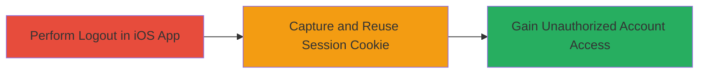

---
tags:
  - session-hijacking
  - improper-authentication
  - logout-failure
type: attack_chain
tools: []
tactics:
  - '[[Initial Access]]'
verified: false
platforms:
  - iOS
  - Web
submitted: true
complexity: low
created_at: '2023-10-01T00:00:00Z'
procedures:
  - '[[procedures/Demonstrate-IRCCloud-Logout-Session-Failure]]'
step_count: 2
techniques:
  - '[[Valid Accounts]]'
  - '[[Pass the Hash]]'
updated_at: '2025-12-14T17:24:39.727Z'
description: >-
  Demonstrates how the IRCCloud iOS app fails to invalidate sessions on logout,
  enabling attackers to reuse captured session cookies for unauthorized account
  access.
skill_level: intermediate
impact_level: high
id: 36868f0b-1b22-469a-a46b-683f0f8390ab
validated: true
mitre_tactics:
  - '[[Initial Access]]'
mitre_techniques:
  - '[[Valid Accounts]]'
  - '[[Pass the Hash]]'
---
# IRCCloud iOS Session Hijacking via Failed Logout Invalidation

Multi-stage attack chain demonstrating how a session management flaw in the IRCCloud iOS app allows persistent access via reused cookies.

## Chain Metrics Dashboard

| Metric | Value |
|--------|-------|
| Chain Status | Unverified |
| Total Steps | 2 |
| Execution Time | ~5 minutes |
| Skill Level | Intermediate |
| Complexity | Low |
| Impact Level | High |

## Attack Flow Visualization

## Prerequisites & Requirements

### Required Tools

- None (uses built-in app functionality and network inspection tools like proxy for cookie capture)

### Target Environment

- IRCCloud iOS application
- Access to IRCCloud web services (Cowboy server backend)
- Network access to https://irccloud.com

### Initial Access Requirements

- Valid user account on IRCCloud
- iOS device with IRCCloud app installed
- Ability to intercept app traffic (e.g., via proxy like Burp Suite, though not strictly required for demo)

## Detailed Attack Procedures

### Step 1: Perform Logout Action
procedure: [[procedures/Demonstrate-IRCCloud-Logout-Session-Failure]]

**Objective**: Trigger the logout process in the IRCCloud iOS app to test session invalidation.

**Instructions**: Open the IRCCloud iOS app and initiate logout. This sends a POST request to the /apn-unregister endpoint with the device_id and session parameters. Monitor the request using a network proxy if available.

**Expected Output**: The server responds with HTTP 200 OK and {"_reqid":0,"success":true}, but the session cookie remains intact.

**Success Indicators**:
- Logout appears successful in the app
- Session cookie (e.g., session=1.eaf395c450d6ad52023804d9846b7376) is not cleared from storage

### Step 2: Reuse Captured Session Cookie
procedure: [[procedures/Demonstrate-IRCCloud-Logout-Session-Failure]]

**Objective**: Demonstrate that the session cookie can be reused for unauthorized access, simulating an attacker who has captured the cookie via leakage or interception.

**Instructions**: Extract the session cookie from the iOS app storage or intercepted traffic. Use it in a subsequent request to IRCCloud services, such as accessing the web interface or API endpoints. For example, include the cookie in a browser or curl request to authenticate without credentials.

**Expected Output**: Successful authentication and access to the victim's account data without re-authentication.

**Success Indicators**:
- Access granted using the old session cookie
- No invalidation errors from the server

## Attack Chain Summary

### Key Achievements

1. Identified failure in session destruction on logout
2. Enabled persistent unauthorized access via cookie reuse
3. Highlighted risks of session leakage in mobile apps

## Technique & Tactic Coverage

### MITRE ATT&CK Techniques

- [[Valid Accounts]] Valid Accounts
- [[Pass the Hash]] Pass the Ticket (adapted for web sessions)

### MITRE ATT&CK Tactics

- [[Initial Access]] Initial Access

---

*Last updated: 2023-10-01T00:00:00Z*
