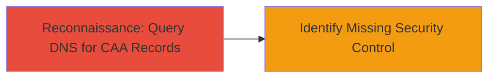

---
tags:
  - dns
  - caa
  - certificate
  - misconfiguration
  - reconnaissance
type: attack_chain
tools:
  - '[[tools/CAA-Test-Tool]]'
tactics:
  - '[[Reconnaissance]]'
verified: false
platforms:
  - Web
  - DNS
submitted: true
complexity: low
created_at: '2023-10-01T00:00:00Z'
procedures:
  - '[[procedures/Check-for-CAA-DNS-Records]]'
step_count: 1
techniques:
  - '[[Hardware]]'
updated_at: '2025-12-14T17:28:36.602Z'
description: >-
  A reconnaissance procedure to detect the absence of Certificate Authority
  Authorization (CAA) DNS records, which can lead to risks of unauthorized
  certificate issuance for a domain.
skill_level: beginner
impact_level: medium
id: e9299ed4-785e-45be-879c-f60cc4f78e26
validated: true
mitre_tactics:
  - '[[Reconnaissance]]'
mitre_techniques:
  - '[[Hardware]]'
---
# Identifying Missing CAA DNS Records for Certificate Misissuance Risk

Multi-stage attack chain demonstrating a complete attack workflow.

The report identifies a missing Certificate Authority Authorization (CAA) DNS record for the domain gratipay.com, a security best practice to restrict which certificate authorities can issue certificates for the domain. This misconfiguration was discovered via a DNS lookup, revealing no CAA record (resource record type 257). The potential impact includes an elevated risk of certificate misissuance, where a malicious actor could deceive a compliant CA into issuing a fraudulent certificate, enabling site impersonation. No active exploitation was reported, but this reconnaissance step highlights a vulnerability in domain security controls.

## Chain Metrics Dashboard

| Metric | Value |
|--------|-------|
| Chain Status | Unverified |
| Total Steps | 1 |
| Execution Time | ~1 minute |
| Skill Level | Beginner |
| Complexity | Low |
| Impact Level | Medium |

## Attack Flow Visualization

## Prerequisites & Requirements

### Required Tools

- [[tools/CAA-Test-Tool]]

### Target Environment

- DNS resolution services
- Internet access for online lookup tools
- Target domain name (e.g., gratipay.com)

### Initial Access Requirements

- No credentials required
- Public DNS access
- No prior access to the target needed

## Detailed Attack Procedures

### Step 1: Query DNS for CAA Records
procedure: [[procedures/Check-for-CAA-DNS-Records]]

**Objective**: Perform a DNS lookup to check for the presence of CAA resource records (type 257) on the target domain, identifying if the domain lacks restrictions on certificate authorities.

**Instructions**: Use the [[tools/CAA-Test-Tool]] to query the domain's CAA records:

1. Navigate to the tool's website.
2. Enter the target domain (e.g., gratipay.com).
3. Submit the query to retrieve CAA records.

**Expected Output**: A report indicating no CAA records found, confirming the misconfiguration.

**Success Indicators**:
- No CAA records returned in the DNS response.
- Confirmation that any compliant CA could issue certificates without restriction.

## Attack Chain Summary

### Key Achievements

1. Successful DNS query revealing missing CAA record.
2. Identification of potential risk for certificate misissuance.
3. Highlighting a best practice gap in domain security.

## Technique & Tactic Coverage

### MITRE ATT&CK Techniques

- [[Hardware]]

### MITRE ATT&CK Tactics

- [[Reconnaissance]]

---

*Last updated: 2023-10-01T00:00:00Z*
