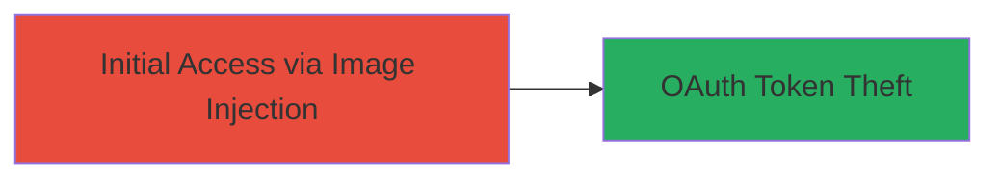

---
tags:
  - image-injection
  - web-vulnerability
  - oauth-theft
  - token-leakage
  - facebook
type: attack_chain
tools: []
tactics:
  - '[[Initial Access]]'
verified: false
platforms:
  - Web
submitted: true
complexity: medium
created_at: '2023-10-01T00:00:00Z'
procedures:
  - '[[procedures/Exploit-Image-Injection-Vulnerability]]'
step_count: 1
techniques:
  - '[[Exploit Public-Facing Application]]'
updated_at: '2025-12-14T17:24:35.484Z'
description: >-
  A web vulnerability exploiting insufficient image input validation on the
  Rockstar Games Bully Anniversary Edition page, enabling potential injection of
  malicious images to steal Facebook OAuth tokens as part of a data leakage
  chain.
skill_level: intermediate
impact_level: high
id: bee41c47-6f8d-4e20-9f75-2d9098d9828f
validated: true
mitre_tactics:
  - '[[Initial Access]]'
mitre_techniques:
  - '[[Exploit Public-Facing Application]]'
---
# Image Injection Leading to Facebook OAuth Token Theft on Rockstar Games Bully Page

Multi-stage attack chain demonstrating a complete attack workflow targeting the Rockstar Games website via image injection to facilitate OAuth token theft.

## Chain Metrics Dashboard

| Metric | Value |
|--------|-------|
| Chain Status | Unverified |
| Total Steps | 1 |
| Execution Time | ~5 minutes |
| Skill Level | Intermediate |
| Complexity | Medium |
| Impact Level | High |

## Attack Flow Visualization



## Prerequisites & Requirements

### Required Tools

- Browser developer tools for inspecting and modifying requests
- Proxy tool like Burp Suite for intercepting and altering form submissions

### Target Environment

- Web platform
- Services: Facebook OAuth integration
- Network access: Public internet access to https://www.rockstargames.com/bully/anniversaryedition

### Initial Access Requirements

- No prior credentials required; public-facing page
- Ability to interact with the page's image upload or display functionality
- Basic knowledge of web forms and HTML

## Detailed Attack Procedures

### Step 1: Exploit Image Injection
procedure: [[procedures/Exploit-Image-Injection-Vulnerability]]

**Objective**: Inject a malicious image payload into the Bully Anniversary Edition page to bypass sanitization, potentially executing code or exfiltrating Facebook OAuth tokens stored in user sessions.

**Instructions**: Navigate to the target page and identify the image input field or parameter (likely a form for user-uploaded images or avatars). Use a proxy to intercept the request and replace the image source with a malicious payload, such as an SVG containing JavaScript to access and exfiltrate tokens. Submit the form and observe if the injected image renders unsanitized, leading to execution.

For testing, use a browser or curl to simulate the injection:

```bash
curl -X POST 'https://www.rockstargames.com/bully/anniversaryedition/upload' \
  -H 'Content-Type: application/x-www-form-urlencoded' \
  -d 'image_url=<svg onload=alert(document.cookie)>malicious.svg</svg>'
```

Monitor the response for successful injection and any token leakage in network requests.

**Expected Output**: The page renders the malicious image, potentially triggering JavaScript execution that logs or sends OAuth tokens to an attacker-controlled server.

**Success Indicators**:
- Malicious image loads without sanitization errors
- JavaScript from the image executes (e.g., alert pops or network request to attacker domain)
- Facebook OAuth token appears in exfiltrated data

## Attack Chain Summary

### Key Achievements

1. Successful image injection bypassing input validation
2. Potential access to sensitive Facebook OAuth tokens
3. Contribution to broader data leakage chain, prompting site remediation

## Technique & Tactic Coverage

### MITRE ATT&CK Techniques

- [[Exploit Public-Facing Application]]

### MITRE ATT&CK Tactics

- [[Initial Access]]

---
*Last updated: 2023-10-01T00:00:00Z*
