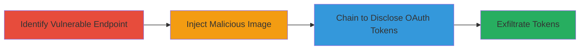

---
tags:
  - image-injection
  - information-disclosure
  - oauth-token-theft
  - web-vulnerability
type: attack_chain
tools: []
tactics:
  - '[[Initial Access]]'
  - '[[Credential Access]]'
verified: false
platforms:
  - Web
submitted: true
created_at: '2023-10-01T00:00:00Z'
procedures:
  - '[[procedures/Exploit-Image-Injection-Vulnerability]]'
  - '[[procedures/Disclose-OAuth-Tokens-via-Chained-Vulnerabilities]]'
step_count: 2
techniques:
  - '[[Exploit Public-Facing Application]]'
  - '[[Unsecured Credentials]]'
updated_at: '2025-12-14T17:24:35.460Z'
description: >-
  A multi-stage attack exploiting an image injection vulnerability on the
  Rockstar Games Bully Anniversary Edition page, chained with unspecified
  weaknesses to disclose sensitive OAuth tokens.
id: 4df4d386-74b4-4de2-8ad2-97c6eebb0d80
validated: true
mitre_tactics:
  - '[[Initial Access]]'
  - '[[Credential Access]]'
mitre_techniques:
  - '[[Exploit Public-Facing Application]]'
  - '[[Unsecured Credentials]]'
---
# Image Injection Leading to OAuth Token Theft on Rockstar Games Bully Anniversary Edition

Multi-stage attack chain demonstrating exploitation of an image injection vulnerability on www.rockstargames.com/bully/anniversaryedition, combined with other weaknesses to steal OAuth tokens.

## Chain Metrics Dashboard

| Metric | Value |
|--------|-------|
| Chain Status | Unverified |
| Total Steps | 2 |
| Execution Time | ~5 minutes |
| Skill Level | Intermediate |
| Complexity | Medium |
| Impact Level | High |

## Attack Flow Visualization



## Prerequisites & Requirements

### Required Tools

- Browser developer tools for inspection
- [[tools/curl]] (inferred for testing)

### Target Environment

- Web platform
- Accessible public endpoint: www.rockstargames.com/bully/anniversaryedition
- No specific ports required (HTTPS/443 implied)

### Initial Access Requirements

- Public internet access
- No credentials needed for initial injection
- Ability to interact with web forms or parameters handling images

## Detailed Attack Procedures

### Step 1: Identify and Test Image Injection
procedure: [[procedures/Exploit-Image-Injection-Vulnerability]]

**Objective**: Locate the image handling endpoint and inject unsanitized input to confirm vulnerability.

**Instructions**: Navigate to the target page and inspect elements for image upload or display parameters. Use a tool like curl to test injection by supplying a malicious image URL or payload in the image parameter, such as embedding script or redirecting to internal resources.

For example, test with [[commands/curl-image-injection-test]]:

```bash
curl -X GET "https://www.rockstargames.com/bully/anniversaryedition?image=javascript:alert(1)" -v
```

If the parameter is reflected without sanitization, proceed to craft a payload that could lead to further exploitation.

**Expected Output**: Unsanitized image parameter reflected in response, potentially executing injected content or loading malicious resources.

**Success Indicators**:
- Injection payload appears in page source without escaping
- Browser alerts or unexpected behavior on image load

### Step 2: Chain Exploitation for Token Disclosure
procedure: [[procedures/Disclose-OAuth-Tokens-via-Chained-Vulnerabilities]]

**Objective**: Leverage the image injection to access internal resources or trigger disclosure of OAuth tokens through unspecified chained vulnerabilities.

**Instructions**: Once image injection is confirmed, combine it with other weaknesses (e.g., lack of token scoping or internal endpoint exposure). Modify the injection payload to request internal OAuth endpoints, such as forcing the image loader to fetch from an internal service where tokens are stored or transmitted.

Example chained request using [[commands/curl-chained-disclosure]]:

```bash
curl -X GET "https://www.rockstargames.com/bully/anniversaryedition?image=http://internal.oauth.service/token" -v
```

Monitor responses for token leakage in headers, cookies, or reflected content.

**Expected Output**: Exposure of OAuth token in response body, headers, or via network interception.

**Success Indicators**:
- OAuth token visible in tools like Burp Suite or browser dev tools
- Successful validation of stolen token against OAuth provider

## Attack Chain Summary

### Key Achievements

1. Confirmed image injection on public endpoint
2. Chained to disclose sensitive OAuth tokens
3. Potential for unauthorized access to user accounts or services

## Technique & Tactic Coverage

### MITRE ATT&CK Techniques

- [[Exploit Public-Facing Application]]
- [[Unsecured Credentials]]

### MITRE ATT&CK Tactics

- [[Initial Access]]
- [[Credential Access]]

---

*Last updated: 2023-10-01T00:00:00Z*
