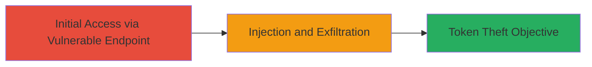

---
id: a1b2c3d4-e5f6-7890-abcd-ef1234567890
name: Image Injection in Screenshot Viewer Leading to Facebook OAuth Token Theft
type: attack_chain
description: "A vulnerability chain exploiting image injection in the Rockstar Games screenshot viewer to exfiltrate sensitive Facebook OAuth tokens from authenticated users."
verified: false
submitted: false
step_count: 1
created_at: 2023-10-01T12:00:00Z
updated_at: 2023-10-01T12:00:00Z
procedures: [[procedures/Exploit-Image-Injection-for-Token-Exfiltration]]
techniques: [[Exploit Public-Facing Application]]
tactics: [[Initial Access]], [[Collection]]
tags: image-injection, token-theft, oauth, facebook, web-vulnerability
platforms: Web
tools: []
---

# Image Injection in Screenshot Viewer Leading to Facebook OAuth Token Theft

Multi-stage attack chain demonstrating a complete attack workflow targeting insecure image handling in a web application to steal authentication tokens.

## Chain Metrics Dashboard

| Metric | Value |
|--------|-------|
| Chain Status | Unverified |
| Total Steps | 1 |
| Execution Time | ~5 minutes |
| Skill Level | Intermediate |
| Complexity | Medium |
| Impact Level | High |

## Attack Flow Visualization



## Prerequisites & Requirements

### Required Tools

- Browser developer tools for payload crafting
- [[commands/curl-image-injection-test]]

### Target Environment

- Web platform
- Services: Facebook OAuth integration
- Open access to public-facing screenshot viewer endpoint

### Initial Access Requirements

- No prior credentials needed for initial probe
- Network access to https://www.rockstargames.com
- Ability to craft and send HTTP requests

## Detailed Attack Procedures

### Step 1: Exploit Image Injection
procedure: [[procedures/Exploit-Image-Injection-for-Token-Exfiltration]]

**Objective**: Inject malicious content into the image handling function to trigger unauthorized access and exfiltrate Facebook OAuth tokens from the user's session.

**Instructions**: Begin by identifying the vulnerable endpoint at https://www.rockstargames.com/screenshot-viewer/responsive/image. Craft a malicious image payload, such as an SVG with embedded JavaScript to access and exfiltrate tokens. Use [[commands/curl-image-injection-test]] to send the injected request:

```bash
curl -X GET "https://www.rockstargames.com/screenshot-viewer/responsive/image?image_url=malicious.svg" -H "Cookie: session_token=abc123"
```

Monitor the response for signs of injection success, such as altered output or network requests to an attacker-controlled server. If the target is authenticated with Facebook OAuth, the injected script will capture and send the token.

**Expected Output**: Server response containing processed image data or error indicating injection processing; external server logs showing exfiltrated token.

**Success Indicators**:
- Malicious payload executed without sanitization
- Facebook OAuth token received on attacker server
- No immediate blocking or validation errors

## Attack Chain Summary

### Key Achievements

1. Successful injection into image viewer endpoint
2. Exfiltration of sensitive Facebook OAuth tokens
3. Demonstration of full attack chain impact on user authentication

## Technique & Tactic Coverage

### MITRE ATT&CK Techniques

- [[Exploit Public-Facing Application]]

### MITRE ATT&CK Tactics

- [[Initial Access]]
- [[Collection]]

---
*Last updated: 2023-10-01T12:00:00Z*
